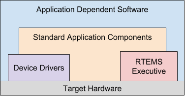
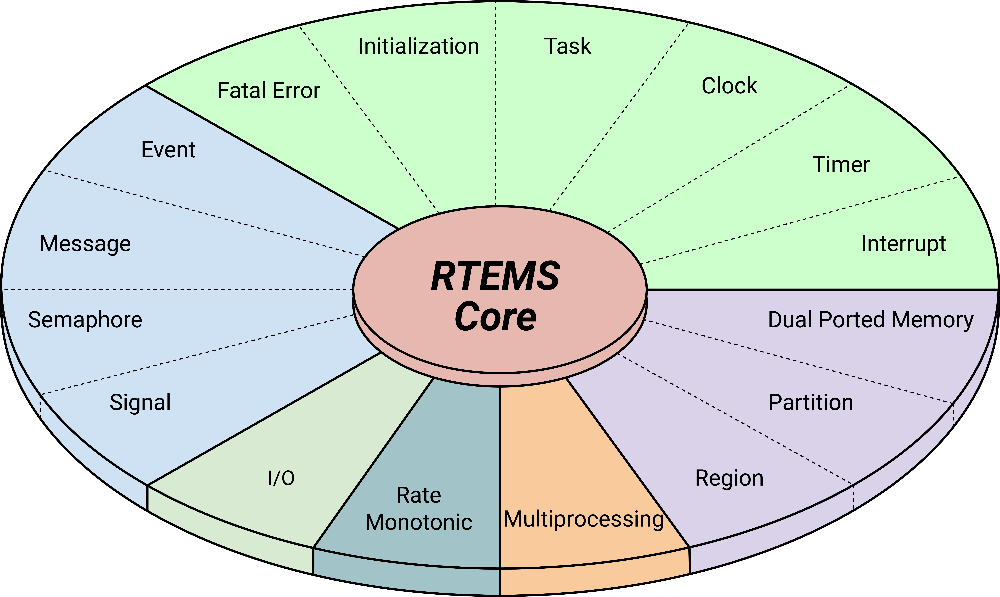

.. comment SPDX-License-Identifier: CC-BY-SA-4.0

.. Copyright (C) 1988, 2008 On-Line Applications Research Corporation (OAR)
.. COMMENT: All rights reserved.

Overview
********

Introduction
============

RTEMS, Real-Time Executive for Multiprocessor Systems, is a real-time executive
(kernel) which provides a high performance environment for embedded military
applications including the following features:

- multitasking capabilities

- homogeneous and heterogeneous multiprocessor systems

- event-driven, priority-based, preemptive scheduling

- optional rate monotonic scheduling

- intertask communication and synchronization

- priority inheritance

- responsive interrupt management

- dynamic memory allocation

- high level of user configurability

This manual describes the usage of RTEMS for applications written in the C
programming language.  Those implementation details that are processor
dependent are provided in the Applications Supplement documents.  A supplement
document which addresses specific architectural issues that affect RTEMS is
provided for each processor type that is supported.

.. index:: Real-time applications

Real-time Application Systems
=============================

Real-time application systems are a special class of computer applications.
They have a complex set of characteristics that distinguish them from other
software problems.  Generally, they must adhere to more rigorous requirements.
The correctness of the system depends not only on the results of computations,
but also on the time at which the results are produced.  The most important and
complex characteristic of real-time application systems is that they must
receive and respond to a set of external stimuli within rigid and critical time
constraints referred to as deadlines.  Systems can be buried by an avalanche of
interdependent, asynchronous or cyclical event streams.

Deadlines can be further characterized as either hard or soft based upon the
value of the results when produced after the deadline has passed.  A deadline
is hard if the results have no value or if their use will result in a
catastrophic event.  In contrast, results which are produced after a soft
deadline may have some value.

Another distinguishing requirement of real-time application systems is the
ability to coordinate or manage a large number of concurrent activities. Since
software is a synchronous entity, this presents special problems.  One
instruction follows another in a repeating synchronous cycle.  Even though
mechanisms have been developed to allow for the processing of external
asynchronous events, the software design efforts required to process and manage
these events and tasks are growing more complicated.

The design process is complicated further by spreading this activity over a set
of processors instead of a single processor. The challenges associated with
designing and building real-time application systems become very complex when
multiple processors are involved.  New requirements such as interprocessor
communication channels and global resources that must be shared between
competing processors are introduced.  The ramifications of multiple processors
complicate each and every characteristic of a real-time system.

.. index:: Real-time executive

Real-time Executive
===================

Fortunately, real-time operating systems or real-time executives serve as a
cornerstone on which to build the application system.  A real-time multitasking
executive allows an application to be cast into a set of logical, autonomous
processes or tasks which become quite manageable.  Each task is internally
synchronous, but different tasks execute independently, resulting in an
asynchronous processing stream.  Tasks can be dynamically paused for many
reasons resulting in a different task being allowed to execute for a period of
time.  The executive also provides an interface to other system components such
as interrupt handlers and device drivers.  System components may request the
executive to allocate and coordinate resources, and to wait for and trigger
synchronizing conditions.  The executive system calls effectively extend the
CPU instruction set to support efficient multitasking.  By causing tasks to
travel through well-defined state transitions, system calls permit an
application to demand-switch between tasks in response to real-time events.

By proper grouping of responses to stimuli into separate tasks, a system can
now asynchronously switch between independent streams of execution, directly
responding to external stimuli as they occur.  This allows the system design to
meet critical performance specifications which are typically measured by
guaranteed response time and transaction throughput.  The multiprocessor
extensions of RTEMS provide the features necessary to manage the extra
requirements introduced by a system distributed across several processors.  It
removes the physical barriers of processor boundaries from the world of the
system designer, enabling more critical aspects of the system to receive the
required attention. Such a system, based on an efficient real-time,
multiprocessor executive, is a more realistic model of the outside world or
environment for which it is designed.  As a result, the system will always be
more logical, efficient, and reliable.

By using the directives provided by RTEMS, the real-time applications developer
is freed from the problem of controlling and synchronizing multiple tasks and
processors.  In addition, one need not develop, test, debug, and document
routines to manage memory, pass messages, or provide mutual exclusion.  The
developer is then able to concentrate solely on the application.  By using
standard software components, the time and cost required to develop
sophisticated real-time applications is significantly reduced.

.. index:: Application architecture

RTEMS Application Architecture
==============================

One important design goal of RTEMS was to provide a bridge between two critical
layers of typical real-time systems.  As shown in the following figure, RTEMS
serves as a buffer between the project dependent application code and the
target hardware.  Most hardware dependencies for real-time applications can be
localized to the low level device drivers.

The RTEMS I/O interface manager provides an efficient tool for incorporating
these hardware dependencies into the system while simultaneously providing a
general mechanism to the application code that accesses them.  A well designed
real-time system can benefit from this architecture by building a rich library
of standard application components which can be used repeatedly in other
real-time projects.

.. index:: Internal Architecture

RTEMS Internal Architecture
===========================

RTEMS can be viewed as a set of layered components that work in harmony to
provide a set of services to a real-time application system.  The executive
interface presented to the application is formed by grouping directives into
logical sets called resource managers.  Functions utilized by multiple managers
such as scheduling, dispatching, and object management are provided in the
executive core.  The executive core depends on a small set of CPU dependent
routines.  Together these components provide a powerful run time environment
that promotes the development of efficient real-time application systems.  The
following figure illustrates this organization:

Subsequent chapters present a detailed description of the capabilities provided
by each of the following RTEMS managers:

- initialization

- task

- interrupt

- clock

- timer

- semaphore

- message

- event

- signal

- partition

- region

- dual ported memory

- I/O

- fatal error

- rate monotonic

- user extensions

- multiprocessing

User Customization and Extensibility
====================================

As thirty-two bit microprocessors have decreased in cost, they have become
increasingly common in a variety of embedded systems.  A wide range of custom
and general-purpose processor boards are based on various thirty-two bit
processors.  RTEMS was designed to make no assumptions concerning the
characteristics of individual microprocessor families or of specific support
hardware.  In addition, RTEMS allows the system developer a high degree of
freedom in customizing and extending its features.

RTEMS assumes the existence of a supported microprocessor and sufficient memory
for both RTEMS and the real-time application.  Board dependent components such
as clocks, interrupt controllers, or I/O devices can be easily integrated with
RTEMS.  The customization and extensibility features allow RTEMS to efficiently
support as many environments as possible.

Portability
===========

The issue of portability was the major factor in the creation of RTEMS.  Since
RTEMS is designed to isolate the hardware dependencies in the specific board
support packages, the real-time application should be easily ported to any
other processor.  The use of RTEMS allows the development of real-time
applications which can be completely independent of a particular microprocessor
architecture.

Memory Requirements
===================

Since memory is a critical resource in many real-time embedded systems, RTEMS
was specifically designed to automatically leave out all services that are not
required from the run-time environment.  Features such as networking, various
fileystems, and many other features are completely optional.  This allows the
application designer the flexibility to tailor RTEMS to most efficiently meet
system requirements while still satisfying even the most stringent memory
constraints.  As a result, the size of the RTEMS executive is application
dependent.

RTEMS requires RAM to manage each instance of an RTEMS object that is created.
Thus the more RTEMS objects an application needs, the more memory that must be
reserved.  See :ref:`Configuring a System`.

RTEMS utilizes memory for both code and data space.  Although RTEMS' data space
must be in RAM, its code space can be located in either ROM or RAM.

Audience
========

This manual was written for experienced real-time software developers.
Although some background is provided, it is assumed that the reader is familiar
with the concepts of task management as well as intertask communication and
synchronization.  Since directives, user related data structures, and examples
are presented in C, a basic understanding of the C programming language is
required to fully understand the material presented.  However, because of the
similarity of the Ada and C RTEMS implementations, users will find that the use
and behavior of the two implementations is very similar.  A working knowledge
of the target processor is helpful in understanding some of RTEMS' features.  A
thorough understanding of the executive cannot be obtained without studying the
entire manual because many of RTEMS' concepts and features are interrelated.
Experienced RTEMS users will find that the manual organization facilitates its
use as a reference document.

Conventions
===========

The following conventions are used in this manual:

- Significant words or phrases as well as all directive names are printed in
  bold type.

- Items in bold capital letters are constants defined by RTEMS.  Each language
  interface provided by RTEMS includes a file containing the standard set of
  constants, data types, and structure definitions which can be incorporated
  into the user application.

- A number of type definitions are provided by RTEMS and can be found in
  rtems.h.

- The characters "0x" preceding a number indicates that the number is in
  hexadecimal format.  Any other numbers are assumed to be in decimal format.

Manual Organization
===================

This first chapter has presented the introductory and background material for
the RTEMS executive.  The remaining chapters of this manual present a detailed
description of RTEMS and the environment, including run time behavior, it
creates for the user.

A chapter is dedicated to each manager and provides a detailed discussion of
each RTEMS manager and the directives which it provides.  The presentation
format for each directive includes the following sections:

- Calling sequence

- Directive status codes

- Description

- Notes

The following provides an overview of the remainder of this manual:

Chapter 3:
    Key Concepts: presents an introduction to the ideas which are common across
    multiple RTEMS managers.

Chapter 4:
    RTEMS Data Types: describes the fundamental data types shared by the
    services in the RTEMS Classic API.

Chapter 5:
    Scheduling Concepts: details the various RTEMS scheduling algorithms and
    task state transitions.

Chapter 6:
    Initialization Manager: describes the functionality and directives provided
    by the Initialization Manager.

Chapter 7:
    Task Manager: describes the functionality and directives provided by the
    Task Manager.

Chapter 8:
    Interrupt Manager: describes the functionality and directives provided by
    the Interrupt Manager.

Chapter 9:
    Clock Manager: describes the functionality and directives provided by the
    Clock Manager.

Chapter 10:
    Timer Manager: describes the functionality and directives provided by the
    Timer Manager.

Chapter 11:
    Rate Monotonic Manager: describes the functionality and directives provided
    by the Rate Monotonic Manager.

Chapter 12:
    Semaphore Manager: describes the functionality and directives provided by
    the Semaphore Manager.

Chapter 13:
    Barrier Manager: describes the functionality and directives provided by the
    Barrier Manager.

Chapter 14:
    Message Manager: describes the functionality and directives provided by the
    Message Manager.

Chapter 15:
    Event Manager: describes the functionality and directives provided by the
    Event Manager.

Chapter 16:
    Signal Manager: describes the functionality and directives provided by the
    Signal Manager.

Chapter 17:
    Partition Manager: describes the functionality and directives provided by
    the Partition Manager.

Chapter 18:
    Region Manager: describes the functionality and directives provided by the
    Region Manager.

Chapter 19:
    Dual-Ported Memory Manager: describes the functionality and directives
    provided by the Dual-Ported Memory Manager.

Chapter 20:
    I/O Manager: describes the functionality and directives provided by the I/O
    Manager.

Chapter 21:
    Fatal Error Manager: describes the functionality and directives provided by
    the Fatal Error Manager.

Chapter 22:
    Board Support Packages: defines the functionality required of user-supplied
    board support packages.

Chapter 23:
    User Extensions: shows the user how to extend RTEMS to incorporate custom
    features.

Chapter 24:
    Configuring a System: details the process by which one tailors RTEMS for a
    particular single-processor or multiprocessor application.

Chapter 25:
    Self-Contained Objects: contains information about objects like threads,
    mutexes and semaphores.

Chapter 26:
    Multiprocessing Manager: presents a conceptual overview of the
    multiprocessing capabilities provided by RTEMS as well as describing the
    Multiprocessing Communications Interface Layer and Multiprocessing Manager
    directives.

Chapter 27:
    Symmetric Multiprocessing (SMP): information regarding the SMP features.

Chapter 28:
    PCI Library: information about using the PCI bus in RTEMS.

Chapter 29:
    Stack Bounds Checker: presents the capabilities of the RTEMS task stack
    checker which can report stack usage as well as detect bounds violations.

Chapter 30:
    CPU Usage Statistics: presents the capabilities of the CPU Usage statistics
    gathered on a per task basis along with the mechanisms for reporting and
    resetting the statistics.

Chapter 31:
    Object Services: presents a collection of helper services useful when
    manipulating RTEMS objects. These include methods to assist in obtaining an
    object's name in printable form. Additional services are provided to
    decompose an object Id and determine which API and object class it belongs
    to.

Chapter 32:
    Chains: presents the methods provided to build, iterate and manipulate
    doubly-linked chains. This manager makes the chain implementation used
    internally by RTEMS to user space applications.

Chapter 33:
    Red-Black Trees: information about how to use the Red-Black Tree API.

Chapter 34:
    Timespec Helpers: presents a set of helper services useful when
    manipulating POSIX ``struct timespec`` instances.

Chapter 35:
    Constant Bandwidth Server Scheduler API.

Chapter 36:
    Ada Support: information about Ada programming language support.

Chapter 37:
    Directive Status Codes: provides a definition of each of the directive
    status codes referenced in this manual.

Chapter 38:
    Linker Sets: information about linker set features.

Chapter 39:
    Example Application: provides a template for simple RTEMS applications.

Chapter 40:
    Glossary: defines terms used throughout this manual.

Chapter 41:
    References: References.

Chapter 42:
    Index: Index.
