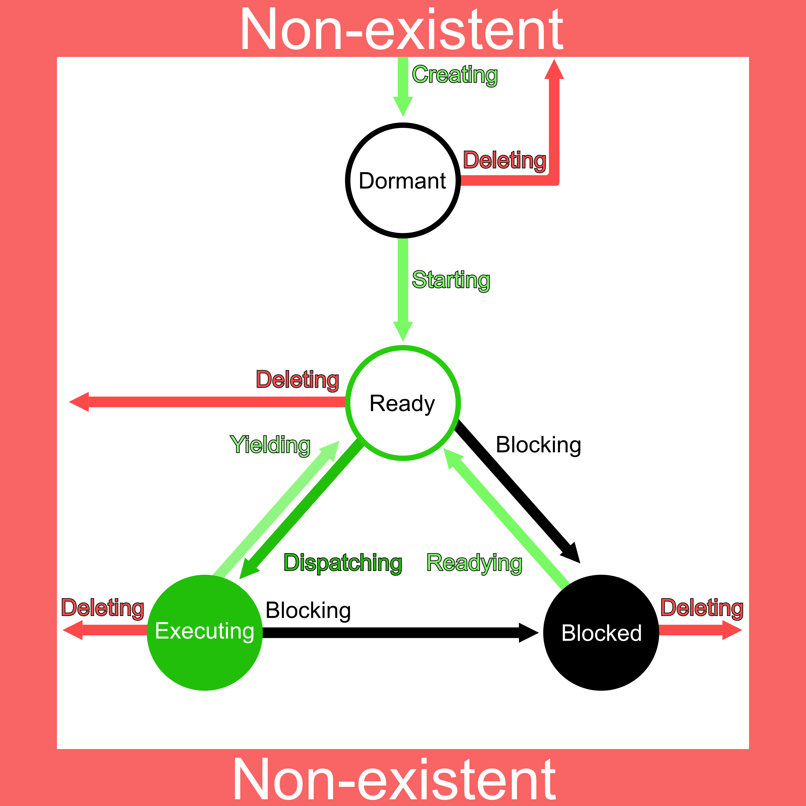

.. comment SPDX-License-Identifier: CC-BY-SA-4.0

.. COMMENT: COPYRIGHT (c) 1988-2008.
.. COMMENT: On-Line Applications Research Corporation (OAR).
.. COMMENT: All rights reserved.

Scheduling Concepts
*******************

.. index:: scheduling
.. index:: task scheduling

Introduction
============

The concept of scheduling in real-time systems dictates the ability to provide
immediate response to specific external events, particularly the necessity of
scheduling tasks to run within a specified time limit after the occurrence of
an event.  For example, software embedded in life-support systems used to
monitor hospital patients must take instant action if a change in the patient's
status is detected.

The component of RTEMS responsible for providing this capability is
appropriately called the scheduler.  The scheduler's sole purpose is to
allocate the all important resource of processor time to the various tasks
competing for attention.

The directives provided by the scheduler manager are:

- rtems_scheduler_ident_ - Get ID of a scheduler

- rtems_scheduler_get_processor_set_ - Get processor set of a scheduler

- rtems_scheduler_add_processor_ - Add processor to a scheduler

- rtems_scheduler_remove_processor_ - Remove processor from a scheduler

Scheduling Algorithms
=====================

.. index:: scheduling algorithms

RTEMS provides a plugin framework which allows it to support multiple
scheduling algorithms. RTEMS now includes multiple scheduling algorithms in the
SuperCore and the user can select which of these they wish to use in their
application.  In addition, the user can implement their own scheduling
algorithm and configure RTEMS to use it.

Supporting multiple scheduling algorithms gives the end user the option to
select the algorithm which is most appropriate to their use case. Most
real-time operating systems schedule tasks using a priority based algorithm,
possibly with preemption control.  The classic RTEMS scheduling algorithm which
was the only algorithm available in RTEMS 4.10 and earlier, is a priority based
scheduling algorithm.  This scheduling algoritm is suitable for single core
(e.g. non-SMP) systems and is now known as the *Deterministic Priority
Scheduler*.  Unless the user configures another scheduling algorithm, RTEMS
will use this on single core systems.

Priority Scheduling
-------------------
.. index:: priority scheduling

When using priority based scheduling, RTEMS allocates the processor using a
priority-based, preemptive algorithm augmented to provide round-robin
characteristics within individual priority groups.  The goal of this algorithm
is to guarantee that the task which is executing on the processor at any point
in time is the one with the highest priority among all tasks in the ready
state.

When a task is added to the ready chain, it is placed behind all other tasks of
the same priority.  This rule provides a round-robin within priority group
scheduling characteristic.  This means that in a group of equal priority tasks,
tasks will execute in the order they become ready or FIFO order.  Even though
there are ways to manipulate and adjust task priorities, the most important
rule to remember is:

.. note::

  Priority based scheduling algorithms will always select the highest priority
  task that is ready to run when allocating the processor to a task.

Priority scheduling is the most commonly used scheduling algorithm.  It should
be used by applications in which multiple tasks contend for CPU time or other
resources and there is a need to ensure certain tasks are given priority over
other tasks.

There are a few common methods of accomplishing the mechanics of this
algorithm.  These ways involve a list or chain of tasks in the ready state.

- The least efficient method is to randomly place tasks in the ready chain
  forcing the scheduler to scan the entire chain to determine which task
  receives the processor.

- A more efficient method is to schedule the task by placing it in the proper
  place on the ready chain based on the designated scheduling criteria at the
  time it enters the ready state.  Thus, when the processor is free, the first
  task on the ready chain is allocated the processor.

- Another mechanism is to maintain a list of FIFOs per priority.  When a task
  is readied, it is placed on the rear of the FIFO for its priority.  This
  method is often used with a bitmap to assist in locating which FIFOs have
  ready tasks on them.

RTEMS currently includes multiple priority based scheduling algorithms as well
as other algorithms which incorporate deadline.  Each algorithm is discussed in
the following sections.

Deterministic Priority Scheduler
--------------------------------

This is the scheduler implementation which has always been in RTEMS.  After the
4.10 release series, it was factored into pluggable scheduler selection.  It
schedules tasks using a priority based algorithm which takes into account
preemption.  It is implemented using an array of FIFOs with a FIFO per
priority.  It maintains a bitmap which is used to track which priorities have
ready tasks.

This algorithm is deterministic (e.g. predictable and fixed) in execution time.
This comes at the cost of using slightly over three (3) kilobytes of RAM on a
system configured to support 256 priority levels.

This scheduler is only aware of a single core.

Simple Priority Scheduler
-------------------------

This scheduler implementation has the same behaviour as the Deterministic
Priority Scheduler but uses only one linked list to manage all ready tasks.
When a task is readied, a linear search of that linked list is performed to
determine where to insert the newly readied task.

This algorithm uses much less RAM than the Deterministic Priority Scheduler but
is *O(n)* where *n* is the number of ready tasks.  In a small system with a
small number of tasks, this will not be a performance issue.  Reducing RAM
consumption is often critical in small systems which are incapable of
supporting a large number of tasks.

This scheduler is only aware of a single core.

Simple SMP Priority Scheduler
-----------------------------

This scheduler is based upon the Simple Priority Scheduler and is designed to
have the same behaviour on a single core system.  But this scheduler is capable
of scheduling threads across multiple cores in an SMP system.  When given a
choice of replacing one of two threads at equal priority on different cores,
this algorithm favors replacing threads which are preemptible and have executed
the longest.

This algorithm is non-deterministic. When scheduling, it must consider which
tasks are to be executed on each core while avoiding superfluous task
migrations.

Earliest Deadline First Scheduler
---------------------------------
.. index:: earliest deadline first scheduling

This is an alternative scheduler in RTEMS for single core applications.  The
primary EDF advantage is high total CPU utilization (theoretically up to
100%). It assumes that tasks have priorities equal to deadlines.

This EDF is initially preemptive, however, individual tasks may be declared
not-preemptive. Deadlines are declared using only Rate Monotonic manager which
goal is to handle periodic behavior. Period is always equal to deadline. All
ready tasks reside in a single ready queue implemented using a red-black tree.

This implementation of EDF schedules two different types of task priority types
while each task may switch between the two types within its execution. If a
task does have a deadline declared using the Rate Monotonic manager, the task
is deadline-driven and its priority is equal to deadline.  On the contrary if a
task does not have any deadline or the deadline is cancelled using the Rate
Monotonic manager, the task is considered a background task with priority equal
to that assigned upon initialization in the same manner as for priority
scheduler. Each background task is of a lower importance than each
deadline-driven one and is scheduled when no deadline-driven task and no higher
priority background task is ready to run.

Every deadline-driven scheduling algorithm requires means for tasks to claim a
deadline.  The Rate Monotonic Manager is responsible for handling periodic
execution. In RTEMS periods are equal to deadlines, thus if a task announces a
period, it has to be finished until the end of this period. The call of
``rtems_rate_monotonic_period`` passes the scheduler the length of oncoming
deadline. Moreover, the ``rtems_rate_monotonic_cancel`` and
``rtems_rate_monotonic_delete`` calls clear the deadlines assigned to the task.

Earliest Deadline First SMP Scheduler
-------------------------------------

An EDF scheduler with SMP support.  The processors managed by this scheduler
are allocated to the highest priority (earliest deadline) tasks which are ready
to execute.

Constant Bandwidth Server Scheduling (CBS)
------------------------------------------
.. index:: constant bandwidth server scheduling

This is an alternative scheduler in RTEMS for single core applications.  The
CBS is a budget aware extension of EDF scheduler. The main goal of this
scheduler is to ensure temporal isolation of tasks meaning that a task's
execution in terms of meeting deadlines must not be influenced by other tasks
as if they were run on multiple independent processors.

Each task can be assigned a server (current implementation supports only one
task per server). The server is characterized by period (deadline) and
computation time (budget). The ratio budget/period yields bandwidth, which is
the fraction of CPU to be reserved by the scheduler for each subsequent period.

The CBS is equipped with a set of rules applied to tasks attached to servers
ensuring that deadline miss because of another task cannot occur.  In case a
task breaks one of the rules, its priority is pulled to background until the
end of its period and then restored again. The rules are:

- Task cannot exceed its registered budget,

- Task cannot be unblocked when a ratio between remaining budget and remaining
  deadline is higher than declared bandwidth.

The CBS provides an extensive API. Unlike EDF, the
``rtems_rate_monotonic_period`` does not declare a deadline because it is
carried out using CBS API. This call only announces next period.

Scheduling Modification Mechanisms
==================================

.. index:: scheduling mechanisms

RTEMS provides four mechanisms which allow the user to alter the task
scheduling decisions:

- user-selectable task priority level

- task preemption control

- task timeslicing control

- manual round-robin selection

Each of these methods provides a powerful capability to customize sets of tasks
to satisfy the unique and particular requirements encountered in custom
real-time applications.  Although each mechanism operates independently, there
is a precedence relationship which governs the effects of scheduling
modifications.  The evaluation order for scheduling characteristics is always
priority, preemption mode, and timeslicing.  When reading the descriptions of
timeslicing and manual round-robin it is important to keep in mind that
preemption (if enabled) of a task by higher priority tasks will occur as
required, overriding the other factors presented in the description.

Task Priority and Scheduling
----------------------------
.. index:: task priority

The most significant task scheduling modification mechanism is the ability for
the user to assign a priority level to each individual task when it is created
and to alter a task's priority at run-time.  RTEMS supports up to 255 priority
levels.  Level 255 is the lowest priority and level 1 is the highest.

Preemption
----------
.. index:: preemption

Another way the user can alter the basic scheduling algorithm is by
manipulating the preemption mode flag (``RTEMS_PREEMPT_MASK``) of individual
tasks.  If preemption is disabled for a task (``RTEMS_NO_PREEMPT``), then the
task will not relinquish control of the processor until it terminates, blocks,
or re-enables preemption.  Even tasks which become ready to run and possess
higher priority levels will not be allowed to execute.  Note that the
preemption setting has no effect on the manner in which a task is scheduled.
It only applies once a task has control of the processor.

Timeslicing
-----------
.. index:: timeslicing
.. index:: round robin scheduling

Timeslicing or round-robin scheduling is an additional method which can be used
to alter the basic scheduling algorithm.  Like preemption, timeslicing is
specified on a task by task basis using the timeslicing mode flag
(``RTEMS_TIMESLICE_MASK``).  If timeslicing is enabled for a task
(``RTEMS_TIMESLICE``), then RTEMS will limit the amount of time the task can
execute before the processor is allocated to another task.  Each tick of the
real-time clock reduces the currently running task's timeslice.  When the
execution time equals the timeslice, RTEMS will dispatch another task of the
same priority to execute.  If there are no other tasks of the same priority
ready to execute, then the current task is allocated an additional timeslice
and continues to run.  Remember that a higher priority task will preempt the
task (unless preemption is disabled) as soon as it is ready to run, even if the
task has not used up its entire timeslice.

Manual Round-Robin
------------------
.. index:: manual round robin

The final mechanism for altering the RTEMS scheduling algorithm is called
manual round-robin.  Manual round-robin is invoked by using
the ``rtems_task_wake_after`` directive with a time interval of
``RTEMS_YIELD_PROCESSOR``.  This allows a task to give up the processor and be
immediately returned to the ready chain at the end of its priority group.  If
no other tasks of the same priority are ready to run, then the task does not
lose control of the processor.

Dispatching Tasks
=================
.. index:: dispatching

The dispatcher is the RTEMS component responsible for allocating the processor
to a ready task.  In order to allocate the processor to one task, it must be
deallocated or retrieved from the task currently using it.  This involves a
concept called a context switch.  To perform a context switch, the dispatcher
saves the context of the current task and restores the context of the task
which has been allocated to the processor.  Saving and restoring a task's
context is the storing/loading of all the essential information about a task to
enable it to continue execution without any effects of the interruption.  For
example, the contents of a task's register set must be the same when it is
given the processor as they were when it was taken away.  All of the
information that must be saved or restored for a context switch is located
either in the TCB or on the task's stacks.

Tasks that utilize a numeric coprocessor and are created with the
``RTEMS_FLOATING_POINT`` attribute require additional operations during a
context switch.  These additional operations are necessary to save and restore
the floating point context of ``RTEMS_FLOATING_POINT`` tasks.  To avoid
unnecessary save and restore operations, the state of the numeric coprocessor
is only saved when a ``RTEMS_FLOATING_POINT`` task is dispatched and that task
was not the last task to utilize the coprocessor.

Task State Transitions
======================
.. index:: task state transitions

Tasks in an RTEMS system must always be in one of the five allowable task
states.  These states are: executing, ready, blocked, dormant, and
non-existent.

A task occupies the non-existent state before a ``rtems_task_create`` has been
issued on its behalf.  A task enters the non-existent state from any other
state in the system when it is deleted with the ``rtems_task_delete``
directive.  While a task occupies this state it does not have a TCB or a task
ID assigned to it; therefore, no other tasks in the system may reference this
task.

When a task is created via the ``rtems_task_create`` directive it enters the
dormant state.  This state is not entered through any other means.  Although
the task exists in the system, it cannot actively compete for system resources.
It will remain in the dormant state until it is started via the
``rtems_task_start`` directive, at which time it enters the ready state.  The
task is now permitted to be scheduled for the processor and to compete for
other system resources.

A task occupies the blocked state whenever it is unable to be scheduled to run.
A running task may block itself or be blocked by other tasks in the system.
The running task blocks itself through voluntary operations that cause the task
to wait.  The only way a task can block a task other than itself is with the
``rtems_task_suspend`` directive.  A task enters the blocked state due to any
of the following conditions:

- A task issues a ``rtems_task_suspend`` directive which blocks either itself
  or another task in the system.

- The running task issues a ``rtems_barrier_wait`` directive.

- The running task issues a ``rtems_message_queue_receive`` directive with the
  wait option and the message queue is empty.

- The running task issues an ``rtems_event_receive`` directive with the wait
  option and the currently pending events do not satisfy the request.

- The running task issues a ``rtems_semaphore_obtain`` directive with the wait
  option and the requested semaphore is unavailable.

- The running task issues a ``rtems_task_wake_after`` directive which blocks
  the task for the given time interval.  If the time interval specified is
  zero, the task yields the processor and remains in the ready state.

- The running task issues a ``rtems_task_wake_when`` directive which blocks the
  task until the requested date and time arrives.

- The running task issues a ``rtems_rate_monotonic_period`` directive and must
  wait for the specified rate monotonic period to conclude.

- The running task issues a ``rtems_region_get_segment`` directive with the
  wait option and there is not an available segment large enough to satisfy the
  task's request.

A blocked task may also be suspended.  Therefore, both the suspension and the
blocking condition must be removed before the task becomes ready to run again.

A task occupies the ready state when it is able to be scheduled to run, but
currently does not have control of the processor.  Tasks of the same or higher
priority will yield the processor by either becoming blocked, completing their
timeslice, or being deleted.  All tasks with the same priority will execute in
FIFO order.  A task enters the ready state due to any of the following
conditions:

- A running task issues a ``rtems_task_resume`` directive for a task that is
  suspended and the task is not blocked waiting on any resource.

- A running task issues a ``rtems_message_queue_send``,
  ``rtems_message_queue_broadcast``, or a ``rtems_message_queue_urgent``
  directive which posts a message to the queue on which the blocked task is
  waiting.

- A running task issues an ``rtems_event_send`` directive which sends an event
  condition to a task which is blocked waiting on that event condition.

- A running task issues a ``rtems_semaphore_release`` directive which releases
  the semaphore on which the blocked task is waiting.

- A timeout interval expires for a task which was blocked by a call to the
  ``rtems_task_wake_after`` directive.

- A timeout period expires for a task which blocked by a call to the
  ``rtems_task_wake_when`` directive.

- A running task issues a ``rtems_region_return_segment`` directive which
  releases a segment to the region on which the blocked task is waiting and a
  resulting segment is large enough to satisfy the task's request.

- A rate monotonic period expires for a task which blocked by a call to the
  ``rtems_rate_monotonic_period`` directive.

- A timeout interval expires for a task which was blocked waiting on a message,
  event, semaphore, or segment with a timeout specified.

- A running task issues a directive which deletes a message queue, a semaphore,
  or a region on which the blocked task is waiting.

- A running task issues a ``rtems_task_restart`` directive for the blocked
  task.

- The running task, with its preemption mode enabled, may be made ready by
  issuing any of the directives that may unblock a task with a higher priority.
  This directive may be issued from the running task itself or from an ISR.  A
  ready task occupies the executing state when it has control of the CPU.  A
  task enters the executing state due to any of the following conditions:

- The task is the highest priority ready task in the system.

- The running task blocks and the task is next in the scheduling queue.  The
  task may be of equal priority as in round-robin scheduling or the task may
  possess the highest priority of the remaining ready tasks.

- The running task may reenable its preemption mode and a task exists in the
  ready queue that has a higher priority than the running task.

- The running task lowers its own priority and another task is of higher
  priority as a result.

- The running task raises the priority of a task above its own and the running
  task is in preemption mode.

Directives
==========

This section details the scheduler manager.  A subsection is dedicated to each
of these services and describes the calling sequence, related constants, usage,
and status codes.

.. raw:: latex

   \clearpage

.. _rtems_scheduler_ident:

SCHEDULER_IDENT - Get ID of a scheduler
---------------------------------------

CALLING SEQUENCE:
    .. code-block:: c

        rtems_status_code rtems_scheduler_ident(
            rtems_name  name,
            rtems_id   *id
        );

DIRECTIVE STATUS CODES:
    .. list-table::
     :class: rtems-table

     * - ``RTEMS_SUCCESSFUL``
       - Successful operation.
     * - ``RTEMS_INVALID_ADDRESS``
       - The ``id`` parameter is ``NULL``.
     * - ``RTEMS_INVALID_NAME``
       - Invalid scheduler name.

DESCRIPTION:
    Identifies a scheduler by its name.  The scheduler name is determined by
    the scheduler configuration.  See :ref:`Configuring Clustered Schedulers`
    and :ref:`Configuring a Scheduler Name`.

NOTES:
    None.

.. raw:: latex

   \clearpage

.. _rtems_scheduler_get_processor_set:

SCHEDULER_GET_PROCESSOR_SET - Get processor set of a scheduler
--------------------------------------------------------------

CALLING SEQUENCE:
    .. code-block:: c

        rtems_status_code rtems_scheduler_get_processor_set(
            rtems_id   scheduler_id,
            size_t     cpusetsize,
            cpu_set_t *cpuset
        );

DIRECTIVE STATUS CODES:
    .. list-table::
     :class: rtems-table

     * - ``RTEMS_SUCCESSFUL``
       - Successful operation.
     * - ``RTEMS_INVALID_ID``
       - Invalid scheduler instance identifier.
     * - ``RTEMS_INVALID_ADDRESS``
       - The ``cpuset`` parameter is ``NULL``.
     * - ``RTEMS_INVALID_NUMBER``
       - The processor set buffer is too small for the set of processors owned
         by the scheduler instance.

DESCRIPTION:
    Returns the processor set owned by the scheduler instance in ``cpuset``.  A
    set bit in the processor set means that this processor is owned by the
    scheduler instance and a cleared bit means the opposite.

NOTES:
    None.

.. raw:: latex

   \clearpage

.. _rtems_scheduler_add_processor:

SCHEDULER_ADD_PROCESSOR - Add processor to a scheduler
------------------------------------------------------

CALLING SEQUENCE:
    .. code-block:: c

        rtems_status_code rtems_scheduler_add_processor(
            rtems_id scheduler_id,
            uint32_t cpu_index
        );

DIRECTIVE STATUS CODES:
    .. list-table::
     :class: rtems-table

     * - ``RTEMS_SUCCESSFUL``
       - Successful operation.
     * - ``RTEMS_INVALID_ID``
       - Invalid scheduler instance identifier.
     * - ``RTEMS_NOT_CONFIGURED``
       - The processor is not configured to be used by the application.
     * - ``RTEMS_INCORRECT_STATE``
       - The processor is configured to be used by the application, however, it
         is not online.
     * - ``RTEMS_RESOURCE_IN_USE``
       - The processor is already assigned to a scheduler instance.

DESCRIPTION:
    Adds a processor to the set of processors owned by the specified scheduler
    instance.

NOTES:
    Must be called from task context.  This operation obtains and releases the
    objects allocator lock.

.. raw:: latex

   \clearpage

.. _rtems_scheduler_remove_processor:

SCHEDULER_REMOVE_PROCESSOR - Remove processor from a scheduler
--------------------------------------------------------------

CALLING SEQUENCE:
    .. code-block:: c

        rtems_status_code rtems_scheduler_remove_processor(
            rtems_id scheduler_id,
            uint32_t cpu_index
        );

DIRECTIVE STATUS CODES:
    .. list-table::
     :class: rtems-table

     * - ``RTEMS_SUCCESSFUL``
       - Successful operation.
     * - ``RTEMS_INVALID_ID``
       - Invalid scheduler instance identifier.
     * - ``RTEMS_INVALID_NUMBER``
       - The processor is not owned by the specified scheduler instance.
     * - ``RTEMS_RESOURCE_IN_USE``
       - The set of processors owned by the specified scheduler instance would
         be empty after the processor removal and there exists a non-idle task
         that uses this scheduler instance as its home scheduler instance.

DESCRIPTION:
    Removes a processor from set of processors owned by the specified scheduler
    instance.

NOTES:
    Must be called from task context.  This operation obtains and releases the
    objects allocator lock.  Removing a processor from a scheduler is a complex
    operation that involves all tasks of the system.
