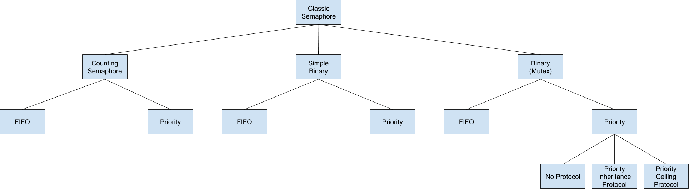

.. comment SPDX-License-Identifier: CC-BY-SA-4.0

.. Copyright (C) 1988, 2008 On-Line Applications Research Corporation (OAR)
.. COMMENT: All rights reserved.

.. index:: semaphores
.. index:: binary semaphores
.. index:: counting semaphores
.. index:: mutual exclusion

Semaphore Manager
*****************

Introduction
============

The semaphore manager utilizes standard Dijkstra
counting semaphores to provide synchronization and mutual
exclusion capabilities.  The directives provided by the
semaphore manager are:

- rtems_semaphore_create_ - Create a semaphore

- rtems_semaphore_ident_ - Get ID of a semaphore

- rtems_semaphore_delete_ - Delete a semaphore

- rtems_semaphore_obtain_ - Acquire a semaphore

- rtems_semaphore_release_ - Release a semaphore

- rtems_semaphore_flush_ - Unblock all tasks waiting on a semaphore

- rtems_semaphore_set_priority_ - Set priority by scheduler for a semaphore

Background
==========

A semaphore can be viewed as a protected variable whose value can be modified
only with the ``rtems_semaphore_create``, ``rtems_semaphore_obtain``, and
``rtems_semaphore_release`` directives.  RTEMS supports both binary and
counting semaphores. A binary semaphore is restricted to values of zero or one,
while a counting semaphore can assume any non-negative integer value.

A binary semaphore (not a simple binary semaphore) can be used to control
access to a single resource.  In particular, it can be used to enforce mutual
exclusion for a critical section in user code (mutex).  In this instance, the
semaphore would be created with an initial count of one to indicate that no
task is executing the critical section of code.  Upon entry to the critical
section, a task must issue the ``rtems_semaphore_obtain`` directive to prevent
other tasks from entering the critical section.  Upon exit from the critical
section, the task that obtained the binary semaphore must issue the
``rtems_semaphore_release`` directive to allow another task to execute the
critical section.  A binary semaphore must be released by the task that
obtained it.

A counting semaphore can be used to control access to a pool of two or more
resources.  For example, access to three printers could be administered by a
semaphore created with an initial count of three.  When a task requires access
to one of the printers, it issues the ``rtems_semaphore_obtain`` directive to
obtain access to a printer.  If a printer is not currently available, the task
can wait for a printer to become available or return immediately.  When the
task has completed printing, it should issue the ``rtems_semaphore_release``
directive to allow other tasks access to the printer.

Task synchronization may be achieved by creating a semaphore with an initial
count of zero.  One task waits for the arrival of another task by issuing a
``rtems_semaphore_obtain`` directive when it reaches a synchronization point.
The other task performs a corresponding ``rtems_semaphore_release`` operation
when it reaches its synchronization point, thus unblocking the pending task.

.. _Nested Resource Access:

Nested Resource Access
----------------------

Deadlock occurs when a task owning a binary semaphore attempts to acquire that
same semaphore and blocks as result.  Since the semaphore is allocated to a
task, it cannot be deleted.  Therefore, the task that currently holds the
semaphore and is also blocked waiting for that semaphore will never execute
again.

RTEMS addresses this problem by allowing the task holding the binary semaphore
to obtain the same binary semaphore multiple times in a nested manner.  Each
``rtems_semaphore_obtain`` must be accompanied with a
``rtems_semaphore_release``.  The semaphore will only be made available for
acquisition by other tasks when the outermost ``rtems_semaphore_obtain`` is
matched with a ``rtems_semaphore_release``.

Simple binary semaphores do not allow nested access and so can be used for task
synchronization.

.. _Priority Inheritance:

Priority Inheritance
--------------------

RTEMS supports :ref:`priority inheritance <PriorityInheritance>` for local,
binary semaphores that use the priority task wait queue blocking discipline.
In SMP configurations, the :ref:`OMIP` is used instead.

.. _Priority Ceiling:

Priority Ceiling
----------------

RTEMS supports :ref:`priority ceiling <PriorityCeiling>` for local, binary
semaphores that use the priority task wait queue blocking discipline.

.. _Multiprocessor Resource Sharing Protocol:

Multiprocessor Resource Sharing Protocol
----------------------------------------

RTEMS supports the :ref:`MrsP` for local, binary semaphores that use the
priority task wait queue blocking discipline.  In uniprocessor configurations,
the :ref:`PriorityCeiling` is used instead.

.. _Building a Semaphore Attribute Set:

Building a Semaphore Attribute Set
----------------------------------

In general, an attribute set is built by a bitwise OR of the desired attribute
components.  The following table lists the set of valid semaphore attributes:

.. list-table::
 :class: rtems-table

 * - ``RTEMS_FIFO``
   - tasks wait by FIFO (default)
 * - ``RTEMS_PRIORITY``
   - tasks wait by priority
 * - ``RTEMS_BINARY_SEMAPHORE``
   - restrict values to 0 and 1
 * - ``RTEMS_COUNTING_SEMAPHORE``
   - no restriction on values (default)
 * - ``RTEMS_SIMPLE_BINARY_SEMAPHORE``
   - restrict values to 0 and 1, do not allow nested access, allow deletion of
     locked semaphore.
 * - ``RTEMS_NO_INHERIT_PRIORITY``
   - do not use priority inheritance (default)
 * - ``RTEMS_INHERIT_PRIORITY``
   - use priority inheritance
 * - ``RTEMS_NO_PRIORITY_CEILING``
   - do not use priority ceiling (default)
 * - ``RTEMS_PRIORITY_CEILING``
   - use priority ceiling
 * - ``RTEMS_NO_MULTIPROCESSOR_RESOURCE_SHARING``
   - do not use Multiprocessor Resource Sharing Protocol (default)
 * - ``RTEMS_MULTIPROCESSOR_RESOURCE_SHARING``
   - use Multiprocessor Resource Sharing Protocol
 * - ``RTEMS_LOCAL``
   - local semaphore (default)
 * - ``RTEMS_GLOBAL``
   - global semaphore

Attribute values are specifically designed to be mutually exclusive, therefore
bitwise OR and addition operations are equivalent as long as each attribute
appears exactly once in the component list.  An attribute listed as a default
is not required to appear in the attribute list, although it is a good
programming practice to specify default attributes.  If all defaults are
desired, the attribute ``RTEMS_DEFAULT_ATTRIBUTES`` should be specified on this
call.

This example demonstrates the attribute_set parameter needed to create a local
semaphore with the task priority waiting queue discipline.  The attribute_set
parameter passed to the ``rtems_semaphore_create`` directive could be either
``RTEMS_PRIORITY`` or ``RTEMS_LOCAL | RTEMS_PRIORITY``.  The attribute_set
parameter can be set to ``RTEMS_PRIORITY`` because ``RTEMS_LOCAL`` is the
default for all created tasks.  If a similar semaphore were to be known
globally, then the attribute_set parameter would be ``RTEMS_GLOBAL |
RTEMS_PRIORITY``.

Some combinatinos of these attributes are invalid.  For example, priority
ordered blocking discipline must be applied to a binary semaphore in order to
use either the priority inheritance or priority ceiling functionality.  The
following tree figure illustrates the valid combinations.

.. _Building a SEMAPHORE_OBTAIN Option Set:

Building a SEMAPHORE_OBTAIN Option Set
--------------------------------------

In general, an option is built by a bitwise OR of the desired option
components.  The set of valid options for the ``rtems_semaphore_obtain``
directive are listed in the following table:

.. list-table::
 :class: rtems-table

 * - ``RTEMS_WAIT``
   - task will wait for semaphore (default)
 * - ``RTEMS_NO_WAIT``
   - task should not wait

Option values are specifically designed to be mutually exclusive, therefore
bitwise OR and addition operations are equivalent as long as each attribute
appears exactly once in the component list.  An option listed as a default is
not required to appear in the list, although it is a good programming practice
to specify default options.  If all defaults are desired, the option
``RTEMS_DEFAULT_OPTIONS`` should be specified on this call.

This example demonstrates the option parameter needed to poll for a semaphore.
The option parameter passed to the ``rtems_semaphore_obtain`` directive should
be ``RTEMS_NO_WAIT``.

Operations
==========

.. _Creating a Semaphore:

Creating a Semaphore
--------------------

The ``rtems_semaphore_create`` directive creates a binary or counting semaphore
with a user-specified name as well as an initial count.  If a binary semaphore
is created with a count of zero (0) to indicate that it has been allocated,
then the task creating the semaphore is considered the current holder of the
semaphore.  At create time the method for ordering waiting tasks in the
semaphore's task wait queue (by FIFO or task priority) is specified.
Additionally, the priority inheritance or priority ceiling algorithm may be
selected for local, binary semaphores that use the priority task wait queue
blocking discipline.  If the priority ceiling algorithm is selected, then the
highest priority of any task which will attempt to obtain this semaphore must
be specified.  RTEMS allocates a Semaphore Control Block (SMCB) from the SMCB
free list.  This data structure is used by RTEMS to manage the newly created
semaphore.  Also, a unique semaphore ID is generated and returned to the
calling task.

.. _Obtaining Semaphore IDs:

Obtaining Semaphore IDs
-----------------------

When a semaphore is created, RTEMS generates a unique semaphore ID and assigns
it to the created semaphore until it is deleted.  The semaphore ID may be
obtained by either of two methods.  First, as the result of an invocation of
the ``rtems_semaphore_create`` directive, the semaphore ID is stored in a user
provided location.  Second, the semaphore ID may be obtained later using the
``rtems_semaphore_ident`` directive.  The semaphore ID is used by other
semaphore manager directives to access this semaphore.

.. _Acquiring a Semaphore:

Acquiring a Semaphore
---------------------

The ``rtems_semaphore_obtain`` directive is used to acquire the
specified semaphore.  A simplified version of the ``rtems_semaphore_obtain``
directive can be described as follows:

    If the semaphore's count is greater than zero then decrement the
    semaphore's count else wait for release of semaphore then return
    SUCCESSFUL.

When the semaphore cannot be immediately acquired, one of the following
situations applies:

- By default, the calling task will wait forever to acquire the semaphore.

- Specifying ``RTEMS_NO_WAIT`` forces an immediate return with an error status
  code.

- Specifying a timeout limits the interval the task will wait before returning
  with an error status code.

If the task waits to acquire the semaphore, then it is placed in the
semaphore's task wait queue in either FIFO or task priority order.  If the task
blocked waiting for a binary semaphore using priority inheritance and the
task's priority is greater than that of the task currently holding the
semaphore, then the holding task will inherit the priority of the blocking
task.  All tasks waiting on a semaphore are returned an error code when the
semaphore is deleted.

When a task successfully obtains a semaphore using priority ceiling and the
priority ceiling for this semaphore is greater than that of the holder, then
the holder's priority will be elevated.

.. _Releasing a Semaphore:

Releasing a Semaphore
---------------------

The ``rtems_semaphore_release`` directive is used to release the specified
semaphore.  A simplified version of the ``rtems_semaphore_release`` directive
can be described as follows:

    If there are no tasks are waiting on this semaphore then increment the
    semaphore's count else assign semaphore to a waiting task and return
    SUCCESSFUL.

If this is the outermost release of a binary semaphore that uses priority
inheritance or priority ceiling and the task does not currently hold any other
binary semaphores, then the task performing the ``rtems_semaphore_release``
will have its priority restored to its normal value.

.. _Deleting a Semaphore:

Deleting a Semaphore
--------------------

The ``rtems_semaphore_delete`` directive removes a semaphore from the system
and frees its control block.  A semaphore can be deleted by any local task that
knows the semaphore's ID.  As a result of this directive, all tasks blocked
waiting to acquire the semaphore will be readied and returned a status code
which indicates that the semaphore was deleted.  Any subsequent references to
the semaphore's name and ID are invalid.

Directives
==========

This section details the semaphore manager's directives.  A subsection is
dedicated to each of this manager's directives and describes the calling
sequence, related constants, usage, and status codes.

.. raw:: latex

   \clearpage

.. index:: create a semaphore
.. index:: rtems_semaphore_create

.. _rtems_semaphore_create:

SEMAPHORE_CREATE - Create a semaphore
-------------------------------------

CALLING SEQUENCE:
    .. code-block:: c

        rtems_status_code rtems_semaphore_create(
            rtems_name           name,
            uint32_t             count,
            rtems_attribute      attribute_set,
            rtems_task_priority  priority_ceiling,
            rtems_id            *id
        );

DIRECTIVE STATUS CODES:
    .. list-table::
     :class: rtems-table

     * - ``RTEMS_SUCCESSFUL``
       - semaphore created successfully
     * - ``RTEMS_INVALID_NAME``
       - invalid semaphore name
     * - ``RTEMS_INVALID_ADDRESS``
       - ``id`` is NULL
     * - ``RTEMS_TOO_MANY``
       - too many semaphores created
     * - ``RTEMS_NOT_DEFINED``
       - invalid attribute set
     * - ``RTEMS_INVALID_NUMBER``
       - invalid starting count for binary semaphore
     * - ``RTEMS_MP_NOT_CONFIGURED``
       - multiprocessing not configured
     * - ``RTEMS_TOO_MANY``
       - too many global objects

DESCRIPTION:
    This directive creates a semaphore which resides on the local node. The
    created semaphore has the user-defined name specified in name and the
    initial count specified in count.  For control and maintenance of the
    semaphore, RTEMS allocates and initializes a SMCB.  The RTEMS-assigned
    semaphore id is returned in id.  This semaphore id is used with other
    semaphore related directives to access the semaphore.

    Specifying PRIORITY in attribute_set causes tasks waiting for a semaphore
    to be serviced according to task priority.  When FIFO is selected, tasks
    are serviced in First In-First Out order.

NOTES:
    This directive will not cause the calling task to be preempted.

    The priority inheritance and priority ceiling algorithms are only supported
    for local, binary semaphores that use the priority task wait queue blocking
    discipline.

    The following semaphore attribute constants are defined by RTEMS:

    .. list-table::
     :class: rtems-table

     * - ``RTEMS_FIFO``
       - tasks wait by FIFO (default)
     * - ``RTEMS_PRIORITY``
       - tasks wait by priority
     * - ``RTEMS_BINARY_SEMAPHORE``
       - restrict values to 0 and 1
     * - ``RTEMS_COUNTING_SEMAPHORE``
       - no restriction on values (default)
     * - ``RTEMS_SIMPLE_BINARY_SEMAPHORE``
       - restrict values to 0 and 1, block on nested access, allow deletion of locked semaphore.
     * - ``RTEMS_NO_INHERIT_PRIORITY``
       - do not use priority inheritance (default)
     * - ``RTEMS_INHERIT_PRIORITY``
       - use priority inheritance
     * - ``RTEMS_NO_PRIORITY_CEILING``
       - do not use priority ceiling (default)
     * - ``RTEMS_PRIORITY_CEILING``
       - use priority ceiling
     * - ``RTEMS_NO_MULTIPROCESSOR_RESOURCE_SHARING``
       - do not use Multiprocessor Resource Sharing Protocol (default)
     * - ``RTEMS_MULTIPROCESSOR_RESOURCE_SHARING``
       - use Multiprocessor Resource Sharing Protocol
     * - ``RTEMS_LOCAL``
       - local semaphore (default)
     * - ``RTEMS_GLOBAL``
       - global semaphore

    Semaphores should not be made global unless remote tasks must interact with
    the created semaphore.  This is to avoid the system overhead incurred by
    the creation of a global semaphore.  When a global semaphore is created,
    the semaphore's name and id must be transmitted to every node in the system
    for insertion in the local copy of the global object table.

    *Note*, some combinations of attributes are not valid.  See the earlier
    discussion on this.

    The total number of global objects, including semaphores, is limited by the
    maximum_global_objects field in the Configuration Table.

    It is not allowed to create an initially locked MrsP semaphore and the
    ``RTEMS_INVALID_NUMBER`` status code will be returned in SMP configurations
    in this case.  This prevents lock order reversal problems with the
    allocator mutex.

.. raw:: latex

   \clearpage

.. index:: get ID of a semaphore
.. index:: obtain ID of a semaphore
.. index:: rtems_semaphore_ident

.. _rtems_semaphore_ident:

SEMAPHORE_IDENT - Get ID of a semaphore
---------------------------------------

CALLING SEQUENCE:
    .. code-block:: c

        rtems_status_code rtems_semaphore_ident(
            rtems_name  name,
            uint32_t    node,
            rtems_id   *id
        );

DIRECTIVE STATUS CODES:
    .. list-table::
     :class: rtems-table

     * - ``RTEMS_SUCCESSFUL``
       - semaphore identified successfully
     * - ``RTEMS_INVALID_NAME``
       - semaphore name not found
     * - ``RTEMS_INVALID_NODE``
       - invalid node id

DESCRIPTION:
    This directive obtains the semaphore id associated with the semaphore name.
    If the semaphore name is not unique, then the semaphore id will match one
    of the semaphores with that name.  However, this semaphore id is not
    guaranteed to correspond to the desired semaphore.  The semaphore id is
    used by other semaphore related directives to access the semaphore.

NOTES:
    This directive will not cause the running task to be preempted.

    If node is ``RTEMS_SEARCH_ALL_NODES``, all nodes are searched with the
    local node being searched first.  All other nodes are searched with the
    lowest numbered node searched first.

    If node is a valid node number which does not represent the local node,
    then only the semaphores exported by the designated node are searched.

    This directive does not generate activity on remote nodes.  It accesses
    only the local copy of the global object table.

.. raw:: latex

   \clearpage

.. index:: delete a semaphore
.. index:: rtems_semaphore_delete

.. _rtems_semaphore_delete:

SEMAPHORE_DELETE - Delete a semaphore
-------------------------------------

CALLING SEQUENCE:
    .. code-block:: c

        rtems_status_code rtems_semaphore_delete(
            rtems_id id
        );

DIRECTIVE STATUS CODES:
    .. list-table::
     :class: rtems-table

     * - ``RTEMS_SUCCESSFUL``
       - semaphore deleted successfully
     * - ``RTEMS_INVALID_ID``
       - invalid semaphore id
     * - ``RTEMS_RESOURCE_IN_USE``
       - binary semaphore is in use
     * - ``RTEMS_ILLEGAL_ON_REMOTE_OBJECT``
       - cannot delete remote semaphore

DESCRIPTION:
    This directive deletes the semaphore specified by ``id``.  All tasks
    blocked waiting to acquire the semaphore will be readied and returned a
    status code which indicates that the semaphore was deleted.  The SMCB for
    this semaphore is reclaimed by RTEMS.

NOTES:
    The calling task will be preempted if it is enabled by the task's execution
    mode and a higher priority local task is waiting on the deleted semaphore.
    The calling task will NOT be preempted if all of the tasks that are waiting
    on the semaphore are remote tasks.

    The calling task does not have to be the task that created the semaphore.  Any
    local task that knows the semaphore id can delete the semaphore.

    When a global semaphore is deleted, the semaphore id must be transmitted to
    every node in the system for deletion from the local copy of the global
    object table.

    The semaphore must reside on the local node, even if the semaphore was
    created with the ``RTEMS_GLOBAL`` option.

    Proxies, used to represent remote tasks, are reclaimed when the semaphore
    is deleted.

.. raw:: latex

   \clearpage

.. index:: obtain a semaphore
.. index:: lock a semaphore
.. index:: rtems_semaphore_obtain

.. _rtems_semaphore_obtain:

SEMAPHORE_OBTAIN - Acquire a semaphore
--------------------------------------

CALLING SEQUENCE:
    .. code-block:: c

        rtems_status_code rtems_semaphore_obtain(
            rtems_id        id,
            rtems_option    option_set,
            rtems_interval  timeout
        );

DIRECTIVE STATUS CODES:
    .. list-table::
     :class: rtems-table

     * - ``RTEMS_SUCCESSFUL``
       - semaphore obtained successfully
     * - ``RTEMS_UNSATISFIED``
       - semaphore not available
     * - ``RTEMS_TIMEOUT``
       - timed out waiting for semaphore
     * - ``RTEMS_OBJECT_WAS_DELETED``
       - semaphore deleted while waiting
     * - ``RTEMS_INVALID_ID``
       - invalid semaphore id

DESCRIPTION:
    This directive acquires the semaphore specified by id.  The ``RTEMS_WAIT``
    and ``RTEMS_NO_WAIT`` components of the options parameter indicate whether
    the calling task wants to wait for the semaphore to become available or
    return immediately if the semaphore is not currently available.  With
    either ``RTEMS_WAIT`` or ``RTEMS_NO_WAIT``, if the current semaphore count
    is positive, then it is decremented by one and the semaphore is
    successfully acquired by returning immediately with a successful return
    code.

    If the calling task chooses to return immediately and the current semaphore
    count is zero or negative, then a status code is returned indicating that
    the semaphore is not available. If the calling task chooses to wait for a
    semaphore and the current semaphore count is zero or negative, then it is
    decremented by one and the calling task is placed on the semaphore's wait
    queue and blocked.  If the semaphore was created with the
    ``RTEMS_PRIORITY`` attribute, then the calling task is inserted into the
    queue according to its priority.  However, if the semaphore was created
    with the ``RTEMS_FIFO`` attribute, then the calling task is placed at the
    rear of the wait queue.  If the binary semaphore was created with the
    ``RTEMS_INHERIT_PRIORITY`` attribute, then the priority of the task
    currently holding the binary semaphore is guaranteed to be greater than or
    equal to that of the blocking task.  If the binary semaphore was created
    with the ``RTEMS_PRIORITY_CEILING`` attribute, a task successfully obtains
    the semaphore, and the priority of that task is greater than the ceiling
    priority for this semaphore, then the priority of the task obtaining the
    semaphore is elevated to that of the ceiling.

    The timeout parameter specifies the maximum interval the calling task is
    willing to be blocked waiting for the semaphore.  If it is set to
    ``RTEMS_NO_TIMEOUT``, then the calling task will wait forever.  If the
    semaphore is available or the ``RTEMS_NO_WAIT`` option component is set,
    then timeout is ignored.

    In case a semaphore is not available, then ``RTEMS_UNSATISFIED`` will be
    returned.  This happens immediately in case ``RTEMS_NO_WAIT`` is specified,
    or as a result of another task invoking the ``rtems_semaphore_flush``
    directive in case ``RTEMS_WAIT`` is specified.

    Deadlock situations are detected for MrsP semaphores and the
    ``RTEMS_UNSATISFIED`` status code will be returned in SMP configurations in
    this case.

NOTES:
    The following semaphore acquisition option constants are defined by RTEMS:

    .. list-table::
     :class: rtems-table

     * - ``RTEMS_WAIT``
       - task will wait for semaphore (default)
     * - ``RTEMS_NO_WAIT``
       - task should not wait

    Attempting to obtain a global semaphore which does not reside on the local
    node will generate a request to the remote node to access the semaphore.
    If the semaphore is not available and ``RTEMS_NO_WAIT`` was not specified,
    then the task must be blocked until the semaphore is released.  A proxy is
    allocated on the remote node to represent the task until the semaphore is
    released.

    A clock tick is required to support the timeout functionality of this
    directive.

    It is not allowed to obtain a MrsP semaphore more than once by one task at
    a time (nested access) and the ``RTEMS_UNSATISFIED`` status code will be
    returned in SMP configurations in this case.

.. raw:: latex

   \clearpage

.. index:: release a semaphore
.. index:: unlock a semaphore
.. index:: rtems_semaphore_release

.. _rtems_semaphore_release:

SEMAPHORE_RELEASE - Release a semaphore
---------------------------------------

CALLING SEQUENCE:
    .. code-block:: c

        rtems_status_code rtems_semaphore_release(
            rtems_id id
        );

DIRECTIVE STATUS CODES:
    .. list-table::
     :class: rtems-table

     * - ``RTEMS_SUCCESSFUL``
       - semaphore released successfully
     * - ``RTEMS_INVALID_ID``
       - invalid semaphore id
     * - ``RTEMS_NOT_OWNER_OF_RESOURCE``
       - calling task does not own semaphore
     * - ``RTEMS_INCORRECT_STATE``
       - invalid unlock order

DESCRIPTION:
    This directive releases the semaphore specified by id.  The semaphore count
    is incremented by one.  If the count is zero or negative, then the first
    task on this semaphore's wait queue is removed and unblocked.  The
    unblocked task may preempt the running task if the running task's
    preemption mode is enabled and the unblocked task has a higher priority
    than the running task.

NOTES:
    The calling task may be preempted if it causes a higher priority task to be
    made ready for execution.

    Releasing a global semaphore which does not reside on the local node will
    generate a request telling the remote node to release the semaphore.

    If the task to be unblocked resides on a different node from the semaphore,
    then the semaphore allocation is forwarded to the appropriate node, the
    waiting task is unblocked, and the proxy used to represent the task is
    reclaimed.

    The outermost release of a local, binary, priority inheritance or priority
    ceiling semaphore may result in the calling task having its priority
    lowered.  This will occur if the calling task holds no other binary
    semaphores and it has inherited a higher priority.

    The MrsP semaphores must be released in the reversed obtain order,
    otherwise the ``RTEMS_INCORRECT_STATE`` status code will be returned in SMP
    configurations in this case.

.. raw:: latex

   \clearpage

.. index:: flush a semaphore
.. index:: unblock all tasks waiting on a semaphore
.. index:: rtems_semaphore_flush

.. _rtems_semaphore_flush:

SEMAPHORE_FLUSH - Unblock all tasks waiting on a semaphore
----------------------------------------------------------

CALLING SEQUENCE:
    .. code-block:: c

        rtems_status_code rtems_semaphore_flush(
            rtems_id id
        );

DIRECTIVE STATUS CODES:
    .. list-table::
     :class: rtems-table

     * - ``RTEMS_SUCCESSFUL``
       - semaphore released successfully
     * - ``RTEMS_INVALID_ID``
       - invalid semaphore id
     * - ``RTEMS_NOT_DEFINED``
       - operation not defined for the protocol of the semaphore
     * - ``RTEMS_ILLEGAL_ON_REMOTE_OBJECT``
       - not supported for remote semaphores

DESCRIPTION:
    This directive unblocks all tasks waiting on the semaphore specified by id.
    Since there are tasks blocked on the semaphore, the semaphore's count is
    not changed by this directive and thus is zero before and after this
    directive is executed.  Tasks which are unblocked as the result of this
    directive will return from the ``rtems_semaphore_obtain`` directive with a
    status code of ``RTEMS_UNSATISFIED`` to indicate that the semaphore was not
    obtained.

    This directive may unblock any number of tasks.  Any of the unblocked tasks
    may preempt the running task if the running task's preemption mode is
    enabled and an unblocked task has a higher priority than the running task.

NOTES:
    The calling task may be preempted if it causes a higher priority task to be
    made ready for execution.

    If the task to be unblocked resides on a different node from the semaphore,
    then the waiting task is unblocked, and the proxy used to represent the
    task is reclaimed.

    It is not allowed to flush a MrsP semaphore and the ``RTEMS_NOT_DEFINED``
    status code will be returned in SMP configurations in this case.

    Using the ``rtems_semaphore_flush`` directive for condition synchronization
    in concert with another semaphore may be subject to the lost wake-up
    problem.  The following attempt to implement a condition variable is
    broken.

    .. code-block:: c

        #include <rtems.h>
        #include <assert.h>

        void cnd_wait( rtems_id cnd, rtems_id mtx )
        {
          rtems_status_code sc;

          sc = rtems_semaphore_release( mtx );
          assert( sc == RTEMS_SUCCESSFUL );

          /*
           * Here, a higher priority task may run and satisfy the condition. We
           * may never wake up from the next semaphore obtain.
           */

          sc = rtems_semaphore_obtain( cnd, RTEMS_WAIT, RTEMS_NO_TIMEOUT );
          assert( sc == RTEMS_UNSATISFIED );

          sc = rtems_semaphore_obtain( mtx, RTEMS_WAIT, RTEMS_NO_TIMEOUT );
          assert( sc == RTEMS_SUCCESSFUL );
        }

        void cnd_broadcast( rtems_id cnd )
        {
          rtems_status_code sc;

          sc = rtems_semaphore_flush( cnd );
          assert( sc == RTEMS_SUCCESSFUL );
        }

    For barrier synchronization, the :ref:`barrier_manager` offers a cleaner
    alternative to using the `rtems_semaphore_flush` directive.  Unlike POSIX
    barriers, they have a manual release option.

.. raw:: latex

   \clearpage

.. index:: set priority by scheduler for a semaphore
.. index:: rtems_semaphore_set_priority

.. _rtems_semaphore_set_priority:

SEMAPHORE_SET_PRIORITY - Set priority by scheduler for a semaphore
------------------------------------------------------------------

CALLING SEQUENCE:
    .. code-block:: c

        rtems_status_code rtems_semaphore_set_priority(
            rtems_id             semaphore_id,
            rtems_id             scheduler_id,
            rtems_task_priority  new_priority,
            rtems_task_priority *old_priority
        );

DIRECTIVE STATUS CODES:
    .. list-table::
     :class: rtems-table

     * - ``RTEMS_SUCCESSFUL``
       - successful operation
     * - ``RTEMS_INVALID_ID``
       - invalid semaphore or scheduler id
     * - ``RTEMS_INVALID_ADDRESS``
       - ``old_priority`` is NULL
     * - ``RTEMS_INVALID_PRIORITY``
       - invalid new priority value
     * - ``RTEMS_NOT_DEFINED``
       - operation not defined for the protocol ofthe semaphore
     * - ``RTEMS_ILLEGAL_ON_REMOTE_OBJECT``
       - not supported for remote semaphores

DESCRIPTION:
    This directive sets the priority value with respect to the specified
    scheduler of a semaphore.

    The special priority value ``RTEMS_CURRENT_PRIORITY`` can be used to get
    the current priority value without changing it.

    The interpretation of the priority value depends on the protocol of the
    semaphore object.

    - The Multiprocessor Resource Sharing Protocol needs a ceiling priority per
      scheduler instance.  This operation can be used to specify these priority
      values.

    - For the Priority Ceiling Protocol the ceiling priority is used with this
      operation.

    - For other protocols this operation is not defined.

EXAMPLE:
    .. code-block:: c
        :linenos:

        #include <assert.h>
        #include <stdlib.h>
        #include <rtems.h>

        #define SCHED_A rtems_build_name(' ', ' ', ' ', 'A')
        #define SCHED_B rtems_build_name(' ', ' ', ' ', 'B')

        static void Init(rtems_task_argument arg)
        {
            rtems_status_code   sc;
            rtems_id            semaphore_id;
            rtems_id            scheduler_a_id;
            rtems_id            scheduler_b_id;
            rtems_task_priority prio;

            /* Get the scheduler identifiers */
            sc = rtems_scheduler_ident(SCHED_A, &scheduler_a_id);
            assert(sc == RTEMS_SUCCESSFUL);
            sc = rtems_scheduler_ident(SCHED_B, &scheduler_b_id);
            assert(sc == RTEMS_SUCCESSFUL);

            /* Create a MrsP semaphore object */
            sc = rtems_semaphore_create(
                rtems_build_name('M', 'R', 'S', 'P'),
                1,
                RTEMS_MULTIPROCESSOR_RESOURCE_SHARING | RTEMS_BINARY_SEMAPHORE,
                1,
                &semaphore_id
            );
            assert(sc == RTEMS_SUCCESSFUL);

            /*
             * The ceiling priority values per scheduler are equal to the value specified
             * for object creation.
             */
            prio = RTEMS_CURRENT_PRIORITY;
            sc = rtems_semaphore_set_priority(semaphore_id, scheduler_a_id, prio, &prio);
            assert(sc == RTEMS_SUCCESSFUL);
            assert(prio == 1);

            /* Check the old value and set a new ceiling priority for scheduler B */
            prio = 2;
            sc = rtems_semaphore_set_priority(semaphore_id, scheduler_b_id, prio, &prio);
            assert(sc == RTEMS_SUCCESSFUL);
            assert(prio == 1);

            /* Check the ceiling priority values */
            prio = RTEMS_CURRENT_PRIORITY;
            sc = rtems_semaphore_set_priority(semaphore_id, scheduler_a_id, prio, &prio);
            assert(sc == RTEMS_SUCCESSFUL);
            assert(prio == 1);
            prio = RTEMS_CURRENT_PRIORITY;
            sc = rtems_semaphore_set_priority(semaphore_id, scheduler_b_id, prio, &prio);
            assert(sc == RTEMS_SUCCESSFUL);
            assert(prio == 2);
            sc = rtems_semaphore_delete(semaphore_id);
            assert(sc == RTEMS_SUCCESSFUL);
            exit(0);
        }

        #define CONFIGURE_APPLICATION_NEEDS_CLOCK_DRIVER
        #define CONFIGURE_APPLICATION_NEEDS_CONSOLE_DRIVER
        #define CONFIGURE_MAXIMUM_TASKS 1
        #define CONFIGURE_MAXIMUM_SEMAPHORES 1
        #define CONFIGURE_MAXIMUM_MRSP_SEMAPHORES 1
        #define CONFIGURE_MAXIMUM_PROCESSORS 2
        #define CONFIGURE_SCHEDULER_SIMPLE_SMP

        #include <rtems/scheduler.h>

        RTEMS_SCHEDULER_CONTEXT_SIMPLE_SMP(a);
        RTEMS_SCHEDULER_CONTEXT_SIMPLE_SMP(b);

        #define CONFIGURE_SCHEDULER_CONTROLS \
                  RTEMS_SCHEDULER_CONTROL_SIMPLE_SMP(a, SCHED_A), \
                  RTEMS_SCHEDULER_CONTROL_SIMPLE_SMP(b, SCHED_B)
        #define CONFIGURE_SMP_SCHEDULER_ASSIGNMENTS \
                  RTEMS_SCHEDULER_ASSIGN(0, RTEMS_SCHEDULER_ASSIGN_PROCESSOR_MANDATORY), \
                  RTEMS_SCHEDULER_ASSIGN(1, RTEMS_SCHEDULER_ASSIGN_PROCESSOR_MANDATORY)
        #define CONFIGURE_RTEMS_INIT_TASKS_TABLE
        #define CONFIGURE_INIT
        #include <rtems/confdefs.h>
