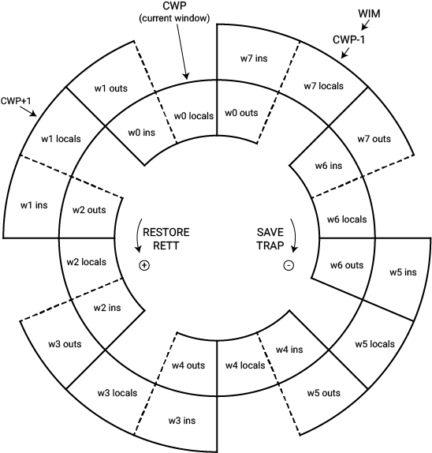
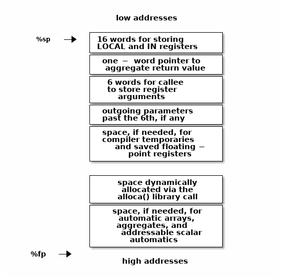
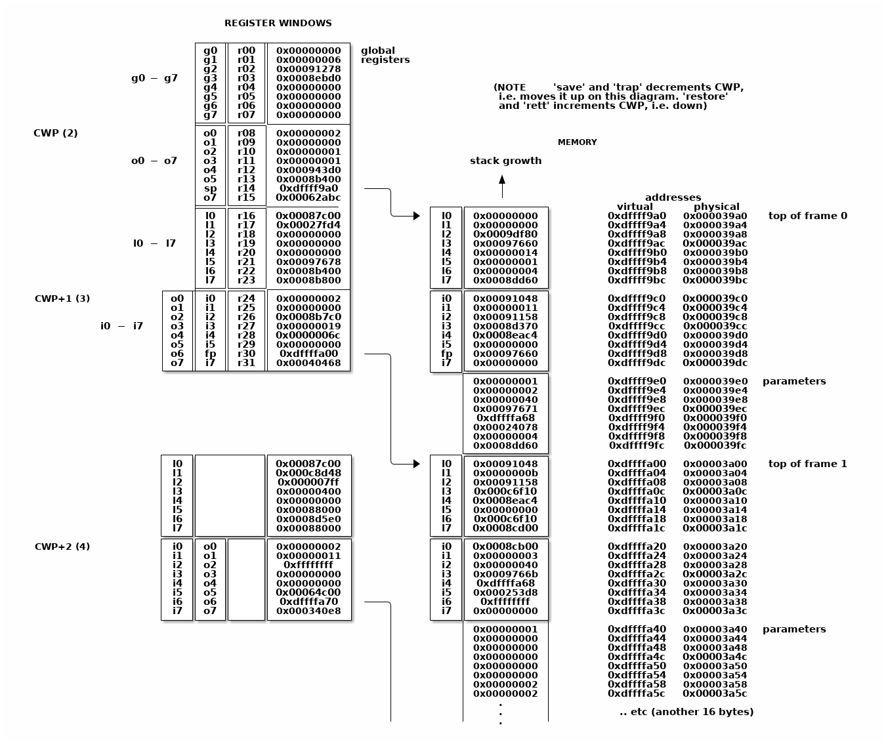

.. comment SPDX-License-Identifier: CC-BY-SA-4.0

.. comment Permission granted by the original author (Peter Magnusson) to
.. comment convert this page to Rest and include in the RTEMS Documentation.
.. comment This content is no longer online and only accessible at
.. comment https://web.archive.org/web/20120205014832/https://www.sics.se/~psm/sparcstack.html

Understanding stacks and registers in the SPARC architecture(s)
===============================================================
The SPARC architecture from Sun Microsystems has some "interesting"
characteristics. After having to deal with both compiler, interpreter, OS
emulator, and OS porting issues for the SPARC, I decided to gather notes
and documentation in one place. If there are any issues you don't find
addressed by this page, or if you know of any similar Net resources, let
me know. This document is limited to the V8 version of the architecture.

General Structure
-----------------
SPARC has 32 general purpose integer registers visible to the program
at any given time. Of these, 8 registers are ``global`` registers and 24
registers are in a register window. A window consists of three groups
of 8 registers, the ``out``, ``local``, and ``in`` registers. See table 1. A
SPARC implementation can have from 2 to 32 windows, thus varying the number
of registers from 40 to 520. Most implementations have 7 or 8 windows. The
variable number of registers is the principal reason for the SPARC being
"scalable".

At any given time, only one window is visible, as determined by the
current window pointer (CWP) which is part of the processor status
register (PSR). This is a five bit value that can be decremented or
incremented by the SAVE and RESTORE instructions, respectively. These
instructions are generally executed on procedure call and return
(respectively). The idea is that the ``in`` registers contain incoming
parameters, the ``local`` register constitutes scratch registers, the ``out``
registers contain outgoing parameters, and the ``global`` registers contain
values that vary little between executions. The register windows overlap
partially, thus the ``out`` registers become renamed by SAVE to become the
``in`` registers of the called procedure. Thus, the memory traffic is reduced
when going up and down the procedure call. Since this is a frequent
operation, performance is improved.

(That was the idea, anyway. The drawback is that upon interactions
with the system the registers need to be flushed to the stack,
necessitating a long sequence of writes to memory of data that is
often mostly garbage. Register windows was a bad idea that was caused
by simulation studies that considered only programs in isolation, as
opposed to multitasking workloads, and by considering compilers with
poor optimization. It also caused considerable problems in implementing
high-end SPARC processors such as the SuperSPARC, although more recent
implementations have dealt effectively with the obstacles. Register
windows are now part of the compatibility legacy and not easily removed
from the architecture.)

.. table:: Table 1 - Visible Registers

    +----------------+------------+---------------+
    |   Register     |  Mnemonic  |   Register    |
    |   Group        |            |   Address     |
    +================+============+===============+
    +   ``global``   +  %g0-%g7   + r[0] - r[7]   +
    +----------------+------------+---------------+
    +    ``out``     +  %o0-%o7   + r[8] - r[15]  +
    +----------------+------------+---------------+
    +   ``local``    +  %l0-%l7   + r[16] - r[23] +
    +----------------+------------+---------------+
    +    ``in``      +  %i0-%i7   + r[24] - r[31] +
    +----------------+------------+---------------+

The overlap of the registers is illustrated in figure 1. The figure
shows an implementation with 8 windows, numbered 0 to 7 (labeled w0 to
w7 in the figure). Each window corresponds to 24 registers, 16 of which
are shared with "neighboring" windows. The windows are arranged in a
wrap-around manner, thus window number 0 borders window number 7. The
common cause of changing the current window, as pointed to by CWP, is
the RESTORE and SAVE instructions, shown in the middle. Less common is
the supervisor RETT instruction (return from trap) and the trap event
(interrupt, exception, or TRAP instruction).

    Figure 1 - Windowed Registers

The "WIM" register is also indicated in the top left of Figure 1. The
window invalid mask is a bit map of valid windows. It is generally used
as a pointer, i.e. exactly one bit is set in the WIM register indicating
which window is invalid (in the figure it's window 7). Register windows
are generally used to support procedure calls, so they can be viewed
as a cache of the stack contents. The WIM "pointer" indicates how
many procedure calls in a row can be taken without writing out data to
memory. In the figure, the capacity of the register windows is fully
utilized. An additional call will thus exceed capacity, triggering a
window overflow trap. At the other end, a window underflow trap occurs
when the register window "cache" if empty and more data needs to be
fetched from memory.

Register Semantics
------------------

The SPARC Architecture includes recommended software semantics. These are
described in the architecture manual, the SPARC ABI (application binary
interface) standard, and, unfortunately, in various other locations as
well (including header files and compiler documentation).

Figure 2 shows a summary of register contents at any given time.

.. code-block:: c

                 %g0  (r00)       always zero
                 %g1  (r01)  [1]  temporary value
                 %g2  (r02)  [2]  global 2
     global      %g3  (r03)  [2]  global 3
                 %g4  (r04)  [2]  global 4
                 %g5  (r05)       reserved for SPARC ABI
                 %g6  (r06)       reserved for SPARC ABI
                 %g7  (r07)       reserved for SPARC ABI

                 %o0  (r08)  [3]  outgoing parameter 0 / return value from callee
                 %o1  (r09)  [1]  outgoing parameter 1
                 %o2  (r10)  [1]  outgoing parameter 2
     out         %o3  (r11)  [1]  outgoing parameter 3
                 %o4  (r12)  [1]  outgoing parameter 4
                 %o5  (r13)  [1]  outgoing parameter 5
            %sp, %o6  (r14)  [1]  stack pointer
                 %o7  (r15)  [1]  temporary value / address of CALL instruction

                 %l0  (r16)  [3]  local 0
                 %l1  (r17)  [3]  local 1
                 %l2  (r18)  [3]  local 2
     local       %l3  (r19)  [3]  local 3
                 %l4  (r20)  [3]  local 4
                 %l5  (r21)  [3]  local 5
                 %l6  (r22)  [3]  local 6
                 %l7  (r23)  [3]  local 7

                 %i0  (r24)  [3]  incoming parameter 0 / return value to caller
                 %i1  (r25)  [3]  incoming parameter 1
                 %i2  (r26)  [3]  incoming parameter 2
     in          %i3  (r27)  [3]  incoming parameter 3
                 %i4  (r28)  [3]  incoming parameter 4
                 %i5  (r29)  [3]  incoming parameter 5
            %fp, %i6  (r30)  [3]  frame pointer
                 %i7  (r31)  [3]  return address - 8

.. topic:: Items

    [1] assumed by caller to be destroyed (volatile) across a procedure call

    [2] should not be used by SPARC ABI library code

    [3] assumed by caller to be preserved across a procedure call

*Figure 2 - SPARC register semantics*

Particular compilers are likely to vary slightly.

Note that globals %g2-%g4 are reserved for the "application", which
includes libraries and compiler. Thus, for example, libraries may
overwrite these registers unless they've been compiled with suitable
flags. Also, the "reserved" registers are presumed to be allocated
(in the future) bottom-up, i.e. %g7 is currently the "safest" to use.

Optimizing linkers and interpreters are examples that use global registers.

Register Windows and the Stack
------------------------------

The SPARC register windows are, naturally, intimately related to the
stack. In particular, the stack pointer (%sp or %o6) must always point
to a free block of 64 bytes. This area is used by the operating system
(Solaris, SunOS, and Linux at least) to save the current ``local`` and
``in`` registers upon a system interrupt, exception, or trap instruction.
(Note that this can occur at any time.)

Other aspects of register relations with memory are programming
convention. The typical and recommended layout of the stack is shown
in figure 3. The figure shows a stack frame.

    Figure 3 - Stack frame contents

Note that the top boxes of figure 3 are addressed via the stack pointer
(%sp), as positive offsets (including zero), and the bottom boxes are
accessed over the frame pointer using negative offsets (excluding zero),
and that the frame pointer is the old stack pointer. This scheme allows
the separation of information known at compile time (number and size
of local parameters, etc) from run-time information (size of blocks
allocated by ``alloca()``).

"addressable scalar automatics" is a fancy name for local variables.

The clever nature of the stack and frame pointers is that they are always
16 registers apart in the register windows. Thus, a SAVE instruction will
make the current stack pointer into the frame pointer and, since the SAVE
instruction also doubles as an ADD, create a new stack pointer. Figure 4
illustrates what the top of a stack might look like during execution. (The
listing is from the "pwin" command in the SimICS simulator.)

    Figure 4 - Sample stack contents

Note how the stack contents are not necessarily synchronized with the
registers. Various events can cause the register windows to be "flushed"
to memory, including most system calls. A programmer can force this
update by using ST_FLUSH_WINDOWS trap, which also reduces the number of
valid windows to the minimum of 1.

Writing a library for multithreaded execution is an example that requires
explicit flushing, as is ``longjmp()``.

Procedure epilogue and prologue
-------------------------------

The stack frame described in the previous section leads to the standard
entry/exit mechanisms listed in figure 5.

.. code-block:: c

  function:
    save  %sp, -C, %sp

               ; perform function, leave return value,
               ; if any, in register %i0 upon exit

    ret        ; jmpl %i7+8, %g0
    restore    ; restore %g0,%g0,%g0

*Figure 5 - Epilogue/prologue in procedures*

The SAVE instruction decrements the CWP, as discussed earlier, and also
performs an addition. The constant "C" that is used in the figure to
indicate the amount of space to make on the stack, and thus corresponds
to the frame contents in Figure 3. The minimum is therefore the 16 words
for the LOCAL and IN registers, i.e. (hex) 0x40 bytes.

A confusing element of the SAVE instruction is that the source operands
(the first two parameters) are read from the old register window, and
the destination operand (the rightmost parameter) is written to the new
window. Thus, although "%sp" is indicated as both source and destination,
the result is actually written into the stack pointer of the new window
(the source stack pointer becomes renamed and is now the frame pointer).

The return instructions are also a bit particular. ``ret`` is a synthetic
instruction, corresponding to ``jmpl`` (jump linked). This instruction
jumps to the address resulting from adding 8 to the %i7 register. The
source instruction address (the address of the ``ret`` instruction itself)
is written to the %g0 register, i.e. it is discarded.

The ``restore`` instruction is similarly a synthetic instruction and is
just a short form for a restore that chooses not to perform an addition.

The calling instruction, in turn, typically looks as follows:

.. code-block:: c

    call <function>    ; jmpl <address>, %o7
    mov 0, %o0

Again, the ``call`` instruction is synthetic, and is actually the same
instruction that performs the return. This time, however, it is interested
in saving the return address, into register %o7. Note that the delay
slot is often filled with an instruction related to the parameters,
in this example it sets the first parameter to zero.

Note also that the return value is also generally passed in %o0.

Leaf procedures are different. A leaf procedure is an optimization that
reduces unnecessary work by taking advantage of the knowledge that no
``call`` instructions exist in many procedures. Thus, the
``save``/``restore`` couple can be eliminated. The downside is that such a
procedure may only use the ``out`` registers (since the ``in`` and ``local``
registers actually belong to the caller). See Figure 6.

.. comment XXX FIX FORMATTING

.. code-block:: c

  function:
               ; no save instruction needed upon entry

               ; perform function, leave return value,
               ; if any, in register %o0 upon exit

    retl       ; jmpl %o7+8, %g0
    nop        ; the delay slot can be used for something else

*Figure 6 - Epilogue/prologue in leaf procedures*

Note in the figure that there is only one instruction overhead, namely the
``retl`` instruction. ``retl`` is also synthetic (return from leaf subroutine),
is again a variant of the ``jmpl`` instruction, this time with %o7+8 as target.

Yet another variation of epilogue is caused by tail call elimination,
an optimization supported by some compilers (including Sun's C compiler
but not GCC). If the compiler detects that a called function will return
to the calling function, it can replace its place on the stack with the
called function. Figure 7 contains an example.

.. code-block:: c

      int
        foo(int n)
      {
        if (n == 0)
          return 0;
        else
          return bar(n);
      }

        cmp     %o0,0
        bne     .L1
        or      %g0,%o7,%g1
        retl
        or      %g0,0,%o0
  .L1:  call    bar
        or      %g0,%g1,%o7

*Figure 7 - Example of tail call elimination*

Note that the call instruction overwrites register ``%o7`` with the program
counter. Therefore the above code saves the old value of ``%o7``, and restores
it in the delay slot of the call instruction. If the function ``call`` is
register indirect, this twiddling with ``%o7`` can be avoided, but of course
that form of call is slower on modern processors.

The benefit of tail call elimination is to remove an indirection upon
return. It is also needed to reduce register window usage, since otherwise
the ``foo()`` function in Figure 7 would need to allocate a stack frame to
save the program counter.

A special form of tail call elimination is tail recursion elimination,
which detects functions calling themselves, and replaces it with a simple
branch. Figure 8 contains an example.

.. code-block:: c

        int
          foo(int n)
        {
          if (n == 0)
            return 1;
          else
            return (foo(n - 1));
        }

        cmp     %o0,0
        be      .L1
        or      %g0,%o0,%g1
        subcc   %g1,1,%g1
  .L2:  bne     .L2
        subcc   %g1,1,%g1
  .L1:  retl
        or      %g0,1,%o0

*Figure 8 - Example of tail recursion elimination*

Needless to say, these optimizations produce code that is difficult
to debug.

Procedures, stacks, and debuggers
---------------------------------

When debugging an application, your debugger will be parsing the binary
and consulting the symbol table to determine procedure entry points. It
will also travel the stack frames "upward" to determine the current
call chain.

When compiling for debugging, compilers will generate additional code
as well as avoid some optimizations in order to allow reconstructing
situations during execution. For example, GCC/GDB makes sure original
parameter values are kept intact somewhere for future parsing of
the procedure call stack. The live ``in`` registers other than %i0 are
not touched. %i0 itself is copied into a free ``local`` register, and its
location is noted in the symbol file. (You can find out where variables
reside by using the "info address" command in GDB.)

Given that much of the semantics relating to stack handling and procedure
call entry/exit code is only recommended, debuggers will sometimes
be fooled. For example, the decision as to whether or not the current
procedure is a leaf one or not can be incorrect. In this case a spurious
procedure will be inserted between the current procedure and it's "real"
parent. Another example is when the application maintains its own implicit
call hierarchy, such as jumping to function pointers. In this case the
debugger can easily become totally confused.

The window overflow and underflow traps
---------------------------------------

When the SAVE instruction decrements the current window pointer (CWP)
so that it coincides with the invalid window in the window invalid mask
(WIM), a window overflow trap occurs. Conversely, when the RESTORE or
RETT instructions increment the CWP to coincide with the invalid window,
a window underflow trap occurs.

Either trap is handled by the operating system. Generally, data is
written out to memory and/or read from memory, and the WIM register
suitably altered.

The code in Figure 9 and Figure 10 below are bare-bones handlers for
the two traps. The text is directly from the source code, and sort of
works. (As far as I know, these are minimalistic handlers for SPARC
V8). Note that there is no way to directly access window registers
other than the current one, hence the code does additional save/restore
instructions. It's pretty tricky to understand the code, but figure 1
should be of help.

.. code-block:: c

        /* a SAVE instruction caused a trap */
  window_overflow:
        /* rotate WIM on bit right, we have 8 windows */
        mov %wim,%l3
        sll %l3,7,%l4
        srl %l3,1,%l3
        or  %l3,%l4,%l3
        and %l3,0xff,%l3

        /* disable WIM traps */
        mov %g0,%wim
        nop; nop; nop

        /* point to correct window */
        save

        /* dump registers to stack */
        std %l0, [%sp +  0]
        std %l2, [%sp +  8]
        std %l4, [%sp + 16]
        std %l6, [%sp + 24]
        std %i0, [%sp + 32]
        std %i2, [%sp + 40]
        std %i4, [%sp + 48]
        std %i6, [%sp + 56]

        /* back to where we should be */
        restore

        /* set new value of window */
        mov %l3,%wim
        nop; nop; nop

        /* go home */
        jmp %l1
        rett %l2

*Figure 9 - window_underflow trap handler*

.. code-block:: c

        /* a RESTORE instruction caused a trap */
  window_underflow:

        /* rotate WIM on bit LEFT, we have 8 windows */
        mov %wim,%l3
        srl %l3,7,%l4
        sll %l3,1,%l3
        or  %l3,%l4,%l3
        and %l3,0xff,%l3

        /* disable WIM traps */
        mov %g0,%wim
        nop; nop; nop

        /* point to correct window */
        restore
        restore

        /* dump registers to stack */
        ldd [%sp +  0], %l0
        ldd [%sp +  8], %l2
        ldd [%sp + 16], %l4
        ldd [%sp + 24], %l6
        ldd [%sp + 32], %i0
        ldd [%sp + 40], %i2
        ldd [%sp + 48], %i4
        ldd [%sp + 56], %i6

        /* back to where we should be */
        save
        save

        /* set new value of window */
        mov %l3,%wim
        nop; nop; nop

        /* go home */
        jmp %l1
        rett %l2

*Figure 10 - window_underflow trap handler*

