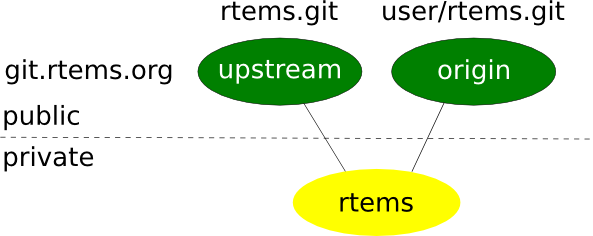

.. SPDX-License-Identifier: CC-BY-SA-4.0

.. Copyright (C) 2018.
.. COMMENT: RTEMS Foundation, The RTEMS Documentation Project

Software Development (Git Writers)
**********************************

.. COMMENT: TBD - Some guidelines for anyone who wishes to contribute to
.. COMMENT: TBD - rtems... Patches? Pull Requests?...

 The preferred workflow for making changes to RTEMS is to push patches to a
 committer's personal repository in public view and then merge changes from
 there. For working on enhancements or bug fixes committers are encouraged to
 push to branches on their personal repositories and to merge into the main
 RTEMS repository from their personal repository. Personal branches should
 not be pushed to the RTEMS repository.

SSH Access
----------

Currently all committer's should have an ssh account on the main git server,
dispatch.rtems.org. If you have been granted commit access and do have an
account on dispatch.rtems.org one should be requested on the devel@ list.
SSH access for git uses key logins instead of passwords. The key should be at
least 1024 bits in length.

The public repositories can by cloned with

.. code-block:: shell

  git clone ssh://user@dispatch.rtems.org/data/git/rtems.git

Or replace `rtems.git` with another repo to clone another one.

Personal Repository
-------------------
Personal repositories keep the clutter away from the master repository. A
user with a personal repository can make commits, create and delete branches,
plus more without interfering with the master repository. Commits to the
master repository generate email to the vc@ list and development type commits
by a developer would only add noise and lessen the effectiveness of the commit
list

A committer should maintain a personal clone of the RTEMS repository through
which all changes merged into the RTEMS head are sent. The personal repository
is also a good place for committers to push branches that contain works in
progress. The following instructions show how to setup a personal repositor
that by default causes commits to go to your private local repository and
pushes to go to your publicly visible personal repository. The RTEMS head is
configured as a remote repository named 'upstream' to which you can push
changes that have been approved for merging into RTEMS.

Branches aren't automatically pushed until you tell git to do the initial push
after which the branch is pushed automatically. In order to keep code private
just put it on a branch in your local clone and do not push the branch.

Create a personal repository
----------------------------

Set up the server side repository. In the following substitute user with your
username.

.. code-block:: shell

  # ssh git.rtems.org
  [user@git ~]$ ln -s /data/git/user git
  [user@git ~]$ ls -l
  lrwxrwxrwx 1 user rtems 16 Feb  1 11:52 git -> /data/git/user
  [user@git ~]$ cd git
  [user@git git]$ git clone --mirror /data/git/rtems.git

Provide a description for the repository, for example "Clone of master
repository."

.. code-block:: shell

  [user@git git]$ echo "Clone of master repository." > rtems.git/description
  [user@git git]$ logout

Clone the repository on your local machine

.. code-block:: shell

  # git clone ssh://user@dispatch.rtems.org/home/user/git/rtems.git
  # cd rtems

Add the RTEMS repository as a remote repository and get the remote tags
and branches

.. code-block:: shell

  # git remote add upstream ssh://user@dispatch.rtems.org/data/git/rtems.git
  # git fetch upstream

After a little while you should be able to see your personal repo
at https://git.rtems.org/@USER@/rtems.git/ and you can create other
repositories in your git directory that will propagate
to https://git.rtems.org/@USER@/ if you need. For example, `joel`'s personal
repos appear at https://git.rtems.org/joel/.

Check your setup
~~~~~~~~~~~~~~~~

.. code-block:: shell

  git remote show origin

Should print something similar to

.. code-block:: shell

 * remote origin
   Fetch URL: ssh://user@dispatch.rtems.org/home/user/git/rtems.git
   Push  URL: ssh://user@dispatch.rtems.org/home/user/git/rtems.git
   HEAD branch: master
   Remote branches:
     4.10   tracked
     4.8    tracked
     4.9    tracked
     master tracked
   Local branch configured for 'git pull':
     master merges with remote master
   Local ref configured for 'git push':
     master pushes to master (up to date)

Push commits to personal repo master from local master
~~~~~~~~~~~~~~~~~~~~~~~~~~~~~~~~~~~~~~~~~~~~~~~~~~~~~~

.. code-block:: shell

  # git push

Push a branch onto personal repo
~~~~~~~~~~~~~~~~~~~~~~~~~~~~~~~~

.. code-block:: shell

  # git push origin branchname

Update from upstream master (RTEMS head)
~~~~~~~~~~~~~~~~~~~~~~~~~~~~~~~~~~~~~~~~

 When you have committed changes on a branch that is private (hasn't been
 pushed to your personal repo) then you can use rebase to obtain a linear
 history and avoid merge commit messages.

.. code-block:: shell

  # git checkout new_features
  # git pull --rebase upstream master

If you cannot do a fast-forward merge then you could use the ``--no-commit``
flag to prevent merge from issuing an automatic merge commit message.

When you have committed changes on a branch that is public/shared with another
developer you should not rebase that branch.

Migrate a Personal Repository to top-level
------------------------------------------

Once a project is production ready in the personal repository, it's time to
migrate it to the top-level RTEMS git directory. First, the project directory
needs to be copied and then the permissions need to be set, so that everyone can
push into that repository.

.. code-block:: shell

  cp -R /data/git/user/my-rtems-project.git /data/git
  cd /data/git/my-rtems-project.git
  chgrp -R gitrw ./
  chmod -R g+rws ./

Then copy the post-receive script from the rtems.git directory and change the
name of REPO.

.. code-block:: shell

  cp /data/git/rtems.git/hooks/post-receive  /data/git/my-rtems-project.git/hooks/

After making the change the post-receive script in the new repository should
look like this

.. code-block:: shell

  #!/bin/sh
  #
  # The "post-receive" script is run after receive-pack has accepted a pack
  # and the repository has been updated.  It is passed arguments in through
  # stdin in the form
  #  <oldrev> <newrev> <refname>
  # For example:
  #  aa453216d1b3e49e7f6f98441fa56946ddcd6a20 68f7abf4e6f922807889f52bc043ecd31b79f814 refs/heads/master
  #

  REPO=my-rtems-project

  . /data/support/git-support/hooks/post-receive-0
  . /data/support/git-support/hooks/post-receive-1
  #. /data/support/git-support/hooks/post-receive-2
  . /data/support/git-support/hooks/post-receive-3
  . /data/support/git-support/hooks/post-receive-4
  . /data/support/git-support/hooks/post-receive-5

GIT Push Configuration
----------------------

People with write access to the main repository should make sure that they
push the right branch with the git push command. The above setup ensures
that git push will not touch the main repository, which is identified as
upstream, unless you specify the upstream (by ``git push upstream master``).

Lets suppose we have a test branch intended for integration into the master
branch of the main repository.

.. code-block:: shell

  # git branch
    master
   *  test

There are two options for pushing with the branch. First,

.. code-block:: shell

  # git push origin test

Will push the test branch to the personal repository. To delete the remote
branch

.. code-block:: shell

  # git push origin :test

You'll still need to delete your local branch if you are done with it.

If you are going to work exclusively with one branch for a while, you might
want to configure git to automatically push that branch when you use git push.
By default git push will use the local master branch, but you can use the
`test` branch as the source of your changes:

.. code-block:: shell

  # git config remote.origin.push test:master

Now git push will merge into your master branch on your personal repository.
You can also setup a remote branch:

.. code-block:: shell

  # git config remote.origin.push test:test

You can see what branch is configured for pushing with

.. code-block:: shell

  # git remote show origin

And reset to the default

.. code-block:: shell

  # git config remote.origin.push master

Pull a Developer's Repo
-----------------------

The procedures for creating personal repositories ensure that every developer
can post branches that anyone else can review. To pull a developer's personal
repository into your local RTEMS git clone, just add a new remote repo:

.. code-block:: shell

  # git remote add devname git://dispatch.rtems.org/devname/rtems.git
  # git fetch devname
  # git remote show devname
  # git branch -a

Replace devname with the developer's user name on git, which you can see by
accessing https://git.rtems.org. Now you can switch to the branches
for this developer.

Use a tracking branch if the developer's branch is changing:

.. code-block:: shell

  # git branch --track new_feature devname/new_feature

Committing
----------

Ticket Updates
~~~~~~~~~~~~~~

Our trac instance supports updating a related ticket with the commit message.

Any references to a ticket for example #1234 will insert the message into
he ticket as an 'update'. No command is required.

Closing a ticket can be done by prefixing the ticket number with any of the
following commands:

``close``, ``closed``, ``closes``, ``fix``, ``fixed``, or ``fixes``

For example:

``closes #1234``

``This is a random update it closes #1234 and updates #5678``

Commands
~~~~~~~~

When merging someone's work, whether your own or otherwise, we have some
suggested procedures to follow.

* Never work in the master branch. Checkout a new branch and apply
  patches/commits to it.
* Before pushing upstream:
  - Update master by fetching from the server
  - Rebase the working branch against the updated master
  - Push the working branch to the server master

The basic workflow looks like

.. code-block:: shell

  # git checkout -b somebranch upstream/master
  # patch .. git add/rm/etc
  # git commit ...
  # git pull --rebase upstream master
  # git push upstream somebranch:master

If someone pushed since you updated the server rejects your push until you
are up to date.

For example a workflow where you will commit a series of patches from
``../patches/am/`` directory:

.. code-block:: shell

  # git checkout -b am
  # git am ../patches/am*
  # git pull --rebase upstream master
  # git push upstream am:master
  # git checkout master
  # git pull upstream master
  # git log
  # git branch -d am
  # git push

The git log stage will show your newly pushed patches if everything worked
properly, and you can delete the am branch created. The git push at the end
will push the changes up to your personal repository.

Another way to do this which pushes directly to the upstream is shown here
in an example which simply (and quickly) applies a patch to the branch:

.. code-block:: shell

  git checkout -b rtems@rtems-ver-major@.@rtems-ver-minor@ --track remotes/upstream/@rtems-ver-major@.@rtems-ver-minor@
  cat /tmp/sp.diff | patch
  vi sparc.t
  git add sparc.t
  git commit -m "sparc.t: Correct for V8/V9"
  git push upstream rtems4.10:4.10
  git checkout master
  git log
  git branch -d rtems4.10

Pushing Multiple Commits
------------------------

A push with more than one commit results in Trac missing them. Please use the
following script to push a single commit at a time:

.. code-block:: shell

  #! /bin/sh
  commits=$(git log --format='%h' origin/master..HEAD | tail -r)
  for c in $commits
  do
    cmd=$(echo $c | sed 's%\(.*\)%git push origin \1:master%')
    echo $cmd
  $cmd
  done

Ooops!
------

So you pushed something upstream and broke the repository. First things first:
stop what you're doing and notify devel@... so that (1) you can get help and
(2) no one pulls from the broken repo. For an extended outage also notify
users@.... Now, breathe easy and let's figure out what happened. One thing
that might work is to just `undo the push
<https://stackoverflow.com/questions/1270514/undoing-a-git-push>`_. To get an
idea of what you did, run ``git reflog``, which might be useful for getting
assistance in undoing whatever badness was done.
