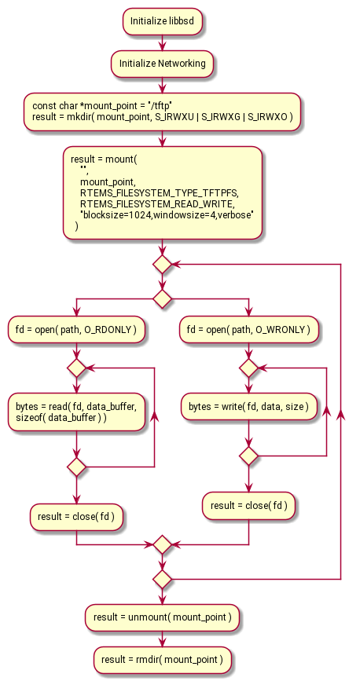

.. SPDX-License-Identifier: CC-BY-SA-4.0

Trivial FTP Client Filesystem
*****************************

This chapter describes the Trivial File Transfer Protocol (TFTP) Client
Filesystem.  TFTP is designed to be an especially simple protocol which
uses the User Datagram Protocol (UDP) for data transfer over the Internet.
Its purpose is to send a single file between to network nodes (client and
server).  A file can be sent in both directions, i.e. a client can either
read a file from a server or write a file to the server.

Besides reading or writing a file no other operations are supported.  That
is, one cannot seek the file, not append to the end of a file, not open
the file for reading and writing at the same time, not list directories,
not move files and so on.

TFTP is inherent insecure as it does not provide any means for
authentication or encryption.  Therefore, it is highly recommended not
to employ it on public networks.  Nevertheless, it is still widely used
to load software and configuration data during early boot stages over
a Local Area Network (LAN).

RTEMS TFTP Filesystem Implementation
====================================

The RTEMS TFTP filesystem implements a TFTP client which can be used
through the file system.  With other words, one needs to mount the
TFTP filesystem and can afterwards open a file for reading or writing
below that mount point.  The content of that file is then effectively
read from or written to the remote server.  The RTEMS implementation
implements the following features:

* `RFC 1350 <https://www.rfc-editor.org/rfc/rfc1350.html>`_
  *The TFTP Protocol (Revision 2)*
* `RFC 2347 <https://www.rfc-editor.org/rfc/rfc2347.html>`_
  *TFTP Option Extension*
* `RFC 2348 <https://www.rfc-editor.org/rfc/rfc2348.html>`_
  *TFTP Blocksize Option*
* `RFC 7440 <https://www.rfc-editor.org/rfc/rfc7440.html>`_
  *TFTP Windowsize Option*

Many simple TFTP server do not support options (RFC 2347). Therefore, in
case the server rejects the first request with options, the RTEMS client
makes automatically a second attempt using only the "classical" RFC 1350.

The implementation has the following shortcomings:

* IPv6 is not supported (yet).

* No congestion control is implemented.

  (Congestion is simply expressed a network traffic jam which involves
  package loss.)  This implementation would worsen a congestion situation
  and squeeze out TCP connections.  If that is a concern in your setup,
  it can be prevented by using value `1` as `windowsize` when mounting
  the TFTP file system.

* One must call ``open()``, ``read()``, ``write()`` and ``close()``
  at a good pace.

  TFTP is designed to read or write a whole already existing file in
  one sweep.  It uses timeouts (of unspecified length) and it does not
  know keep-alive messages.  If the client does not respond to the
  server in due time, the server sets the connection faulty and drops it.
  To avoid this, the user must read or write enough data fast enough.

  The point here is, one cannot pause the reading or writing for longer
  periods of time.  TFTP cannot be used for example to write log files
  where all few seconds a line is written.  Also opening the
  file at the beginning of an application and closing it that the end
  will certainly lead to a timeout.  As another example, one cannot
  read a file by reading one byte per second, this will trigger a
  timeout and the server closes the connection.  The opening, reading
  or writing and closing must happen in swift consecutive steps.

* The transfer mode is always ``octet``.  The only alternative
  ``netascii`` cannot be selected.

* Block number roll-over is currently not supported.  Therefore,
  the maximum file size is limited to max-block-number times blocksize.
  For RFC 1350 blocksize is would be 65535 * 512 = 32 MB.  For the
  default blocksize is would be 65535 * 1456 = 90 MB.

* The inherent insecurity of the protocol has already be mentioned but
  it is worth repeating.

Prerequisites
=============

To use the RTEMS TFTP filesystem one needs:

* The RTEMS tools (cross-compiler, linker, debugger etc.)
* The RTEMS Board Support Package (BSP)
* A network stack for RTEMS, for example RTEMS libbsd

As an example the ARM architecture and a xilinx_zynq_a9 BSP is used below
together with RTEMS libbsd.  The instructions are tested with RTEMS
version 6.  It is recommended to actually use ``arm/xilinx_zynq_a9_qemu``
for the first experiments as other BSPs tend to require different
configuration values and/or command line options.

Moreover, it is recommended to first execute any code using QEMU as
simulator so that no hardware is needed.  Therefore, ``qemu-system-arm``
must be installed.  In Linux distributions this executable is usually
available in the repositories as package ``qemu-arm``.

RTEMS Tools
-----------

Instructions on how to obtain, compile and install the RTEMS tools can
be found in the *RTEMS User Manual* chapter *2. Quick Start*.  To
follow the suggested example ``6/rtems-arm`` should be used as
target architecture argument of the ``../source-builder/sb-set-builder``
command.

RTEMS Board Support Package
---------------------------

Instructions on how to obtain, compile and install a BSP can be found
in the *RTEMS User Manual* section *Build a Board Support Package (BSP)*.
The bsp-option should have the following value to match the example BSP:

.. code-block:: none

  --rtems-bsps=arm/xilinx_zynq_a9_qemu

RTEMS libbsd
------------

Instructions on how to obtain, compile and install RTEMS libbsd can be
found in the ``README.rst`` of the ``rtems-libbsd`` GIT repository:
``git://git.rtems.org/rtems-libbsd.git``.
Make sure to compile and install libbsd for the correct RTEMS version
(here ``6``).  The default build set (``--buildset=buildset/default.ini``)
does suffice and as BSP ``--rtems-bsp=arm/xilinx_zynq_a9_qemu`` is
to be used with the ``waf configure`` command.

RTEMS Configuration
-------------------

To make the TFTP filesystem available to an RTEMS application and have
it initialized, the macro ``CONFIGURE_FILESYSTEM_TFTPFS`` must be
defined when configuring RTEMS (typically in the ``init.c`` file):

.. code-block:: c

  #define CONFIGURE_FILESYSTEM_TFTPFS

Moreover, libbsd and RTEMS must be configured appropriately as well.
For orientation, the code below is from an application using TFTP FS
(file ``tftp_init.c``).

.. code-block:: c

  /* Configure libbsd. */
  #define RTEMS_BSD_CONFIG_NET_PF_UNIX
  #define RTEMS_BSD_CONFIG_NET_IF_BRIDGE
  #define RTEMS_BSD_CONFIG_NET_IF_LAGG
  #define RTEMS_BSD_CONFIG_NET_IF_VLAN
  #define RTEMS_BSD_CONFIG_BSP_CONFIG
  #define RTEMS_BSD_CONFIG_INIT

  #include <machine/rtems-bsd-config.h>

  /* RTEMS configuration for libbsd */
  #define CONFIGURE_MAXIMUM_USER_EXTENSIONS 1
  #define CONFIGURE_INIT_TASK_STACK_SIZE (32 * 1024)
  #define CONFIGURE_INIT_TASK_INITIAL_MODES RTEMS_DEFAULT_MODES
  #define CONFIGURE_INIT_TASK_ATTRIBUTES RTEMS_FLOATING_POINT
  #define CONFIGURE_APPLICATION_NEEDS_LIBBLOCK

  /* RTEMS configuration for tftp */
  #define CONFIGURE_FILESYSTEM_TFTPFS
  #define CONFIGURE_MAXIMUM_FILE_DESCRIPTORS 64

  /* Simple RTEMS configuration */
  #define CONFIGURE_APPLICATION_NEEDS_CLOCK_DRIVER
  #define CONFIGURE_APPLICATION_NEEDS_CONSOLE_DRIVER
  #define CONFIGURE_UNLIMITED_OBJECTS
  #define CONFIGURE_UNIFIED_WORK_AREAS
  #define CONFIGURE_RTEMS_INIT_TASKS_TABLE
  #define CONFIGURE_INIT

  #include <rtems/confdefs.h>

Application Linkage
-------------------

The TFTP filesystem is compiled and linked into ``libtftpfs``.  After
installation it should be in a place like:

.. code-block:: none

  <PREFIX>/arm-rtems6/xilinx_zynq_a9_qemu/lib/libtftpfs.a

An RTEMS application which wants to use the TFTP filesystem must be linked
with the libraries ``libtftpfs``, ``libbsd``, and ``libm`` --- in this order.
An example build target in a ``wscript`` for use with the RTEMS WAF build
system could be:

.. code-block:: python

  def build(ctx):
      rtems.build(ctx)
      ctx(features = 'c cprogram',
          target = 'tftp_app.exe',
          cflags = '-g -O2',
          source = ['tftp_app.c', 'tftp_init.c'],
          lib    = ['tftpfs', 'bsd', 'm'])

Network Configuration and TFTP Server
-------------------------------------

QEMU has a simple build-in TFTP server which can serve files for reading
only.  By default it is reachable from the application executed by QEMU
at IP address ``10.0.2.2`` if SLIRP networking is used.  For the
example ``arm/xilinx_zynq_a9_qemu`` BSP, the QEMU option

.. code-block:: none

  -nic user,model=cadence_gem,tftp=/tmp

will cause this TFTP server to deliver files found below directory
``/tmp``.  Note that SLIRP requires that the application uses DHCP.

Alternatively, it is of course possible to use other kinds of QEMU
networking (as for example the TAP virtual Ethernet interface described
in the above mentioned ``README.rst`` in section *Qemu and Networking*).
Also an external TFTP server can be used.

External TFTP Server Example for OpenSUSE
-----------------------------------------

This example uses ``atftp`` as an external TFTP server to which the RTEMS
TFTP file system running in an QEMU instance connects to.  ``atftp`` was
compiled from the sources.  Instructions how to compile and install
``atftp`` can be found in the ``INSTALL`` file which comes with its sources.

On an OpenSUSE 15.3 machine, the following commands sets up ``atftp``
for use with the mentioned TAP interface (these commands must be executed
as root; ``<APP-USER>`` must be replaced by the name of the "normal"
user starting the RTEMS application in QEMU later on; for other
distributions the ``firewall-cmd`` commands must be
replaced by the equivalent of that distribution):

.. code-block:: shell

  # Create and configure TAP interface
  ip tuntap add qtap mode tap user <APP-USER>
  ip link set dev qtap up
  ip addr add 169.254.1.1/16 dev qtap

  # Open firewalld as non-permanent configuration
  firewall-cmd --zone=home --add-service=tftp
  firewall-cmd --zone=home --add-interface=qtap

  # Start TFTP daemon
  touch /var/log/atftpd/atftp.log
  chown tftp.tftp /var/log/atftpd/atftp.log
  atftpd --user tftp --group tftp --daemon --verbose \
      --logfile /var/log/atftpd/atftp.log /srv/tftpboot

The ``atftp`` server will then be reachable from an application executed
by QEMU at the address of the TAP interface which is in this case
``169.254.1.1``.  When used with this TAP interface, the QEMU network
option must be changed to (replacing the ``-net`` options in the examples
found in the already mentioned ``README.rst`` of the ``rtems-libbsd`` GIT
repository):

.. code-block:: none

   -nic tap,model=cadence_gem,ifname=qtap,script=no,downscript=no

Usage
=====

The following diagram shows how the TFTP filesystem is used by an
application.  The mount point can be any directory.  The name ``/tftp``
used in the figure serves only as an example.  The final unmounting and
remove directory steps are optional.

Mounting the TFTP Filesystem
----------------------------

When mounting the TFTP filesystem, the argument ``filesystemtype`` must
be ``RTEMS_FILESYSTEM_TYPE_TFTPFS`` (``#include <rtems/libio.h>``).

The argument ``data`` can either be

* a 0-terminated C string of comma separated mount options or
* ``NULL`` for mounting with default values.

The mount options are case sensitive.  Spaces are not allowed in the string.
If conflicting options are specified, the ones more to the right (i.e. end
of the string) take precedence.  These mount options are supported:

``blocksize=N``
  where ``N`` is a decimal integer number.

  The TFTP blocksize option is introduced in RFC 2348.  It defines the
  number of octets in the data packages transferred.  Valid values
  range between 8 and 65464 octets, inclusive.  Values larger
  than 1468 may cause package fragmentation over standard Ethernet.
  A value of 512 will prevent this option from being sent to
  the server.

  The default value is 1456.

``windowsize=N``
  where ``N`` is a decimal integer number.

  The TFTP windowsize option is introduced in RFC 7440.  It defines the
  number of data packages send before the receiver must send an
  acknowledgment package.  Valid values range between 1 and 65535
  packages, inclusive.  Simple TFTP servers usually do not support this
  option.  This option may negatively contribute to network
  congestion.  This can be avoided by using a window size of 1.
  A value of 1 will prevent this option from being sent to
  the server.

  The default value is 8.

``rfc1350``
  The TFTP client should strictly follow RFC 1350 and not send any
  options to the server.  Many simple TFTP server do still not support
  the option extension defined in RFC 2347.  The TFTP filesystem will
  always make a second option-less connection attempt to the TFTP server
  in case a first attempt with options was rejected with an error message.

  This option is equivalent to ``blocksize=512,windowsize=1``.

``verbose``
  During operation, print messages to ``stdout``.  This option has
  currently little effect.  It is kept to be compatible to older
  implementations.

Opening a File
--------------

Files must be opened by using either ``O_RDONLY`` or ``O_WRONLY``
as flags but not both.  Other flags are not supported.

The ``pathname`` argument to ``open()`` has the following format:

.. code-block:: none

  <PREFIX>/<server-address>:<path-on-server>

``<PREFIX>``
  The path to the point where the TFTP filesystem is mounted.  This can
  be a relative path from the current working directory or an absolute
  path.

``<server-address>``
  The network address for the TFTP server from which to download the
  file or to which the file should be sent.  This is either

    * an IPv4 address (like `127.0.0.1`) or
    * the (full-qualified) name of an IPv4 host (acceptable to
      ``gethostbyname()``)

  The port number cannot be specified and will always be the one reserved
  for TFTP: 69.

``<path-on-server>``
  The path and file name at which the TFTP server will find or create the
  file.  Any directories in this path must already exist.  It is not
  possible to create or read directories with TFTP.  RFC 1350 specifies
  that this ``<path-on-server>`` must be in *netascii*:

      This is ascii as defined in "USA Standard Code for Information
      Interchange" [1] with the modifications specified in "Telnet
      Protocol Specification" [3].

      [1] USA Standard Code for Information Interchange, USASI X3.4-1968.

      [3] Postel, J., "Telnet Protocol Specification," RFC 764,
      USC/Information Sciences Institute, June, 1980.

Example pathnames:

.. code-block:: c

  "/tftp/169.254.1.1:file.txt"
  "/TFTPFS/tftp-server.sample.org:bootfiles/image"

In the above examples, ``/tftp`` and ``/TFTPFS`` are the directory at which
the TFTP filesystem is mounted.  ``169.254.1.1`` and
``tftp-server.sample.org`` are the network address of the TFTP server to
contact.  ``file.txt`` and ``bootfiles/image`` are the file name and
the path at the server side.

Closing a File
--------------

Especially, when writing a file to the server, the return
code of ``close()`` should be checked.  Invoking ``close()`` triggers
the sending of the last -- not completely filled -- data block.  This
may fail the same way as any ``write()`` may fail.  Therefore, an error
returned by ``close()`` likely indicates that the file was not completely
transferred.

Use From Shell
==============

It is possible to use the RTEMS shell through test ``media01`` of
libbsd to exercise the TFTP filesystem.  This text assumes that libbsd
has already been setup, configured, compiled and installed as described
in the ``README.rst`` of the ``rtems-libbsd`` GIT repository.
How the test ``media01.exe`` can be executed is described in
section *Qemu and Networking* of that file.

A TFTP server must be setup and run.  The instructions to setup an TAP
device and an ``atftp`` server found above in section `External TFTP
Server Example for OpenSUSE`_ could be followed for this purpose.
It may be useful to create a sample file for later download in the
directory served by the TFTP server.  For ``atftp`` "root" could create
a file with these instructions:

.. code-block:: shell

  # echo "Hello World!" >/srv/tftpboot/hello.txt
  # chown tftp.tftp /srv/tftpboot/hello.txt

Start the ``media01`` test in one terminal --- as "normal" user:

.. code-block:: shell

  $ qemu-system-arm -serial null -serial mon:stdio -nographic \
    -M xilinx-zynq-a9 -m 256M \
    -nic tap,model=cadence_gem,ifname=qtap,script=no,downscript=no \
    -kernel build/arm-rtems6-xilinx_zynq_a9_qemu-default/media01.exe

Wait till a line like the following is printed in the terminal:

.. code-block:: none

  info: cgem0: using IPv4LL address 169.254.191.13

Next use the displayed IP address to open a telnet connection in a second terminal:

.. code-block:: shell

  $ telnet 169.254.191.13

At the telnet prompt, enter this command to list the filesystems
available for mounting:

.. code-block:: none

  TLNT [/] # mount -L
  File systems: / dosfs tftpfs

``tftpfs`` should be among them.  Create a directory and mount the TFTP
filesystem:

.. code-block:: none

  TLNT [/] # mkdir /tftp
  TLNT [/] # mount -t tftpfs -o verbose "" /tftp
  mounted  -> /tftp

Now, files can be sent to and read from the TFTP server using the usual
shell commands:

.. code-block:: none

  TLNT [/] # cp /etc/dhcpcd.duid /tftp/169.254.1.1:dhcpcd.duid
  TFTPFS: /169.254.1.1:dhcpcd.duid
  TLNT [/] # cat /tftp/169.254.1.1:hello.txt
  TFTPFS: /169.254.1.1:hello.txt
  Hello World!

The terminal session can be terminated with key combination "CTRL-]"
followed by a ``quit`` command; the
QEMU simulation with "CTRL-a x" and ``tail -f`` with "CTRL-c".

TFTP Client API
===============

The TFTP filesystem has a TFTP client which is responsible to handle all
network traffic.  It permits the use of TFTP without filesystem.
Essentially, one saves the mounting of the filesystem.  Otherwise the
usage is similar to the one of the filesystem.  The equivalent of the
``open()``, ``read()``, ``write()``, and ``close()`` functions are:

.. code-block:: c

  int tftp_open(
    const char *hostname,
    const char *path,
    bool is_for_reading,
    const tftp_net_config *config,
    void **tftp_handle
  );

  ssize_t tftp_read( void *tftp_handle, void *buffer, size_t count );

  ssize_t tftp_write( void *tftp_handle, const void *buffer, size_t count );

  int tftp_close( void *tftp_handle );

``tftp_open()`` accepts as input a data structure of type
``tftp_net_config``.  It can be used to specify certain values governing
the file transfer such as the already described options.  Data of
``tftp_net_config`` type can be initialized using function

.. code-block:: c

  void tftp_initialize_net_config( tftp_net_config *config );

The full description can be found in the file ``cpukit/include/rtems/tftp.h``.
The function ``rtems_tftpfs_initialize()`` found there is only for RTEMS
internal use by the ``mount()`` function.

Software Design
===============

The original source code contained only the files
``cpukit/include/rtems/tftp.h`` and ``cpukit/libfs/src/ftpfs/tftpDriver.c``.
There was no test suite nor any documentation.

When the code was extended to support options (RFC 2347 and others),
the code in ``tftpDriver.c`` was split.  The new file ``tftpfs.c`` is
responsible to handle all filesystem related issues while ``tftpDriver.c``
provides the network related functions.  In effect ``tftpDriver.c`` is
a TFTP client library which can be used independently of the filesystem.
``tftpfs.c`` calls the functions of ``tftpDriver.c`` to do the actual
TFTP file transfer.

At this occasion a test suite and this documentation in the *RTEMS
Filesystem Design Guide* was added.

Test Suite
----------

The TFTP filesystem comes with an extensive test suite.

``libtftpfs`` source code is situated in the RTEMS repository.  For
testing it, either ``libbsd`` or RTEMS legacy networking would have been
required.  This implies that the tests for ``libtftpfs`` would have
needed to be placed in the ``libbsd`` repository --- a different one
than the ``libtftpfs`` source code.

Yet, ``libtftpfs`` uses only a handful of networking functions.  The
test suite provides fake implementations of those functions.  These fake
functions permit to simulate the exchange of UDP packages
with the ``libtftpfs`` code and thus permits testing the TFTP filesystem
without the need of a full network stack.

Consequently, the test suite is placed in the RTEMS repository together
with the TFTP filesystem source code.  Neither ``libbsd`` nor RTEMS
legacy networking is required to run the tests.

The test suite can be executed using the ``rtems-test`` tool:

.. code-block:: shell

  $ cd <path-to-rtems-git-worktree>
  $ rtems-test --log-mode=all --rtems-bsp=xilinx_zynq_a9_qemu \
    build/arm/xilinx_zynq_a9_qemu/testsuites/fstests/tftpfs.exe
