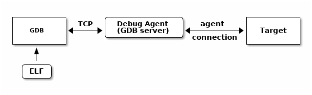
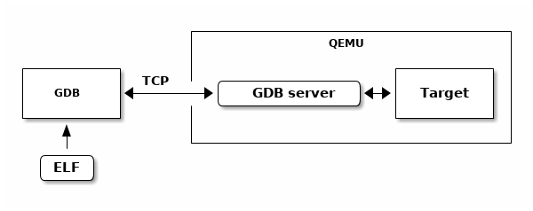
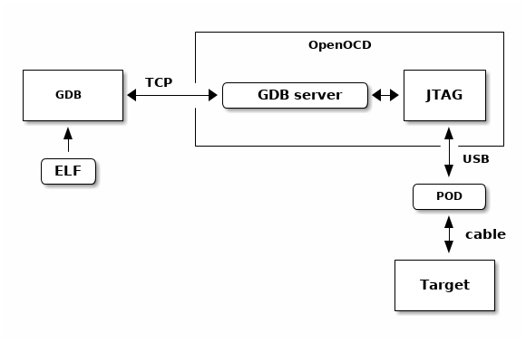
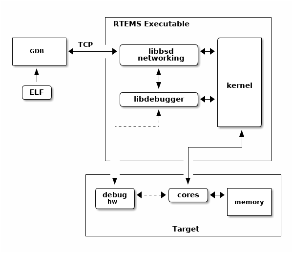

.. SPDX-License-Identifier: CC-BY-SA-4.0

.. Copyright (C) 2018 Chris Johns <chrisj@rtems.org>

Debugging
=========
.. index:: Debugging

An RTEMS executable is debugged by loading the code, data and read-only data
into a target with a debugger connected. The debugger running on a host
computer accesses the ELF file reading the debug information it contains.

The executable being debugged needs to be built with the compiler and linker
debug options enabled. Debug information makes the ELF executable file large
but it does not change the binary footprint of the executable when resident in
the target. Target boot loaders and file conversion tools extract the binary
code, data and read-only data to create the file embedded on the target.

An ELF executable built with debug information contains DWARF debug
information. DWARF is a detailed description of the executable a debugger uses
to locate functions, find data, understand the type and structure of a
variable, and know how much entry code every call has. The debugger uses this
information to set breaks points, step functions, step instructions, view the
data and much more.

We recommend the compiler and linker debug options are always enabled. An ELF
file with debug information can be used to investigate a crash report from a
production system if the production ELF image is archived. The RTEMS tools
chain provides tools that can take an address from a crash dump and find the
corresponding instruction and source line. The extra size the debug information
adds does not effect the target footprint and the extra size on a host is small
compared to the benefits it brings.

A desktop or server operating system's kernel hosts the executable being
debugged handling the interaction with the executable and the debugger. The
debugger knows how to communicate to the kernel to get the information it
needs. Debugging an embedded executable needs an extra piece called an agent to
connect the target to the debugger. The agent provides a standard remote interface to
the debugger and an agent specific connection to the target.

.. _fig-exe-debug:

   Embedded Executable Debugging

The RTEMS tool chain provides the GNU debugger GDB. GDB has a remote protocol
that can run over networks using TCP and UDP protocols. The GDB remote protocol
is available in a number of open source and commercial debugging
solutions. Network debugging using the remote protocol helps setting up a
laboratory, the targets can be remote from the developers desktop allowing for
better control of the target hardware while avoiding the need to plug devices
in to an expensive desktop or server machine.

The following are some examples of GDB and GDB server environments RTEMS
supports.

.. index:: QEMU

QEMU contains a debugging agent for the target being simulated. A QEMU command
line option enables a GDB server and the simulator manages the interaction with
the target processor and it's memory and caches.

.. _fig-exe-debug-qemu:

   QEMU Executable Debugging

.. index:: OpenOCD
.. index:: JTAG

OpenOCD is a JTAG debugging package that interfaces to a wide of JTAG
pods. JTAG is a low level high speed serial interface modern processors provide
as a means of controlling the core processing logic. The features available depend on
the architecture and processor. Typical functions include:

#. Processor control and register access

#. System level register access to allow SOC initialization

#. General address space access

#. Cache and MMU control

#. Break and watch points

.. _fig-exe-debug-qemu:

   OpenOCD JTAG Executable Debugging

.. index:: libdebugger

The RTEMS kernel has a debugging agent called ``libdebugger``. This is a
software based agent that runs within RTEMS using network services to provide a
remote GDB protocol interface. A growing number of architectures are
supported. The RTEMS debugging agent is for application development providing
thread aware stop model debug experience.

.. _fig-exe-debug-libdebugger:

   Libdebugger Executable Debugging
