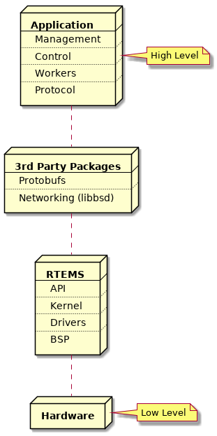
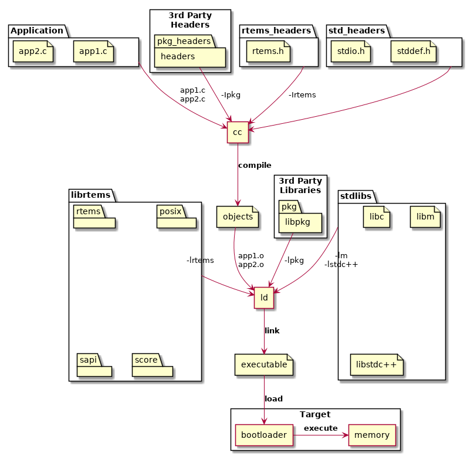

.. SPDX-License-Identifier: CC-BY-SA-4.0

.. Copyright (C) 2018 Chris Johns <chrisj@rtems.org>

RTEMS Executable
================
.. index:: RTEMS Executable

Running executables is the most important part of working with RTEMS, it is
after all how you run your application and use the RTEMS kernel services.

An RTEMS executable is embedded in a target and executing an embedded
executable has challenges not faced when executing software on a desktop or
server computer. A desktop or server operating system kernel provides all the
support needed to bring an executable's code and data into a process's address
space passing control to it and cleaning up when it exits. An embedded target
has to provide similar functionality to execute an embedded executable.

An RTEMS Source Builder (RSB) built RTEMS tool chain is used to create RTEMS
executables. The tool chain executable creates a fixed position statically
linked Extendable Loader Format (ELF) file that contains the RTEMS kernel,
standard libraries, third-party libraries and application code. RTEMS executes in
a single address space which means it does not support the ``fork`` or ``exec``
system calls so statically linking all the code is the easiest and best way to
create an executable.

An RTEMS application is constructed vertically with the RTEMS kernel, BSP
support code and drivers close to the hardware, above which sit the RTEMS
Application Programming Interfaces (API) for control of threads, mutex and
other resources an application may use. Middle-ware services like networking,
interpreted languages, and protocol stacks sit between the RTEMS APIs and the
application components. The software built into an executable can be see as a
vertical software stack.

.. _fig-exe-vert-stack:

   Vertical Software Stack

Building an Application
=======================
.. index:: Building an Application

RTEMS views any code it is running and using it's interfaces as an
application. RTEMS conforms to a number of international standards such as
POSIX and can build and run portable code written in languages such as C, C++
and Ada.

Applications are built from source into ELF object files, third-party packages
can be built as libraries or they can be imported as source into an application
code base. The application, third-party packages, RTEMS and standard libraries
are linked to create the RTEMS executable. The executable is transferred to the
target and a bootloader loads it from the non-volatile storage into RAM or the
code is executed in place in the non-volatile storage. The target hardware
defines what happens.

.. _fig-exe-app:

   Building an Application

The standard and third-party libraries are a collection of object files built
using the same set of tools the application source is compiled with. The
package collects it's object files into an archive or library.

RTEMS does not provide a standard application build system. The RTEMS ecosystem
provides support so a range of build systems can be used. Applications can be
built with ``make``, ``autotools``, ``cmake``, ``waf`` and more. User should
select a build system that meets their project, system, corporate or personal
needs.

.. _MachineFlagsandABI:

Machine Flags and ABI
---------------------
.. index:: Machine flags
.. index:: Application Binary Interface
.. index:: ABI

All code in an RTEMS executable must be built with the same machine flags. The
machine flags control the instruction set and application binary interface
(ABI) the compiler generates. As the executable is statically linked all code
must use the same instruction set the hardware is configured to support and all
code must conform to the same ABI. Any variation can result in unpredictable
behavior such as crashes, failures or lock ups. It is recommend an executable
is built with the same or equivalent tool set. Mixing of tool set versions can
also result in undefined behavior. The RTEMS tool ``rtems-execinfo`` can audit
an RTEMS executable and list the machine flags and compilers used.

RTEMS by default does not support instruction emulation for unsupported
instructions. RTEMS applications are normally built from source so binary
compatibility is not as important as performance. Instruction emulation is
costly to execute and rebuilding the executable with the correct instruction
set only needs to be done once.
