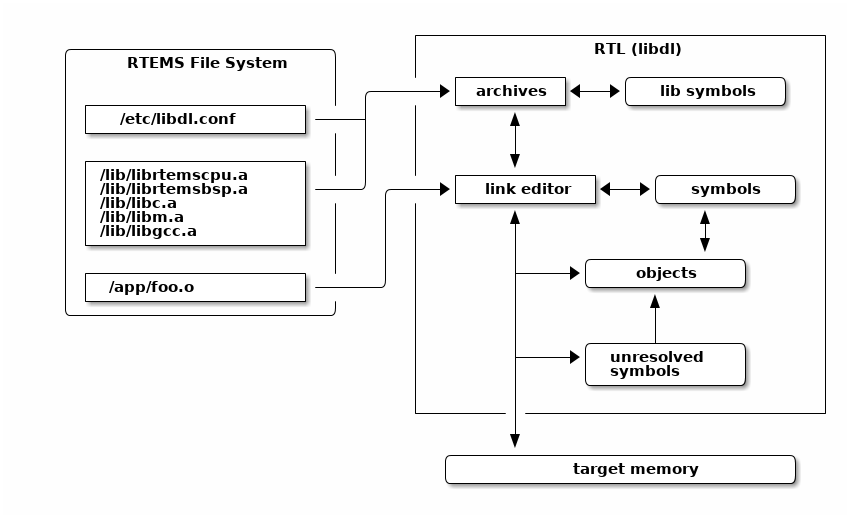
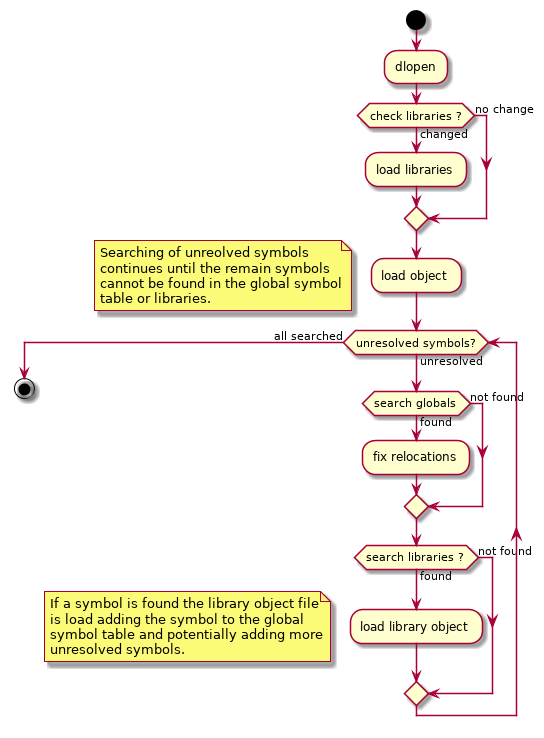

.. SPDX-License-Identifier: CC-BY-SA-4.0

.. Copyright (C) 2019 Chris Johns <chrisj@rtems.org>

.. index:: Dynamic Loader

Dynamic Loader
==============
.. index:: Dynamic Loader
.. index:: Run-time Loader
.. index:: RTL
.. index:: Libdl

RTEMS supports dynamically loading of executable code and data in the form of
object files into a running system where the run-time loaded code can be
executed and data accessed

This section describes RTEMS loader, preparing and loading executable code into
a running system, the supported architectures and any limitation that may exist
with an architecture.

The RTEMS operating system contains a link editor that runs on the target. The
link editor supports loading Extendable Linker Format (ELF) relocatable
executable object files locating the code and data in the target's address space
as it is loaded. An executable object file's external references to function
identifiers and data object identifiers are resolved and any external symbols
can be made available in the global symbol table. The executing performance of
dynamically loaded code is similar to the same code statically linked into an
executable. This is a core requirement of the RTEMS link editor.

.. _fig-dl-libdl:

   Run Time Loader (libdl)

The RTEMS operating system's dynamic loader is not the same as the dynamic
shared library support Unix or Windows have. Those operating systems use dynamic
loading to share code between processes and this is an important feature in
their design. RTEMS is a single address space operating system and that means
there is no ability to share code at run-time. As a result code is loaded in a
similar manner to static linking removing the need for any overheads sharing
code may have.

To load an executable object file it must be resident on a target and accessible
by RTEMS's file system. The executable object file can be a single file or a
collection in a library stored using the Unix standard archive format. The RTEMS
loader supports the extended GNU format for long file names in archives.

The RTEMS developers do not see dynamically loading of code as a real-time
activity. A system should not respond to real-time external events by loading
code. The loading of code should happen before a system is considered available
and the activity the system is experiencing is low and stable.

.. index: base image

The statically linked executable that is loaded and run after reset is called
the *base image*. The *base image* contains your base application that is used
to dynamically load code, a global symbol table, the parts of the RTEMS
operating system code used in the base image as well as functions and data from
the tool suite libraries and packages you are using. Only the software
referenced is used to create the base image. The parts of the libraries not
referenced are not part of the executable or present in the global symbol table.

Application software can locate a symbol by name and call the address or
reference the data at that address. A function identifier located by a symbol
does not have it's signatures checked, it is the responsibility of the caller to
make sure the function is called with the correct arguments. It is the same for
data objects, there is no type checking. Symbol versioning is not supported and
supporting it does not make sense within the RTEMS operating system. An RTEMS
target system is closed to normal users and software needs to be built from the
same tool set and header files used to the build the base image.

An executable object file's text or code has to be built for the target's
architecture it is loaded on and it must be built with the same ABI flags the
base image is built with. See :ref:`MachineFlagsandABI`.

System Design
-------------

The use of dynamic loading in a project is a system design decision. Some
systems will have strict requirements where loading code into a live system is
not allowed while other projects will benefit from the system level flexibility
dynamically loading code provides.

Code loaded at run time needs to be resident or accessible to the target via
RTEMS's file system. Targets that have suitable media or a network interface to
NFS servers to hold the executable object and library files are best suited.

Dynamically loading code uses more memory than statically linking the same code
into the base image. The link editor maintains symbol tables where each symbol
is a string, an address, and some additional data. The executable object files
resident in memory each have data to manage them, the memory they use, and any
dependencies they might have. The link editor is designed to minimize the memory
overheads however only statically linked executables have no memory overhead.

The link editor relocates the code and data into RAM fixing it to the load
address as it is loaded. A target needs to have suitably configured memory
available for the executable object file to reside in. The memory must be able
to support read, write and executable type access. Fine control of the memory
and it's modes can be supported using a customer allocator. Examples are systems
that have a custom memory map, specialized memory for the execution of code or a
requirement for read-only executable sections.

The load address of an executable object file is determined by the load order
and the allocator used. The default allocator for the link editor is the system
heap which means the location a specific executable object file is loaded at
depends on the memory allocated before it is loaded and when in the load order
it is loaded. A statically linked executable's address map is fixed and this is
considered important in some systems. A dynamically loaded system can be loaded
in a repeatable manner if the load order is the same and the initialization
sequence of the system is controlled. A custom allocator may also help.

Management of dynamically loadable object files and libraries adds to the
configuration management of the hosts in a project. The loadable files need to
be released and tracked in a suitable configuration management process just like
the base image is. Executable object files and libraries are specific to a
version of RTEMS and cannot be mixed or moved and this needs to be carefully
managed. Currently there are no checks an executable object file matches the
version of the base image it is being loaded on. These extra configuration
controlled items add to the overheads of a project and need to be considered.

Dynamically loadable systems have a number of features that benefit some systems
and products. Systems can be built on a base of trusted or *golden* modules. A
number of projects using a common base of hardware can make use of proven
modules reducing the testing and qualification overhead for each new release. A
tested base image with libraries for common and available boards provides a
simple and fast way for new users to trial and use RTEMS.

A project can use dynamic loading during development, shipping statically linked
executables in production. Hardware used by a development team can have more
memory, extra media for disk drives, or a network interface.

Loader Interface
----------------
.. index:: Loader Interface
.. index:: Loading object files
.. index:: dlfcn.h

Run-time executable object file loading and management is via the standard's
based calls provided by the header file ``<dlfcn.h>``. The details of the calls
follow.

.. _dlopen:
.. index:: dlopen

``void* dlopen(const char* path, int mode);``
  The ``dlopen()`` function makes the symbols (function identifiers and data
  object identifiers) in the executable object file specified by `file`
  available to the calling program.

  The executable object files eligible for this operation are in the ELF
  format.

  The link loader may load embedded dependencies in executable object files. In
  such cases, a ``dlopen()`` operation may load those dependencies in addition
  to the executable object file specified by `file`.

  A successful ``dlopen()`` returns a `handle` which the caller may use on
  subsequent calls to ``dlsym()``, ``dlinfo()`` and ``dlclose()``.

  The value of the `handle` should not be interpreted in any way by the caller.

  Subsequent calls to ``dlopen()`` for the same executable object file increases
  the references to it.

  The `file` argument is used to construct a pathname to the executable object
  file or archive library of executable object files. If the `file` argument
  contains a colon (``:``) the name of the executable object file in the library
  follows and this file name may optionally end with ``@`` followed by a number
  which is the absolute offset in the library file where the executable object
  file starts. If an executable object file is not detected at the offset the
  archive library's file table is searched.

  If `file` is a null pointer, ``dlopen()`` returns a global symbol table
  handle. This `handle` provides access to the global symbols from an ordered
  set of executable object files consisting of the original base image file, the
  set of executable object files loaded using ``dlopen()`` operations with the
  ``RTLD_GLOBAL`` flag, and any dependencies loaded. As the latter sets of
  executable object files can change during execution, the set of symbols made
  available by this `handle` can also change dynamically.

  Only a single copy of an executable object file is brought into the address
  space, even if ``dlopen()`` is invoked multiple times in reference to the
  executable object file, and even if different pathnames are used to reference
  the executable object file.

  Unresolved external symbols do not cause an error to be returned allowing the
  loading of jointly dependent executable object files.

  If ``dlopen()`` fails, it returns a null pointer, and sets an error condition
  which may be interrogated with ``dlerror()``.

  The `mode` parameter describes how ``dlopen()`` operates upon `file` with
  respect to the processing of relocations and the scope of visibility of the
  symbols provided within `file`. When an executable object file is brought into
  the address space, it may contain references to symbols whose addresses are
  not known until the executable object file is loaded.

  If a loaded executable object file and any dependent executable object files
  loaded with it contain any initialiser functions, they are called in the order
  loaded before ``dlopen()`` returns.

  The modes ``RTLD_LAZY`` and ``RTLD_NOW`` do not effect the type of relocation
  performed, it is same for both modes. All relocations of an executable object
  file and any dependent executable object files loaded with it are completed
  before the ``dlopen()`` call returns. The execution performance of the code
  loaded can be considered deterministic once ``dlopen()`` has returned.

  Any executable object file loaded by ``dlopen()`` can reference global symbols
  in the base image, any executable object files loaded included in the same
  ``dlopen()`` invocation, and any executable object files that were loaded in
  any ``dlopen()`` invocation and which specified the ``RTLD_GLOBAL`` flag. To
  determine the scope of visibility for the symbols loaded with a ``dlopen()``
  invocation, the `mode` parameter should be a bitwise-inclusive ``OR`` with one
  of the following values:

  ``RTLD_GLOBAL``
     The executable object file's symbols are made available for relocation
     processing of any other executable object file. In addition, symbol lookup
     using ``dlopen(NULL,mode)`` and an associated ``dlsym()`` allows
     executable object files loaded with this mode to be searched.

  ``RTLD_LOCAL``
    The executable object file's symbols shall not be made available for
    relocation processing of any other executable object files.

  If neither ``RTLD_GLOBAL`` nor ``RTLD_LOCAL`` is specified, the default
  behavior is unspecified.

  If ``RTLD_GLOBAL`` has been specified, the executable object file maintains
  it's ``RTLD_GLOBAL`` status regardless of any previous or future specification
  of ``RTLD_LOCAL``, as long as the executable object file remains in the
  address space.

  Symbols introduced through calls to ``dlopen()`` may be used in relocation
  activities. Symbols that duplicate symbols already defined by the base image
  or previous ``dlopen()`` calls are treated as an error and the object file is
  not loaded. Symbols introduced through loading dependent executable object
  files are ignored or not loaded depending on the method used to build the
  executable object files.

  The symbols introduced by ``dlopen()`` operations and available through
  ``dlsym()`` are at a minimum those which are exported as identifiers of global
  scope by the executable object file. Typically, such identifiers shall be
  those that were specified in (for example) C source code as having ``extern``
  linkage.

.. _dlclose:
.. index:: dlclose

``int dlclose(void* handle);``
  Releases a reference to the executable object file referenced by `handle`. If
  the reference count drops to ``0``, the executable object file's global symbol
  table is made unavailable. When all references to the global symbols the
  executable object file provided have been removed the object file is removed
  from the address space.

  If the executable object being removed has any termination routines in it they
  are called.

.. _dlsym:
.. index:: dlsym

``void* dlsym(void* handle, const char* symbol);``
 The ``dlsym()`` function obtains the address of a symbol (a function identifier
 or a data object identifier) defined in the symbol table identified by the
 handle argument. The handle argument is a symbol table handle returned from a
 call to ``dlopen()`` (and which has not since been released by a call to
 ``dlclose()``), and name is the symbol's name as a character string. The return
 value from ``dlsym()``, cast to a pointer to the type of the named symbol, can
 be used to call (in the case of a function) or access the contents of (in the
 case of a data object) the named symbol.

 The ``dlsym()`` function searches for the named symbol in the symbol table
 referenced by handle and returns the address of the code or data location
 specified by the null-terminated character string symbol. Which libraries and
 objects are searched depends on the `handle` parameter.

 Upon successful completion, if name names a function identifier, ``dlsym()``
 returns the address of the function converted from type pointer to function to
 type pointer to ``void``; otherwise, ``dlsym()`` shall return the address of
 the data object associated with the data object identifier named by name
 converted from a pointer to the type of the data object to a pointer to
 ``void``. If `handle` does not refer to a valid symbol table handle or if the
 symbol named by name cannot be found in the symbol table associated with
 `handle`, ``dlsym()`` shall return a null pointer.

.. _dlinfo:
.. index:: dlinfo

``int dlinfo(void* handle, int request, void* args);``

 The ``dlinfo()`` function provides information about dynamically loaded object.
 The action taken by ``dlinfo()`` and exact meaning and type of the argument
 `args` depend on value of the `request` argument provided by the caller.

 ``RTLD_DI_UNRESOLVED``
   Return ``1`` in an indexer value pointed to by `args` if the symbol table
   handle has unresolved relocation records to symbols. If the `handle` is the
   global symbol table handle or ``RTLD_SELF`` return ``1`` if any unresolved
   relocation records to symbols are present in any loaded executable object
   files..

.. _dlerror:
.. index:: dlerror

``const char *dlerror(void);``
 The ``dlerror()`` function returns a null-terminated character string (with no
 trailing ``<newline>``) that describes the last error that occurred during
 dynamic linking processing. If no dynamic linking errors have occurred since
 the last invocation of ``dlerror()``, ``dlerror()`` returns ``NULL``. Thus,
 invoking ``dlerror()`` a second time, immediately following a prior
 invocation, results in ``NULL`` being returned.

This example opens an object file, checks for any unresolved symbols the object
file may have, locates a global symbol in the object file, calls it then closes
the object file:

.. code-block:: c

 #include <stdbool.h>
 #include <stdio.h>
 #include <dlfcn.h>

 typedef int (*call_sig)(void);

 bool load_object (void)
 {
   void*    handle;
   call_sig call;
   int      unresolved;

   handle = dlopen ("/code.o", RTLD_NOW | RTLD_GLOBAL);
   if (handle == NULL)
   {
     printf ("dlopen failed: %s\n", dlerror ());
     return false;
   }

   if (dlinfo (handle, RTLD_DI_UNRESOLVED, &unresolved) < 0)
   {
     printf ("dlinfo failed: %s\n", dlerror ());
     dlclose (handle);
     return false;
   }

   if (unresolved != 0)
   {
     printf ("object.o has unresolved external symbols\n");
     dlclose (handle);
     return false;
   }

   call = dlsym (handle, "foo");
   if (call == NULL)
   {
     printf("dlsym failed: symbol 'foo' not found\n");
     dlclose (handle);
     return false;
   }

   printf ("'foo()' returns: %i\n", call ());

   if (dlclose (handle) < 0)
   {
     printf("dlclose failed: %s\n", dlerror());
     return false;
   }

   return true;
 }

Symbols
-------
.. index:: symbol
.. index:: global symbol
.. index:: function identifier
.. index:: data object identifier

The RTEMS link editor manages the symbols for the base image and all resident
executable object files. A symbol is an identifier string and a pointer value to
a function identifier or a data object identifier. The symbols held in the
symbol tables are used in the relocation of executable object files or they can
be accessed by application code using the :ref:`dlsym() <dlsym>` call.

.. index:: orphaned object file

An executable object file's symbols are removed from the global symbol table
when it is closed or orphaned. An executale object file cannot be unloaded if a
symbol it provides is referenced by another object and that object is still
resident. An executable object file that has no references to any of its symbols
and was not explicitly loaded using the :ref:`dlopen() <dlopen>` call is
orphaned and automatically removed from the address space.

Base Image Symbols
^^^^^^^^^^^^^^^^^^
.. index:: base image symbols

The base image symbol table provides access to the function and data objects
statically linked into the base image. Loaded executable object files can be
directly linked to the code and data resident in the base image.

A statically linked RTEMS executable does not contain a symbol table, it has to
be generated and either embedded into the executable or loaded as a specially
created executable object file.

The base image symbol table is dependent on the contents of the base image and
this is not known until it has been linked. This means the base image symbol
table needs to be constructed after the base image executable has been linked
and the list of global symbols is known.

The RTEMS Tools command :program:`rtems-syms` (see :ref:`RTEMSSymbols`) extracts
the global and weak symbols from an RTEMS static executable file, creates a C
file and compiles it creating a relocatable executable object file. This file
can be linked with the static executable's object files and libraries to create
a static executables with an embedded symbol table or the executable file can be
loaded dynamically at run-time. The following needs to be observed:

#. The option ``-e`` or ``--embedded`` to :program:`rtems-syms` creates an
   executable object file to be embedded in the base image and not providing
   either of these options creates a symbols executable object file that is
   loaded at run-time. The same executable object file cannot be used to
   embedded or load.

#. The target C compiler and machine options need to be provided to make sure
   the correct ABI for the target is used. See :ref:`MachineFlagsandABI`.

.. index:: embedded symbol table
.. _EmbbeddedSymbolTable:

Embedded Symbols
^^^^^^^^^^^^^^^^

An embedded symbol table is *embedded* within the base image executable file and
loaded when the static executable is loaded into memory by the bootloader. The
symbol table is automatically added to the link editor's global symbol table
when the first executable object file is loaded.

The process to embed the symbol table requires linking the base image twice.
The first link is to create a static executable that collects together the
symbols to make the symbol table. The RTEMS Tools command `rtems-syms` extracts
the global and weak symbols from the static executable ELF file, creates a C
file and compiles it to create an executable object file. The base image is
linked a second time and this time the symbol table executable object file is
added to the list of object files.

Embedding the symbol table means the chances of the symbol table and base image
not matching is low, however it also means the symbol table is always present in
the kernel image when dynamic loading may be optional. A project's build system
is made more complex as it needs to have extra steps to link a second time.

This example shows creating an embedded symbol table object file and linking it
into the base image.

.. code-block:: none

 $ sparc-rtems@rtems-ver-major@-gcc -mcpu=cypress foo.o -lrtemsbsp -lrtemscpu -o foo.pre
 $ rtems-syms -e -C sparc-rtems@rtems-ver-major@-gcc -c "-mcpu=cypress" -o foo-sym.o foo.pre
 $ sparc-rtems@rtems-ver-major@-gcc -mcpu=cypress foo.o foo-sym.o -lrtemsbsp -lrtemscpu -o foo.exe

The link command line steps in this example are not complete.

.. _LoadableSymbolTable:

Loadable Symbols
^^^^^^^^^^^^^^^^

A run-time loaded symbol table is the default for the command
:program:`rtems-syms`. The symbol table executable object file is packaged with
the other files to be dynamically loaded at run-time and placed on the target's
file system. It needs to be loaded before any other executable object file are
loaded or unresolved symbols can occur that will not be resolved.

A run-time loaded symbol table does not consume any target resources until it is
loaded. This is useful in a system that optionally needs to dynamically load
code, for example as a development environment. The symbol table executable
needs to exactly match the base image loading it or the behavior is
unpredictable. No checks are made.

The example shows creating and loading a symbol table executable object
file. First create the symbol table's executable object file:

.. code-block:: none

 $ sparc-rtems@rtems-ver-major@-gcc -mcpu=cypress foo.o -lrtemsbsp -lrtemscpu -o foo.exe
 $ rtems-syms -C sparc-rtems@rtems-ver-major@-gcc -c "-mcpu=cypress" -o foo-sym.o foo.exe

The link command line steps in this example are not complete.

Load the symbol table:

.. code-block:: c

 #include <stdbool.h>
 #include <stdio.h>
 #include <dlfcn.h>

 bool load (void)
 {
  void* handle = dlopen ("/foo-sym.o", RTLD_NOW | RTLD_GLOBAL);
  if (handle == NULL)
  {
    printf ("failed to load the symbol table: %s\n", dlerror ());
    return false;
  }
  return true;
 }

Unresolved Symbols
------------------

The RTEMS link editor does not return an error when an executable object file is
loaded with unresolved symbols. This allows dependent object files to be
loaded. For example an executable object file :file:`foo.o` contains the
function ``foo()`` and that function calls ``bar()`` and an executable object
file :file:`bar.o` contains a function ``bar()`` that calls the function
``foo()``. Either of these executable object files can be loaded first as long
both are loaded before any symbols are accessed.

The link editor defers the resolution of unresolved symbols until the symbol is
available in the global symbol table. Executing code or accessing data in a
loaded executable object file with unresolved external symbols results in
unpredictable behavior.

All unresolved symbols are checked after an executable object file has been
loaded. If a symbol is found and resolved any relocations that reference the
symbol are fixed. If valid library files have been configured the symbol table's
of each library are searched and if the symbol is found the dependent executable
object file is loaded. This process repeats until no more symbols can be
resolved.

The ``dlinfo()`` call can be used to see if a loaded executable object file has
any unresolved symbols:

.. code-block:: c

 #include <stdbool.h>
 #include <stdio.h>
 #include <dlfcn.h>

 bool has_unresolved(void* handle)
 {
   int unresolved;
   if (dlinfo (handle, RTLD_DI_UNRESOLVED, &unresolved) < 0)
   {
     printf ("dlinfo failed: %s\n", dlerror ());
     return false;
   }
   return unresolved != 0;
 }

The handle ``RTLD_SELF`` checks for any unresolved symbols in all resident
object files:

.. code-block:: c

 if (has_unresolved(RTLD_SELF))
   printf("system has unsolved symbols\n");

Libraries
---------

The RTEMS link editor supports loading executable object files from
libraries. Executable object files can be explicitly loaded from a library using
a specific path to :ref:`dlopen() <dlopen>` and treated the same as loading a
stand alone executable object file. Libraries can be searched and an executable
object file containing the search symbol can be loaded automatically as a
dependent executable object file. A dependent executable object file loaded from
a library with no symbol references to it's symbols is orphaned and
automatically unloaded and removed from the address space.

.. _fig-dl-libs:

   Loading Executable Object Files

A library is an archive format file created using the RTEMS architecture
prefixed :program:`ar` command. The RTEMS tool suite provides the :program:`ar`
program and system libraries such as :file:`libc.a` and :file:`libm.a` for each
architecture and ABI. Libraries used by the RTEMS link editor for searching must
contain a symbol table created by the :program:`ranlib` program from the RTEMS
tool suite.

Searching a library's symbol table and loading an executable object file
containing the symbol is called *dependent loading*. Dependent loading provides
a simple way to manage the dependencies when loading an executable object
file. If code in an executable object file references functions or data objects
that are part of a library and the symbols are not part of the base image those
symbols will not resolve unless the library is on the target and available for
searching and loading. Dependent loading from libraries on the target provides a
simple and understandable way to manage the dependency issue between the base
image, loaded code and the system libraries.

The RTEMS link editor checks for the configuration file :file:`/etc/libdl.conf`
on each call to :ref:`dlopen() <dlopen>`. If the file has changed since the last
check it is loaded again and the contents processed. The file format is:

#. Comments start with the ``#`` character.
#. A line is a wildcard path of libraries to search for. The wildcard search
   uses the ``fnmatch()`` call. The ``fnmatch()`` function matches patterns
   according to the rules used by a shell.

Files that match the search pattern are verified as a library and if a symbol
table is found it is loaded and the symbols it contains made search-able.

A call to :ref:`dlopen() <dlopen>` checks the global symbols table and any
references to relocation symbols not found are *unresolved* and added to the
unresolved symbol table. Once the executable object file is loaded the link
editor attempts to resolve any unresolved symbols. The unresolved symbol
resolver checks each unresolved symbol against the global symbol table and if
not found the available library symbol tables are searched. If a symbol is found
in a library the dependent executable object file is loaded. The process repeats
until all unresolved symbols have been resolved and the remaining unresolved
symbols are not in the global symbol table or any libraries. The loading of a
library executable object file will resolve at least one symbol and it may add
more unresolved symbols requiring further searching of the libraries.

.. index:: strip library

A library of executable object files built by the RTEMS Tool suite can contain
debug information and this should be stripped before loading on to the
target. The tool suite's command :program:`strip` can strip all the object files
in a library with a single command.

.. code-block:: none

  $ sparc-rtems@rtems-ver-major@-strip libc.a

Large Memory
------------

The RTEMS link editor supports large memory relocations. Some architectures have
instructions where the relative branch or jump offset from the instruction to
the target address is limited. These instructions provide improved performance
because less code generated compared to larger instructions which contain full
address space references. The compact code helps lower cache pressure as well
and providing improved performance for localalized functions and loops. The
compiler defaults to generating the smaller instruction and as the final address
map not known when generating the code, linkers need to provide glue code to
extend the small address range to the enitre address space. This is called a
trampoline. A trampoline is transparent to the execution of the code.

The link editor parses an executable object file's relocation records to
determine the number of trampolines needed. Added to this value are all
unresolved symbols present in an executable object file after it is
loaded. There is a slot allocated even if the symbol ends up being within range
as there is no way to determine a symbol's address until it is loaded and the
range calculated.

The trampoline table is allocated a separate block of memory to the executable
object file's text, data and constants memory. The trampoline parsing requires
the executable object file's instructions (text) be in memory as the
instructions are inspected by the architecture specific relocation support to
determine an instruction's range. As a result the allocation for the trampoline
table has to occur after the text memory has been allocated. Most instructions
have relative offsets and the trampoline table is allocated at one end limiting
the size of an object to half the maximum range.

Trampolines support is available for the ARM and PowerPC architectures. The
SPARC and Intel x86 architectures do not need trampolines and MIPS needs support
added.

Allocator
---------

The RTEMS link editor supports custom allocators. A custom allocator lets you
manage the memory used by the RTEMS link editor as it runs. Allocators could
provide:

#. Support for the various types of memory that can be allocated allowing
   specialised target support for specific use cases.
#. Locking of read-only memory. The link editor unlocks read-only memory when it
   needs to write to it.
#. Separation of memory holding code and data from the heap.

The allocator can be hooked using the ``rtems_rtl_alloc_hook`` call before any
calls to :ref:`dlopen() <dlopen>` are made. The hook call returns the current
allocate allowing the allocators to be chained.

The default allocator uses the heap.

.. _rtems_rtl_alloc_tags:
.. index:: rtems_rtl_alloc_tags

The allocator tags specify the type of memory the allocator is handling. The tag
used to allocate memory at an address must be used when making allocator
calls. The ``rtems_rtl_alloc_tags`` are:

 .. index:: RTEMS_RTL_ALLOC_OBJECT

 ``RTEMS_RTL_ALLOC_OBJECT``
  Allocate a generic object. The link editor uses this memory for data
  structures it uses to manage the linking process and resident executable
  object files.

 .. index:: RTEMS_RTL_ALLOC_SYMBOL

 ``RTEMS_RTL_ALLOC_SYMBOL``
  Allocate memory to hold symbol data.

 .. index:: RTEMS_RTL_ALLOC_EXTERNAL

 ``RTEMS_RTL_ALLOC_EXTERNAL``
  Allocate memory for unresolved external symbols.

 .. index:: RTEMS_RTL_ALLOC_READ

 ``RTEMS_RTL_ALLOC_READ``
  Allocate memory for read-only data such as constants and exception tables.

 .. index:: RTEMS_RTL_ALLOC_READ_WRITE

 ``RTEMS_RTL_ALLOC_READ_WRITE``
  Allocate memory for read-write data such as a initialised, uninitialized and
  common variables.

 .. index:: RTEMS_RTL_ALLOC_READ_EXEC

 ``RTEMS_RTL_ALLOC_READ_EXEC``
  Allocate memory for code to be executed in. The address space is configure for
  read and execute.

.. _rtems_rtl_alloc_cmd:
.. index:: rtems_rtl_alloc_cmd

The commands are used to control the action the allocator performs. The
``rtems_rtl_alloc_cmd`` are:

 .. index:: RTEMS_RTL_ALLOC_NEW

 ``RTEMS_RTL_ALLOC_NEW``
  Allocate memory of the ``tag`` type. Returns ``NULL`` if the allocation fails.

 .. index:: RTEMS_RTL_ALLOC_DEL

 ``RTEMS_RTL_ALLOC_DEL``
  Delete a previous allocation freeing the memory. The ``tag`` has to match
  address of the memory being deleted.

 .. index:: RTEMS_RTL_ALLOC_WR_ENABLE

 ``RTEMS_RTL_ALLOC_WR_ENABLE``
  Enable writes to a region of memory previously allocated. The ``tag`` has to
  match the address of the memory being write enabled. The link editor may call
  issue this command for memory that is already write enabled.

 .. index:: RTEMS_RTL_ALLOC_WR_DISABLE

 ``RTEMS_RTL_ALLOC_WR_DISABLE``
  Disable writes to a region of memory previously allocated. The ``tag`` has to
  match address of the memory being write disabled. The link editor may call
  issue this command for memory that is writable and not to be write
  disabled. The allocator need to manage this case.

.. _rtems_rtl_allocator:
.. index:: rtems_rtl_allocator

The allocator handler is a single call to handle all allocator requests. The
handler called on evey allocation action made by the link editor. The type of
the function you need is:

.. code-block:: c

 typedef void (*rtems_rtl_allocator)(rtems_rtl_alloc_cmd cmd,
                                     rtems_rtl_alloc_tag tag,
                                     void**              address,
                                     size_t              size);

The arguments are:

``cmd``
 The command to action. See `rtems_rtl_alloc_cmd <rtems_rtl_alloc_cmd_>`_.

``tag``

 The type of memory the command is for. The ``tag`` must match the
 address for commands other than ``RTEMS_RTL_ALLOC_OBJECT``.  See
 `rtems_rtl_alloc_tags <rtems_rtl_alloc_tags_>`_.

``address``
 Pointer to the address. This is set of the ``RTEMS_RTL_ALLOC_OBJECT`` command
 and read for the other commands. The ``tag`` must match the address for
 commands that read the address from the pointer.

``size``
 The size of the memory to allocate. This is only valid for the
 ``RTEMS_RTL_ALLOC_OBJECT`` command.

The call to hook the allocator is:

.. code-block:: c

 rtems_rtl_allocator rtems_rtl_alloc_hook (rtems_rtl_allocator handler);

The current allocator is returned. You can provide a full allocator or you can
filter commands.

Languages
---------

C is supported.

C++ is supported. Initializer functions are called when an object is loaded and
finalizer functions are called before it is unloaded and removed. Static
constructions are initializer functions and static destructors are finalizer
functions.

C++ exceptions are handled across modules. The compiler generated exception
tables present in an executable object file are registered with the architecture
specific mechanism when loaded and deregistered when unloaded. An exception
thrown in loaded code can be caught in the base image or another loaded
module. If you are using C++ and exceptions it is recommended some exception
code is added to the base image to place the architecture specific support in
the base image.

Thread Local Storage
--------------------

Thread local storage (TLS) is currenly not supported by the RTEMS link
editor. The RTEMS executive needs to have a special allocator added to manage
dynamically allocating TLS variables in a thread.

If you need TLS support in dynamically loaded code please consider the RTEMS
support options.

Architectures
-------------

The following architectures are supported:

 - AArch64
 - ARM
 - Blackfin
 - H8300
 - Intel x86 (i386)
 - LM32
 - M68K
 - MIPS
 - Moxie
 - PowerPC
 - SPARC
 - V850

AArch64
^^^^^^^

The AArch64 relocation backend supports veneers which is trampolines.

The veneer implementation is two instructions and a 64bit target address
making the overhead 16 bytes for each veneer. The performance overhead is two
instructions.

ARM
^^^

The ARM relocation backend supports veneers.

The veneer implementation is a single instruction and a 32bit target address
making the overhead 8 bytes for each veneer. The performance overhead is a
single instruction.

PowerPC
^^^^^^^

The PowerPC relocation backend support trampolines and small data.

The trampoline is four instructions and uses register 12 which the PowerPC ABI
reserves for scratch use. The implementation loads the counter register and
branches to the address it contains. The trampoline size is 16 bytes. The
performance overhead is four instructions.

The PowerPC relocation backend also supports small data. The sections of an
executable object file are parsed and small data are tagged as needing
architecture specific allocations. These sections are not allocated as part of
the standard section allocation. Small data sections are allocated in the global
small data region of memory. The size of this region is defined in the BSP's
linker command file by setting ``bsp_section_small_data_area_size`` variable:

.. code-block:: c

 bsp_section_small_data_area_size = 65536;

The maximum size of the small data region is 65536 bytes. It is recommended code
built for loading uses the same settings for small base as the base image.
