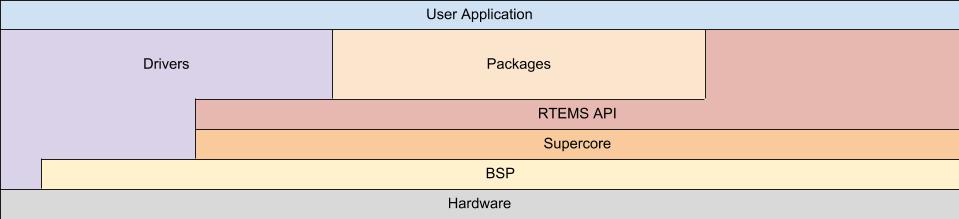

.. SPDX-License-Identifier: CC-BY-SA-4.0

.. Copyright (C) 2016 Chris Johns <chrisj@rtems.org>

.. _targets:

Targets
=======
.. index:: Targets

*Target hardware* that can run RTEMS is often referred to simply as the
*target* because RTEMS is specifically aimed at that target hardware. An RTEMS
executable is statically linked and executes in a single address space on the
target hardware. A statically linked executable means the RTEMS Kernel,
drivers, third party packages and application code is linked into a single
executable image. A single address space means no virtual memory and no memory
protected process address space is running within the RTEMS arena and the RTEMS
executive, drivers and application have unprotected access to the whole address
space and all hardware.

Target hardware supported by RTEMS has a :ref:`Board Support Package <BSPs>` or
BSP.  A BSP is a specific instance of an RTEMS architecture that allows the
creation of an RTEMS executable. You can view the layering as:

.. comment Build image with:
.. comment  aafigure hw-layers.txt --textual --type png --option
.. comment    font=/usr/local/lib/X11/fonts/webfonts/arialbd.ttf --background
.. comment    '#dbe5c6' --scale 1.5 -o ../../images/user/hw-layers.png

RTEMS targets are grouped by architectures and within an architecture there are
a number of Board Support Packages or BPSs. An architecture is a specific class
or family of processors and can be large such as ARM or specific such as the
NIOS-II or Microblaze.

RTEMS is designed to be ported to new target hardware easily and efficiently.
