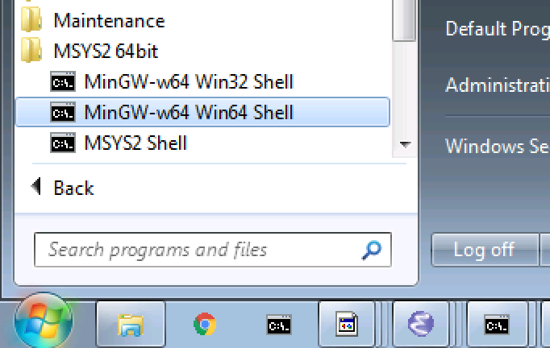

.. comment: Copyright (c) 2016 Chris Johns <chrisj@rtems.org>
.. comment: All rights reserved.

.. _development-hosts:

Development Hosts
=================
.. index:: Hosts

RTEMS applications are developed using cross-development tools running on a
host computer, typically your desktop or a special build server. All RTEMS
tools and runtime libraries are built from source on your host machine. The
RTEMS Project does not maintain binary builds of the tools. This may appear be
the opposite to what you normally experience with host operating systems, and
it is, however this approach works well. RTEMS is not a host operating system
and it is not a distrbution. Providing binary packages for every possible host
operating system is too big a task for the RTEMS Project and it is not a good
use of core developer time. Their time is better spent making RTEMS better and
faster.

Developer Computer
------------------

The rule for selecting a computer for a developer is `more is better` but we do
understand there are limits. Projects set up different configurations and what
is described here is not an approved set up, rather it is a guide. Some
projects have a suitable development machine per developer while others set up
a tightly controlled central build server. RTEMS is flexible and lets you
engineering a development environment that suites you. The basic specs are:

- Multicore processor
- 8G bytes RAM
- 256G harddisk

RTEMS makes no demands on graphics.

If you are using a VM or your host computer that is not a fast current machine
do not be concerned. The tools may take longer to build than faster hardware
however building tools is something you do once. Once the tools and RTEMS is
built all your time can be spent writing and developing your application. Over
an hour does happen and for the ARM architecture with all BSPs it can be many
hours.

Host Software
-------------

A wide range of host operating systems and hardware can be used. The host
operating systems supported are:

- Linux
- FreeBSD
- NetBSD
- Apple OS X
- Windows
- Solaris

The functionality on POSIX operating such as Linux and FreeBSD is similar and
most features on Windows are supported but you are best to ask on
:r:list:`users` if you have a specific question.

Install and set up your host operating system. We recommend you maintain your
operating system by installing any updates.

POSIX Hosts
-----------

.. sidebar:: *GDB and Python*

   RTEMS uses Python in GDB to aid debugging which means GDB needs to be built
   with Python development libraries. Please check the RSB documentation and
   install the packages specified for your host. Make sure a python development
   package is included.

POSIX hosts are most Unix operating systems such as Linux, FreeBSD and
NetBSD. RTEMS development works well on Unix and can scale from a single user
and a desktop machine to a team with decentralised or centralised development
infrastructure. The RTEMS project provides you with the development tools and
aids to help you create an environment that matches your project's needs. The
RTEMS Project's aims to give complete freedom to decide on the languages used
in your project, which version control system, and the build system for your
application.

The following are a few ways you can set up a suitable environment. You are not
limited to what is present here. A common factor that defines the final
location of tools and projects is the place you have suitable storage. The
following set ups assume suitable disk space and disk performance.

Adminisrator Access
~~~~~~~~~~~~~~~~~~~

You either have ``root`` access to your host development machine or you do
not. Some users are given hardware that is centrally managed. If you do not
have ``root`` access you can create your work environment in your home
directory. You could use a prefix of :file:`$HOME/development/rtems` or
:file:`$HOME/rtems`. Note, the ``$HOME`` environment variable can be
substituted with ``~``.

RTEMS Tools and packages do not require ``root`` access
to be built and we encourage you do not build the tools as ``root``. If you
need to control write access then it is best to manage this with groups
assigned to users.

If you have ``root`` access you can decide to install the tools under any
suitable prefix. This may depend on the hardware in your host development
machine. If the machine is a centralised build server the prefix may be used to
separate production versions from the test versions and as just discussed the
prefix paths may have restricted access to only those who manage and
configuration control of the machine.

Apple OS X
----------

Apple's OS X is fully supported. You need to download and install a recent
version of the Apple developer application Xcode. Xocde is available in the App
Store. Make sure you install the Command Line Tools add on available for
download within Xcode and once installed open a Terminal shell and enter the
command ``cc`` and accept the license agreement.

The normal prefix when working on OS X as a user is under your home directory.
Prefixes of :file:`$HOME/development/rtems` or :file:`$HOME/rtems` are
suitable.

.. _microsoft-windows:

Microsoft Windows
-----------------

RTEMS supports Windows as a development host and the tools for most
architectures are available. The RTEMS Project relies on the GNU tools for
compilers and debuggers and we use the simulators that come with GDB and
QEMU. The Windows support for these tools varies and the RTEMS Project is
committed to helping the open source community improve the Windows
experience. If something is not working or supported please email the
:r:list:`users`.

The RTEMS Project's Windows tools are native Windows executables giving the
user the best possible experience on Windows. Native Windows programs use the
standard Windows DLLs and paths. Integration with standard Windows integrated
development tools such as editors is straight forward. POSIX emulation
environments such as Cygwin and the MSYS2 shell have special executables that
require a POSIX emulation DLL and these emulation DLLs add an extra layer of
complexity as well as a performance over-head. The RTEMS Project uses these
POSIX emulation shells to run configure scripts that come with various open
source packages such as `gcc` so they form an important and valued part of the
environment we describe here. The output of this procedure forms the tools you
use during your application development and they do not depend the emulation
DLLs.

The performance of the compiler is as good as you can have on Windows and the
performance compiling a single file will be similar to that on a host like
Linux or FreeBSD given the same hardware. Building the tools from source is
much slower on Windows because POSIX shells and related tools are used and the
POSIX emulation overhead it much much slower than a native POSIX operating
system like Linux and FreeBSD. This overhead is only during the building of the
tools and the RTEMS kernel and if you use a suitable build system that is
native to Windows your application development should be similar to other
operating systems.

Building is known to work on `Windows 7 64bit Professional` and `Windows 10`.

.. _windows-path-length:

Path Length
~~~~~~~~~~~

Windows path length is limited and can cause problems when building the
tools. The standard Windows API has a ``MAX_PATH`` length of 260
characters. This can effect some of the tools used by RTEMS. It is recommended
you keep the top level directories as short as possible when building the RTEMS
tools and you should also keep an eye on the path length when developing your
application. The RTEMS built tools can handle much longer path lengths however
some of the GNU tools such as those in the ``binutils`` package cannot. The
release packages of the RSB when unpacked has a top level file names that is
too big to build RTEMS so you need to change that path to something smaller to
build. This is indicated in :ref:`released-version`.

.. _msys2_parallel_builds:

Parallel Builds with Make
~~~~~~~~~~~~~~~~~~~~~~~~~

The MSYS2 GNU ``make`` has problems when using the `jobs` option. The RSB
defaults to automatically using as many cores as the host machine has. To get a
successful build on Windows it is recommended you add the ``--jobs=none``
option to all RSB build set commands.

POSIX Support
~~~~~~~~~~~~~

Building the RTEMS compilers, debugger, the RTEMS kernel and a number of other
3rd party packages requires a POSIX environment. On Windows you can use Cygwin
or MSYS2. This document focuses on MSYS2. It is smaller than Cygwin and comes
with the Arch Linux package manager ``pacman``.

MSYS2 provides MinGW64 support as well as a POSIX shell called MSYS2. The
MinGW64 compiler and related tools produce 64bit native Windows
executables. The shell is a standard Bourne shell and the MSYS2 environment is
a stripped Cygwin shell with enough support to run the various ``configure``
scripts needed to build the RTEMS tools and the RTEMS kernel.

MSYS2 is built around the ``pacman`` packing tool. This makes MSYS2 a
distribution and that is a welcome feature on Windows. You get a powerful tool
to manage your development environment on Windows.

Python
~~~~~~

We need Python to build the tools as the RSB is written in Python and we need
suitable Python libraries to link to GDB as RTEMS makes use of GDB's Python
support. This places specific demands on the Python we need installed and
available and MSYS2 provides suitable Python versions we can use. You need to
make sure you have the correct type and version of Python installed.

We cannot use the Python executables created by the Python project (python.org)
as they are built by Microsoft's C (MSC) compiler. Linking the MSC Python
libraries with the MinGW64 executables is not easy and MSYS provided us with a
simple solution so we do not support linking MSC libraries.

MSYS2 provides two types and versions of Python executables, MinGW and MSYS and
Python version 2 and 3. For Windows we need the MinGW executable so we have
suitables libraries and we have to have Python version 2 because on Windows GDB
only builds with Python2.

You also need to install the MSYS version of Python along with the MinGW64
Python2 package. The MSYS Python is version 3 and the RSB can support version 2
and 3 of Python and it helps handle some of the long paths building GCC can
generate.

Installing MSYS2
~~~~~~~~~~~~~~~~

MSYS2 is installed on a new machine using the MSYS2 installer found on
https://msys2.github.io/. Please select the ``x86_64`` variant for 64bit
support. Run the installer following the 7 steps listed on the page.

MSYS2 uses the ``pacman`` package manager. The Arch Linux project has detailed
documentation on how to use ``pacman``. What is shown here is a just few
examples of what you can do.

.. sidebar:: **Pin MSYS2 Shell to Taskbar**

  Pin the MSYS2 64bit Shell to the Taskbar so you always use it rather than the
  32bit Shell.

Open a 64bit MSYS shell from the Start Menu:

The packages we require are:

* python
* mingw-w64-x86_64-python2
* mingw-w64-x86_64-gcc
* git
* bison
* cvs
* diffutils
* make
* patch
* tar
* texinfo
* unzip

.. note::

The actual output provided may vary due to changes in the dependent packages or
newer package versions.

Install the packages using ``pacman``:

.. code-block:: shell

  ~
  $ pacman -S python mingw-w64-x86_64-python2 mingw-w64-x86_64-gcc \
  bison cvs diffutils git make patch tar texinfo unzip
  resolving dependencies...
  looking for conflicting packages...

  Packages (74) db-5.3.28-2  expat-2.1.0-2  gdbm-1.11-3  heimdal-1.5.3-8
                libgdbm-1.11-3  mingw-w64-x86_64-binutils-2.26-21
                mingw-w64-x86_64-bzip2-1.0.6-5
                mingw-w64-x86_64-ca-certificates-20150426-2
                mingw-w64-x86_64-crt-git-5.0.0.4627.03684c4-1
                mingw-w64-x86_64-expat-2.1.0-6  mingw-w64-x86_64-gcc-libs-5.3.0-2
                mingw-w64-x86_64-gdbm-1.11-3  mingw-w64-x86_64-gettext-0.19.6-2
                mingw-w64-x86_64-gmp-6.1.0-1
                mingw-w64-x86_64-headers-git-5.0.0.4627.53be55d-1
                mingw-w64-x86_64-isl-0.15-1  mingw-w64-x86_64-libffi-3.2.1-3
                mingw-w64-x86_64-libiconv-1.14-5
                mingw-w64-x86_64-libsystre-1.0.1-2
                mingw-w64-x86_64-libtasn1-4.7-1
                mingw-w64-x86_64-libtre-git-r122.c2f5d13-4
                mingw-w64-x86_64-libwinpthread-git-5.0.0.4573.628fdbf-1
                mingw-w64-x86_64-mpc-1.0.3-2  mingw-w64-x86_64-mpfr-3.1.3.p0-2
                mingw-w64-x86_64-ncurses-6.0.20160220-2
                mingw-w64-x86_64-openssl-1.0.2.g-1
                mingw-w64-x86_64-p11-kit-0.23.1-3
                mingw-w64-x86_64-readline-6.3.008-1  mingw-w64-x86_64-tcl-8.6.5-1
                mingw-w64-x86_64-termcap-1.3.1-2  mingw-w64-x86_64-tk-8.6.5-1
                mingw-w64-x86_64-windows-default-manifest-6.4-2
                mingw-w64-x86_64-winpthreads-git-5.0.0.4573.628fdbf-1
                mingw-w64-x86_64-zlib-1.2.8-9  openssh-7.1p2-1  perl-5.22.0-2
                perl-Authen-SASL-2.16-2  perl-Convert-BinHex-1.123-2
                perl-Encode-Locale-1.04-1  perl-Error-0.17024-1
                perl-File-Listing-6.04-2  perl-HTML-Parser-3.71-3
                perl-HTML-Tagset-3.20-2  perl-HTTP-Cookies-6.01-2
                perl-HTTP-Daemon-6.01-2  perl-HTTP-Date-6.02-2
                perl-HTTP-Message-6.06-2  perl-HTTP-Negotiate-6.01-2
                perl-IO-Socket-SSL-2.016-1  perl-IO-stringy-2.111-1
                perl-LWP-MediaTypes-6.02-2  perl-MIME-tools-5.506-1
                perl-MailTools-2.14-1  perl-Net-HTTP-6.09-1
                perl-Net-SMTP-SSL-1.02-1  perl-Net-SSLeay-1.70-1
                perl-TermReadKey-2.33-1  perl-TimeDate-2.30-2  perl-URI-1.68-1
                perl-WWW-RobotRules-6.02-2  perl-libwww-6.13-1  vim-7.4.1468-1
                bison-3.0.4-1  cvs-1.11.23-2  diffutils-3.3-3  git-2.7.2-1
                make-4.1-4  mingw-w64-x86_64-gcc-5.3.0-2
                mingw-w64-x86_64-python2-2.7.11-4  patch-2.7.5-1  python-3.4.3-3
                tar-1.28-3  texinfo-6.0-1  unzip-6.0-2

  Total Download Size:   114.10 MiB
  Total Installed Size:  689.61 MiB

  :: Proceed with installation? [Y/n] y
  :: Retrieving packages...
   mingw-w64-x86_64-gm...   477.1 KiB   681K/s 00:01 [#####################] 100%
   mingw-w64-x86_64-li...    24.2 KiB   755K/s 00:00 [#####################] 100%
   mingw-w64-x86_64-gc...   541.9 KiB   705K/s 00:01 [#####################] 100%
   mingw-w64-x86_64-ex...   106.7 KiB   702K/s 00:00 [#####################] 100%
   mingw-w64-x86_64-bz...    77.9 KiB   666K/s 00:00 [#####################] 100%
   mingw-w64-x86_64-li...   600.2 KiB   703K/s 00:01 [#####################] 100%
   mingw-w64-x86_64-ge...     3.0 MiB   700K/s 00:04 [#####################] 100%
   mingw-w64-x86_64-gd...   151.8 KiB   483K/s 00:00 [#####################] 100%
   mingw-w64-x86_64-li...    34.5 KiB   705K/s 00:00 [#####################] 100%
   mingw-w64-x86_64-li...    69.2 KiB   713K/s 00:00 [#####################] 100%
   mingw-w64-x86_64-li...     9.3 KiB   778K/s 00:00 [#####################] 100%
   mingw-w64-x86_64-nc...  1800.5 KiB   701K/s 00:03 [#####################] 100%
   mingw-w64-x86_64-li...   171.4 KiB   708K/s 00:00 [#####################] 100%
   mingw-w64-x86_64-p1...   193.5 KiB   709K/s 00:00 [#####################] 100%
   mingw-w64-x86_64-ca...   382.1 KiB   705K/s 00:01 [#####################] 100%
   mingw-w64-x86_64-zl...   148.6 KiB   704K/s 00:00 [#####################] 100%
   mingw-w64-x86_64-op...     3.3 MiB   624K/s 00:05 [#####################] 100%
   mingw-w64-x86_64-te...    12.6 KiB  76.7K/s 00:00 [#####################] 100%
   mingw-w64-x86_64-re...   327.4 KiB   277K/s 00:01 [#####################] 100%
   mingw-w64-x86_64-tc...     2.9 MiB   699K/s 00:04 [#####################] 100%
   mingw-w64-x86_64-tk...  1869.2 KiB   703K/s 00:03 [#####################] 100%
   mingw-w64-x86_64-py...    10.9 MiB   699K/s 00:16 [#####################] 100%
   mingw-w64-x86_64-bi...    12.7 MiB   688K/s 00:19 [#####################] 100%
   mingw-w64-x86_64-he...     5.0 MiB   645K/s 00:08 [#####################] 100%
   mingw-w64-x86_64-cr...     2.6 MiB   701K/s 00:04 [#####################] 100%
   mingw-w64-x86_64-is...   524.3 KiB   684K/s 00:01 [#####################] 100%
   mingw-w64-x86_64-mp...   265.2 KiB   705K/s 00:00 [#####################] 100%
   mingw-w64-x86_64-mp...    62.3 KiB  82.9K/s 00:01 [#####################] 100%
   mingw-w64-x86_64-wi...  1484.0   B  0.00B/s 00:00 [#####################] 100%
   mingw-w64-x86_64-wi...    33.2 KiB   346K/s 00:00 [#####################] 100%
   mingw-w64-x86_64-gc...    25.1 MiB   701K/s 00:37 [#####################] 100%
   python-3.4.3-3-x86_64     12.1 MiB   700K/s 00:18 [#####################] 100%
   bison-3.0.4-1-x86_64    1045.1 KiB   703K/s 00:01 [#####################] 100%
   heimdal-1.5.3-8-x86_64   543.7 KiB   703K/s 00:01 [#####################] 100%
   cvs-1.11.23-2-x86_64     508.2 KiB   388K/s 00:01 [#####################] 100%
   diffutils-3.3-3-x86_64   265.7 KiB   478K/s 00:01 [#####################] 100%
   expat-2.1.0-2-x86_64      13.1 KiB   817K/s 00:00 [#####################] 100%
   vim-7.4.1468-1-x86_64      6.1 MiB   700K/s 00:09 [#####################] 100%
   openssh-7.1p2-1-x86_64   653.4 KiB   703K/s 00:01 [#####################] 100%
   db-5.3.28-2-x86_64        41.7 KiB   719K/s 00:00 [#####################] 100%
   libgdbm-1.11-3-x86_64     20.4 KiB   754K/s 00:00 [#####################] 100%
   gdbm-1.11-3-x86_64       108.5 KiB   704K/s 00:00 [#####################] 100%
   perl-5.22.0-2-x86_64      12.4 MiB   702K/s 00:18 [#####################] 100%
   perl-Error-0.17024-...    17.1 KiB   742K/s 00:00 [#####################] 100%
   perl-Authen-SASL-2....    42.4 KiB   731K/s 00:00 [#####################] 100%
   perl-Encode-Locale-...     9.7 KiB   745K/s 00:00 [#####################] 100%
   perl-HTTP-Date-6.02...     8.6 KiB   784K/s 00:00 [#####################] 100%
   perl-File-Listing-6...     7.7 KiB   769K/s 00:00 [#####################] 100%
   perl-HTML-Tagset-3....    10.3 KiB   732K/s 00:00 [#####################] 100%
   perl-HTML-Parser-3....    76.9 KiB   516K/s 00:00 [#####################] 100%
   perl-LWP-MediaTypes...    18.0 KiB   752K/s 00:00 [#####################] 100%
   perl-URI-1.68-1-any       75.6 KiB   609K/s 00:00 [#####################] 100%
   perl-HTTP-Message-6...    71.3 KiB   625K/s 00:00 [#####################] 100%
   perl-HTTP-Cookies-6...    20.4 KiB   499K/s 00:00 [#####################] 100%
   perl-HTTP-Daemon-6....    14.2 KiB   749K/s 00:00 [#####################] 100%
   perl-HTTP-Negotiate...    11.4 KiB   817K/s 00:00 [#####################] 100%
   perl-Net-HTTP-6.09-...    19.8 KiB   732K/s 00:00 [#####################] 100%
   perl-WWW-RobotRules...    12.2 KiB   766K/s 00:00 [#####################] 100%
   perl-libwww-6.13-1-any   122.2 KiB   661K/s 00:00 [#####################] 100%
   perl-TimeDate-2.30-...    35.9 KiB   718K/s 00:00 [#####################] 100%
   perl-MailTools-2.14...    58.4 KiB   712K/s 00:00 [#####################] 100%
   perl-IO-stringy-2.1...    52.6 KiB   721K/s 00:00 [#####################] 100%
   perl-Convert-BinHex...    30.1 KiB   733K/s 00:00 [#####################] 100%
   perl-MIME-tools-5.5...   180.4 KiB   705K/s 00:00 [#####################] 100%
   perl-Net-SSLeay-1.7...   191.2 KiB   708K/s 00:00 [#####################] 100%
   perl-IO-Socket-SSL-...   112.5 KiB   703K/s 00:00 [#####################] 100%
   perl-Net-SMTP-SSL-1...     3.5 KiB   881K/s 00:00 [#####################] 100%
   perl-TermReadKey-2....    20.9 KiB   745K/s 00:00 [#####################] 100%
   git-2.7.2-1-x86_64         3.6 MiB   702K/s 00:05 [#####################] 100%
   make-4.1-4-x86_64        387.0 KiB   671K/s 00:01 [#####################] 100%
   patch-2.7.5-1-x86_64      75.9 KiB   684K/s 00:00 [#####################] 100%
   tar-1.28-3-x86_64        671.9 KiB   379K/s 00:02 [#####################] 100%
   texinfo-6.0-1-x86_64     992.7 KiB   625K/s 00:02 [#####################] 100%
   unzip-6.0-2-x86_64        93.1 KiB   705K/s 00:00 [#####################] 100%
  (74/74) checking keys in keyring                   [#####################] 100%
  (74/74) checking package integrity                 [#####################] 100%
  (74/74) loading package files                      [#####################] 100%
  (74/74) checking for file conflicts                [#####################] 100%
  (74/74) checking available disk space              [#####################] 100%
  :: Processing package changes...
  ( 1/74) installing python                          [#####################] 100%
  ( 2/74) installing mingw-w64-x86_64-gmp            [#####################] 100%
  ( 3/74) installing mingw-w64-x86_64-libwinpthr...  [#####################] 100%
  ( 4/74) installing mingw-w64-x86_64-gcc-libs       [#####################] 100%
  ( 5/74) installing mingw-w64-x86_64-expat          [#####################] 100%
  ( 6/74) installing mingw-w64-x86_64-bzip2          [#####################] 100%
  ( 7/74) installing mingw-w64-x86_64-libiconv       [#####################] 100%
  ( 8/74) installing mingw-w64-x86_64-gettext        [#####################] 100%
  ( 9/74) installing mingw-w64-x86_64-gdbm           [#####################] 100%
  (10/74) installing mingw-w64-x86_64-libffi         [#####################] 100%
  (11/74) installing mingw-w64-x86_64-libtre-git     [#####################] 100%
  (12/74) installing mingw-w64-x86_64-libsystre      [#####################] 100%
  (13/74) installing mingw-w64-x86_64-ncurses        [#####################] 100%
  (14/74) installing mingw-w64-x86_64-libtasn1       [#####################] 100%
  (15/74) installing mingw-w64-x86_64-p11-kit        [#####################] 100%
  (16/74) installing mingw-w64-x86_64-ca-certifi...  [#####################] 100%
  (17/74) installing mingw-w64-x86_64-zlib           [#####################] 100%
  (18/74) installing mingw-w64-x86_64-openssl        [#####################] 100%
  (19/74) installing mingw-w64-x86_64-termcap        [#####################] 100%
  (20/74) installing mingw-w64-x86_64-readline       [#####################] 100%
  (21/74) installing mingw-w64-x86_64-tcl            [#####################] 100%
  (22/74) installing mingw-w64-x86_64-tk             [#####################] 100%
  (23/74) installing mingw-w64-x86_64-python2        [#####################] 100%
  (24/74) installing mingw-w64-x86_64-binutils       [#####################] 100%
  (25/74) installing mingw-w64-x86_64-headers-git    [#####################] 100%
  (26/74) installing mingw-w64-x86_64-crt-git        [#####################] 100%
  (27/74) installing mingw-w64-x86_64-isl            [#####################] 100%
  (28/74) installing mingw-w64-x86_64-mpfr           [#####################] 100%
  (29/74) installing mingw-w64-x86_64-mpc            [#####################] 100%
  (30/74) installing mingw-w64-x86_64-windows-de...  [#####################] 100%
  (31/74) installing mingw-w64-x86_64-winpthread...  [#####################] 100%
  (32/74) installing mingw-w64-x86_64-gcc            [#####################] 100%
  (33/74) installing bison                           [#####################] 100%
  (34/74) installing heimdal                         [#####################] 100%
  (35/74) installing cvs                             [#####################] 100%
  (36/74) installing diffutils                       [#####################] 100%
  (37/74) installing expat                           [#####################] 100%
  (38/74) installing vim                             [#####################] 100%
  (39/74) installing openssh                         [#####################] 100%
  (40/74) installing db                              [#####################] 100%
  (41/74) installing libgdbm                         [#####################] 100%
  (42/74) installing gdbm                            [#####################] 100%
  (43/74) installing perl                            [#####################] 100%
  (44/74) installing perl-Error                      [#####################] 100%
  (45/74) installing perl-Authen-SASL                [#####################] 100%
  (46/74) installing perl-Encode-Locale              [#####################] 100%
  (47/74) installing perl-HTTP-Date                  [#####################] 100%
  (48/74) installing perl-File-Listing               [#####################] 100%
  (49/74) installing perl-HTML-Tagset                [#####################] 100%
  (50/74) installing perl-HTML-Parser                [#####################] 100%
  (51/74) installing perl-LWP-MediaTypes             [#####################] 100%
  (52/74) installing perl-URI                        [#####################] 100%
  (53/74) installing perl-HTTP-Message               [#####################] 100%
  (54/74) installing perl-HTTP-Cookies               [#####################] 100%
  (55/74) installing perl-HTTP-Daemon                [#####################] 100%
  (56/74) installing perl-HTTP-Negotiate             [#####################] 100%
  (57/74) installing perl-Net-HTTP                   [#####################] 100%
  (58/74) installing perl-WWW-RobotRules             [#####################] 100%
  (59/74) installing perl-libwww                     [#####################] 100%
  Optional dependencies for perl-libwww
      perl-LWP-Protocol-HTTPS: for https:// url schemes
  (60/74) installing perl-TimeDate                   [#####################] 100%
  (61/74) installing perl-MailTools                  [#####################] 100%
  (62/74) installing perl-IO-stringy                 [#####################] 100%
  (63/74) installing perl-Convert-BinHex             [#####################] 100%
  module test... pass.
  (64/74) installing perl-MIME-tools                 [#####################] 100%
  (65/74) installing perl-Net-SSLeay                 [#####################] 100%
  (66/74) installing perl-IO-Socket-SSL              [#####################] 100%
  (67/74) installing perl-Net-SMTP-SSL               [#####################] 100%
  (68/74) installing perl-TermReadKey                [#####################] 100%
  (69/74) installing git                             [#####################] 100%
  Optional dependencies for git
      python2: various helper scripts
      subversion: git svn
  (70/74) installing make                            [#####################] 100%
  (71/74) installing patch                           [#####################] 100%
  Optional dependencies for patch
      ed: for patch -e functionality
  (72/74) installing tar                             [#####################] 100%
  (73/74) installing texinfo                         [#####################] 100%
  (74/74) installing unzip                           [#####################] 100%
