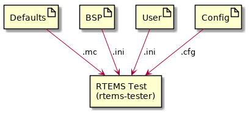
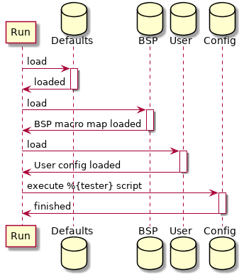

.. comment SPDX-License-Identifier: CC-BY-SA-4.0

.. Copyright (C) 2018 Chris Johns <chrisj@rtems.org>
.. comment: All rights reserved.

Tester Configuration
--------------------

The RTEMS Tester and RTEMS Run are controlled by configuration data and
scripts. The user specifies a BSP on the command line using the ``--rtems-bsp``
option as well as optionally specifying a user configuration file using
``--user-config``.

The Figure :ref:`fig-tester-config-1` shows the various sources of
configuration data and their format. The ``ini`` files are the standard INI
format, the ``mc`` are the internal RTEMS Toolkit's Macro format, and ``cfg``
is the RTEMS Toolkit's Configuration script format, the same format used by the
RTEMS Source Builder.

.. _fig-tester-config-1:

   RTEMS Tester and Run Configuration Files

Configuration data is held in a macro database keyed on the macro name. Macros
can be expanded in configuration scripts using the syntax ``%{name}``. The
macro database is layered using maps. The defaults and values created when a
configure script runs live the in the ``global`` map. Values read from the BSP
and User INI configuration files are loaded into maps based on the BSP
name. This lets a single User configuration file contain specialized
configuration values for a number of BSPs and the tester and run commands
select the values based on the selected BSP. Macros are expanded using the BSP
map first giving those values the highest priority. User defined values are
loaded after the BSP configuration values overwriting them letting a user
speckles a BSP's default configuration for their local needs.

Figure :ref:`fig-tester-config-2` shows the configuration loading and script
execution order.

.. _fig-tester-config-2:

   RTEMS Tester and Run Configuration Load and Execute Sequence

Defaults
^^^^^^^^

The RTEMS Tester and RTEMS Run are primed using defaults from the file
``rtems/testing/testing.mc``. All default settings can be overridden in a BSP or
User configuration file.

.. index:: BSP configuration, User configuration
BSP and User Configuration
^^^^^^^^^^^^^^^^^^^^^^^^^^

The BSP and User configuration files are INI format files. The BSP
configuration file has to have an INI section that is the name of the BSP
passed on the command line. The section has the following mandatory values:

.. index:: bsp
``bsp``
  The name of the BSP. The BSP name is used to create a macro map to hold the
  BSP's configuration data. Typically this is the same as the BSP name used on
  the command line.

.. index:: arch
``arch``
  The name of the BSP architecture. This is need for the GDB configuration
  scripts where the architecture specific GDB needs to run. It is mandatory so
  the *arch/bsp* standard RTEMS BSP string can be used.

.. index:: tester
``tester``
  The tester or run configuration script. This is the name of the configuration
  script the RTEMS Tester or RTEMS Run executes as a back end. The ``tester``
  value is typically of the form ``%{_rtscripts}/<script>`` where ``<script>``
  is name of the back end script to be run.

Target commands support expansion of specific tags to provide a convenient way
for users to customize a local test environment. The parameters expanded are:

.. index:: @ARCH@
``@ARCH@``
  The BSP architecture.

.. index:: @BSP@
``@BSP@``
  The BSP's name set by the ``bsp`` value.

.. index:: @EXE@
``@EXE@``
  The executable name as an absolute path

.. index:: @FEXE@
``@FEXE@``
  The filtered executable if a ``target_exe_filter`` is provided else the
  executable's file name.

The following are optional and depend on the back end being used and the local
target hardware set up:

.. index:: jobs
``jobs``
  The jobs value sets the number of jobs that can be run at once. This setting
  only effects the RTEMS Tester. The tester can run up to the ``jobs`` value of
  tests concurrently. If the tester back end is a simulator running a job on
  each available core lowers the total test time. Overloading a machine with
  too many simulators running in parallel can slow down each simulation and
  test timeouts may be recorded.

.. index:: bsp_tty_dev
``bsp_tty_dev``
  The BSP's tty device. This can be a real device on the host machine the
  executable is being run from or it can be a telnet server and port defined
  using the stand host format. See :ref:`tester-consoles` for details.

.. index:: target_pretest_command
``target_pretest_command``
  The pre-test command is a host shell command that is called before each test
  runs. It can be used to construct a suitable environment or image needed by a
  simulator or target. The RTEMS executate being run is provided as an argument
  and the bootloader specific format is the output.

 .. index:: target_posttest_command
``target_posttest_command``
  The post-test command is a host shell command that is called after each test
  has finished. It can be used to destroy any environment or image created by
  the pre-test command.

.. index:: target_exe_filter
``target_exe_filter``
  The target executable filter transforms the executable name into a filtered
  executable name. This filter lets the tester or run command track the name of
  any generated file a pre-test command may generate. The syntax is a simplified
  ``sed`` regular expression. The first character is a delimiter and there must
  be 2 sections therefore 3 delimiter. The first section is a Python regular
  expression and the second section is plain text that replaces anywhere the
  regular expression matches. For example ``/\.exe/.exe.img/`` will search for
  ``.exe`` in the executable name and replace it with ``.exe.img``. Note, there
  is no need to escape the text in the second part, it is just plain test.

.. index:: test_restarts
``test_restarts``
  The number of restarts before the test is considered ``invalid``. Currently
  not used.

.. index:: target_reset_regex
``target_reset_regex``
  The target reset regular expression. This is a `Python regular expression
  <https://docs.python.org/2/library/re.html#regular-expression-syntax>`_ used
  to filter the console input. If a match is made something has happened during
  the boot process that requires a reset. The ``target_reset_command`` is
  issued to perform the reset. Typically this field looks for boot loader error
  messages that indicate the boot process as failed.

.. index:: target_start_regex
``target_start_regex``

  The target start regular expression. This is a Python regular expression to
  filter the console input to asynchronously detect if a target has reset. If a
  board crashes running a test or at any point reset this filter detects the
  restart and ends the test with a suitable result.

.. index:: target_on_command
``target_on_command``
  The target on command is a host shell command that is called before the first
  test. This command powers on a target. Targets should be left powered off
  when not running tests or the target may request TFTP downloads that are for
  another target interfering with those test results. We recommend you
  implement this command as a target off command, a pause, then a target on
  command.

.. index:: target_off_command
``target_off_command``
  The target off command is a host shell command that is called after the last
  test powering off the target.

.. index:: target_reset_command
``target_reset_command``
  The target reset command is a host shell command that is called when the
  target needs to be reset. This command can power cycle the target or toggle a
  reset signal connected to the target. If you are power cycling a target make
  sure you have a suitable pause to let the target completely power down.

.. _tester-config-scripts:

Configuration Scripts
^^^^^^^^^^^^^^^^^^^^^

Configuration scripts are provided for each supported RTEMS Tester and RTEMS
Run back end and console management. The scripts are in the standard RTEMS
Toolkit Configuration Script format. Please refer to the RTEMS Source Builder
documentation for the basic scripting syntax and usage.

The RTEMS Tester and RTEMS Run specializes the standard configuration syntax
providing a directive for the console and each supported back end. The
supported directives are:

- ``%console``
- ``%execute``
- ``%gdb``
- ``%tftp``

.. _tester-config-console:
.. index:: Console, %console

Console
~~~~~~~

The ``%console`` configures the console used to access the target's
console. The console can be a process's ``stdout``, a termios tty on Unix and
MacOS and Telnet on all hosts. The directive accepts:

``stdio``
  The standard output stream from the executing processing.

``tty <dev> <settings>``
  The name of the ``tty`` to open and use. The ``tty`` device or ``<dev>`` can
  be a *termio* device and the ``<settings>`` are standard termios values.

  The Python termios document provides details of the settings that can be
  controlled. The settings are a single string where prefix the value with
  ``~`` negates the setting. Setting are:

   - ``B115200`` (an example buadrate)
   - ``BRKINT``
   - ``IGNBRK``
   - ``IGNCR``
   - ``ICANON``
   - ``ISIG``
   - ``IEXTEN``
   - ``ECHO``
   - ``CLOCAL``
   - ``CRTSCTS``
   - ``VMIN=<value>``
   - ``VTIME=<value``

A example in a configuration script is::

  %define bsp_tty_dev      /dev/ttyUSB2
  %define bsp_tty_settings B115200,~BRKINT,IGNBRK,IGNCR,~ICANON,~ISIG,~IEXTEN,~ECHO,CLOCAL,~CRTSCTS,VMIN=1,VTIME=2

A example BSP or User configuration file is::

  [bsp-special]
  bsp              = example-bsp
  bsp_tty_dev      = /dev/ttyUSB2
  bsp_tty_settings = B115200,~BRKINT,IGNBRK,IGNCR,~ICANON,~ISIG,~IEXTEN,~ECHO,CLOCAL,~CRTSCTS,VMIN=1,VTIME=2

The console directive is managed in the ``%{_rtscripts}/console.cfg``
configuration script. If the ``%{console_stdio}`` is defined the console will
be ``stdio`` else the console will be the BSP console or ``%{bsp_tty_dev}``.

Telnet can be combined with the ``ser2net`` daemon to remotely access a
target's physical serial UART interface.

.. _tester-config-execute:
.. index:: Execute, %execute

Execute
~~~~~~~

The ``%execute`` directive executes a command for each rest. The execute forks
the command and arguments supplied to the execute directive and captures the
``stdout`` stream as the console. If the console directive is set to ``stdout``
the sub-processes ``stdout`` stream is used as the console.

The RTEMS Tester will run parallel tests as jobs.

An example is::

  %execute %{run_cmd} %{run_opts} %{test_executable} %{test_executable_opts}

.. _tester-config-gdb:
.. index:: GDB, %gdb

GDB
~~~

The ``%gdb`` directive executes GDB in the machine interface mode give the
RTEMS Tester and RTEMS Run commands control. The console is taken from
GDB if it is ``stdout``.

The RTEMS Tester will run parallel tests as jobs.

An example is::

  %gdb %{gdb_cmd} %{test_executable} %{gdb_script}

.. _tester-config-tftp:
.. index:: TFTP, %tftp

TFTP
~~~~

The ``%tftp`` directive starts a TFTP session on a specified port sending the
test executable to the target over a networking using the TFTP protocol.

The RTEMS Tester will run only one test at a time. There is just one physical
board running the test.

An example is::

  %tftp %{test_executable} %{tftp_port}
