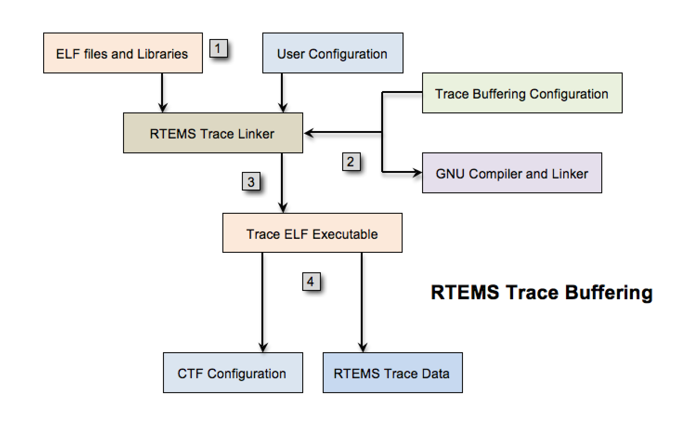
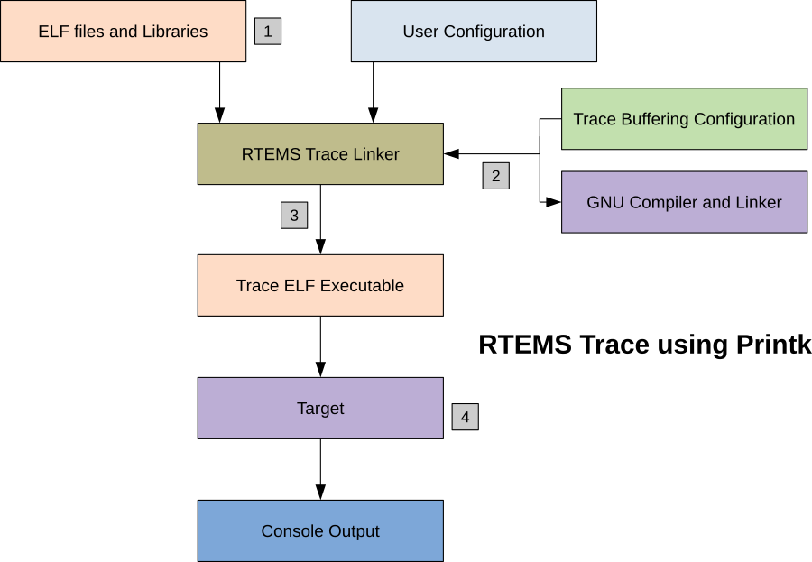

.. SPDX-License-Identifier: CC-BY-SA-4.0

.. Copyright (C) 2016 Chris Johns <chrisj@rtems.org>

.. _introduction:

Introduction to Tracing
***********************

Tracing is an important function which has several applications including
identification of complex threading, detection of deadlocks, tracing
functions along with their argument values, and return values through
progression of several function calls and audit the performance of an
application according to required specifications.

RTEMS tracing framework is under development and welcomes contribution by users.

RTEMS has the following trace components:

- RTEMS :ref:`tracelinker`
- RTEMS :ref:`capturengine`
- Common Trace Format Integration

RTEMS trace framework can currently function using the following methods. Both
of the methods make use of the :ref:`tracelinker` :

.. _tracebuffering:

RTEMS Trace Using Trace Buffering
=================================

This scheme of tracing goes through the flow of events described in a
subsequent flowchart:

Step 1: The user creates an application and user configuration file. The
configuration file specifies the use of the trace buffer generator and other
standard initializations. The user then configures their BSP and invokes the
trace linker using a command to link the application executable. The trace
linker uses the application files in compiled format (ELF) and the libraries
used to build the application for performing this link.

Step 2: The RTEMS Trace Linker reads the user's configuration file and that
results in it reading the standard Trace Buffering Configuration files
installed with the RTEMS Trace Linker. The trace linker uses the target
compiler and linker to create the trace enabled application executable. It
wraps the functions defined in the user's configuration with code that captures
trace records into the statically allocated buffer. The trace wrapper code is
compiled with the target compiler and the resulting ELF object file is added to
the standard link command line used to link the application and the application
is re-linked using the wrapping option of the GNU linker.

Step 3: The trace linker creates an executable which is capable of running on
the target hardware or simulator.

Step 4: RTEMS shell provides the "rtrace" command to display and save trace
buffers.

.. comment: taken from https://devel.rtems.org/wiki/Developer/Tracing

.. _printk:

RTEMS Trace Using Printk
========================

This scheme of tracing goes through the flow of events described in a subsequent
flowchart:

Step 1: The user creates an RTEMS application in the normal manner as well as a
Trace Linker configuration file. The configuration file specifies using the
Printk trace mode and the functions to trace. The user invokes the Trace Linker
with the configuration and the normal link command line used to the link the
application executable. The application ELF object files and libraries,
including the RTEMS libraries are standard and do not need to be built
specially.

Step 2: The RTEMS Trace Linker reads the user's configuration file and that
results in it reading the standard Printk Trace Configuration files installed
with the RTEMS Trace Linker. The trace linker uses the target compiler and
linker to create the trace enabled application executable. It wraps the
functions defined in the user's configuration with code that prints the entry
with arguments and exit and return value if any. The trace wrapper code is
compiled with the target compiler and the resulting ELF object file is added to
the standard link command line used to link the application and the application
is relinked using the wrapping option of the GNU linker.

Step 3: The trace linker creates and RTEMS ELF executable that can be run on the
target hardware or simulator.

Step 4: The application is run in the hardware directly or using a debugger. The
printk() output appears on the target console and the user can save that to a
file.

.. comment: taken from https://devel.rtems.org/wiki/Developer/Tracing

The :ref:`examples` section describes generation of traces using Trace Buffering
technique for the `fileio` testsuite available with RTEMS installation.
